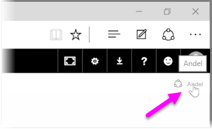
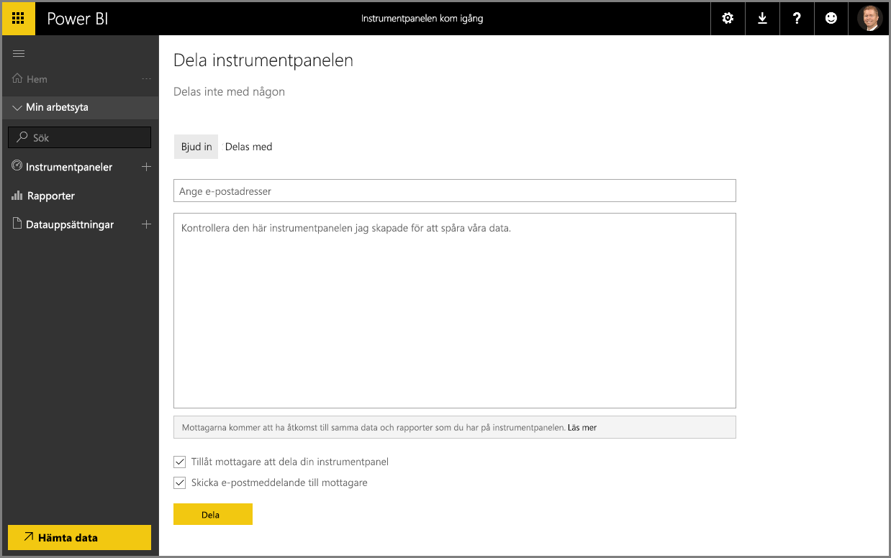

Vi har redan fått veta hur Power BI kan hjälpa dig att söka efter data, samla in den i en datamodell, samt skapa rapporter och visualiseringar med hjälp av dessa data. Vi har också fått se hur du kan publicera dessa rapporter till Power BI-tjänsten och skapa instrumentpaneler som hjälper dig att övervaka din information över tid. Alla dessa funktioner blir ännu mer kraftfulla när du delar dina insikter med andra i din organisation. Det är som tur är enkelt att dela instrumentpaneler.

Om du vill dela en instrumentpanel öppnar du den i Power BI-tjänsten och väljer länken **Dela** i det övre högra hörnet.

Sidan **Dela instrumentpanel** visas där du kan välja avsnittet **Bjud in** och sedan fylla i rutan **E-postadress** med de personer som du vill bevilja åtkomst till din instrumentpanel. Power BI kontrollerar e-postadresserna medan du skriver dem mot konton i din domän och din Office 365-domän, samt kompletterar automatiskt när det är möjligt. Du kan också kopiera och klistra in e-postadresser i den här rutan, eller använda en distributionslista, säkerhetsgrupp eller Office 365-grupp för att nå flera personer på samma gång.

Om du har markerat kryssrutan (längst ned) för att *skicka en e-postavisering till mottagarna* kommer mottagarna få ett e-postmeddelande om att du har delat en instrumentpanel med dem, inklusive en länk till instrumentpanelen. Du kan lägga till en anteckning i det meddelande de får eller skicka den text som Power BI skapar automatiskt (i rutan direkt nedanför där du anger e-postadresserna).

>[!NOTE]
>Mottagare utan ett befintligt Power BI-konto kommer att behöva utföra en registreringsprocess innan de ser instrumentpanelen.
> 
> 

Alla som du delar instrumentpanelen med kan se och interagera med den exakt som du gör. De har dock bara *skrivskyddad* åtkomst till den underliggande rapporter och de har *inte någon åtkomst* till de underliggande datauppsättningarna.

Du kan också välja fliken **Delad med** på sidan Dela instrumentpanel för att se vilka du tidigare har delat instrumentpanelen med.

