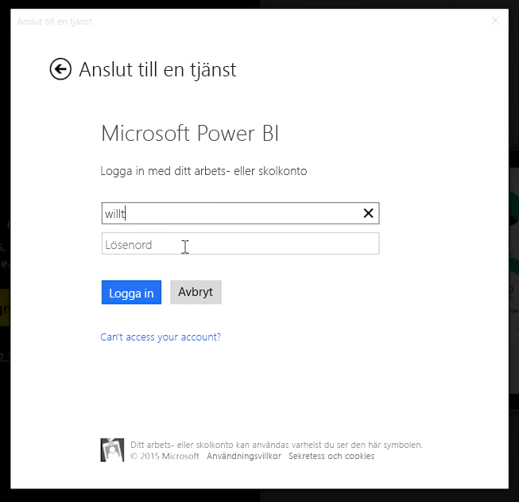
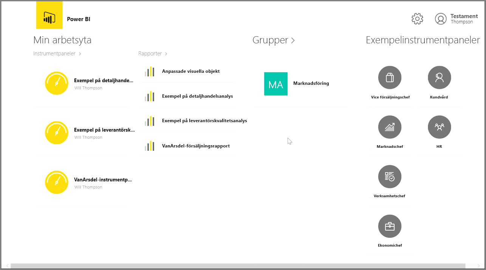
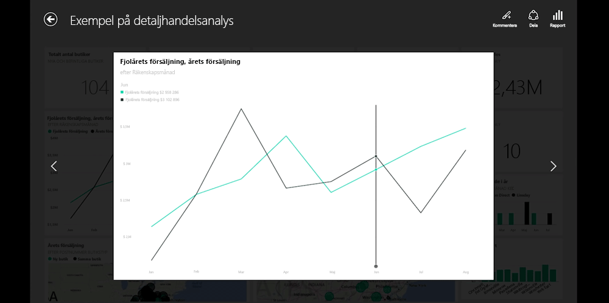
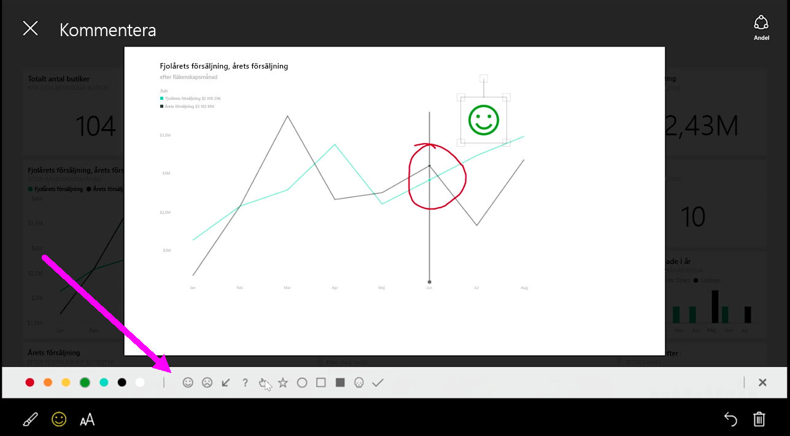

Om du vill ha koll på dina data medan du är i farten kan du använda en av Power BI:s mobilappar för iOS, Android och Windows.

När du använder Power BI-appen loggar du först in på ditt konto med din kontoinformation för Power BI-tjänsten. Inloggningen ser ut som följande på en Windows-mobilenhet (i det här fallet en surfplatta).

Den första skärmen visar allt innehåll som du har åtkomst till, inklusive rapporter, instrumentpaneler och grupper. Det finns också exempel på instrumentpaneler som du kan använda för att bli inspirerad eller för att se Power BI-funktionerna. Appen är pekskärmsanpassad: tryck på en instrumentpanel eller rapport för att visa den i helskärmsläge och bläddra med hjälp av ditt finger.

Du kan öppna vilken som helst av instrumentpanelerna genom att trycka på den. I en instrumentpanel kan du trycka på en panel för att fokusera på den i en större vy.

Du kan också kommentera insikter som du hittar genom att trycka på knappen **Kommentera** i det övre högra hörnet. På så sätt kan du rita en fokuseringsruta som lyfter fram specifika intresseområden. Kommentarsverktygen finns längst ned på skärmen.

Dela din kommenterade panel genom att trycka på länken **Dela** i det övre högra hörnet.

Tryck på länken **Rapport** i det övre högra hörnet för att se den underliggande rapporten för en panel. Detta visar exakt samma visualiseringar som i en webbläsare eller i Power BI Desktop och innefattar också möjligheten att interagera med rapporten genom att trycka på staplar, granska nedåt eller använda utsnitt.

