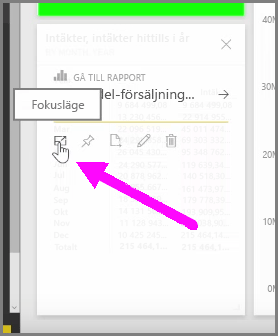
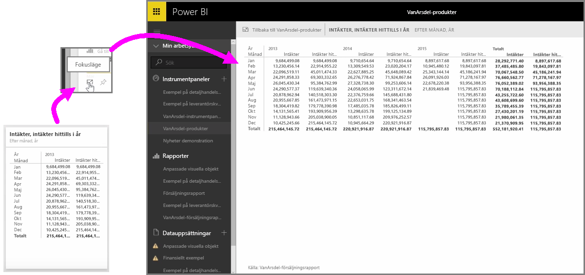

När du tittar på Power BI-instrumentpaneler och rapporter i tjänsten, kan det ibland vara bra att fokusera på ett enskilda diagram eller visualiseringar. Du kan göra det på två olika sätt.

När du är på en instrumentpanel håller du muspekaren över en ruta så att ikonalternativen visas i det övre högra hörnet. När du väljer ellipsen (tre punkter) visas en uppsättning ikoner som representerar åtgärder du kan vidta på panelen.

Ikonen längst till vänster är märkt **Fokusläge**. Välj den ikonen för att expandera panelen så att den täcker hela instrumentpanelen.

I **Fokusläge** kan du se mycket mer information i dina visualiseringar och förklaringar. Till exempel när du ändrar storlek på en panel i Power BI kanske några av kolumnerna som inte visas på grund av det tillgängliga utrymmet i panelen.

I **Fokusläge** du kan se alla data. Du kan även fästa visualiseringen direkt från fokusläge till en annan instrumentpanel genom att välja ikonen **Fäst**. För att avsluta **Fokusläge** väljer du ikonen **Tillbaka till...**  i det övre vänstra hörnet i **Fokusläget**.

Processen påminner om när du visar en rapport. Håll muspekaren över en visualisering för att visa tre ikoner i det övre högra hörnet och välj ikonen **Fokusläge**. Om du väljer detta expanderar din visualisering så att den omfattar den fullständiga rapportarbetsytan. Visualiseringen är fortfarande interaktiv i detta läge, även om du tillfälligt förlorar eventuella korsfiltereffekter mellan visualiseringarna.

Håll muspekaren över en utökad panel eller rapport och välj den vänstra hattikonen **tillbaka till...**  i det övre vänstra hörnet för att återgå till den föregående vyn.

