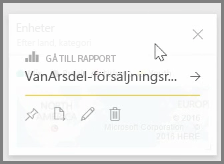
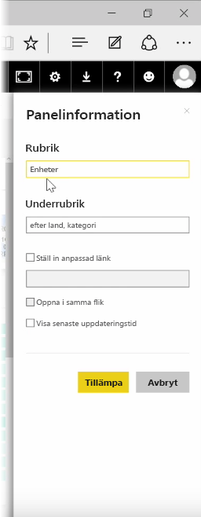
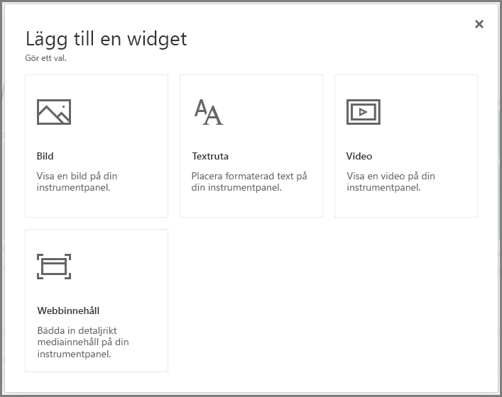
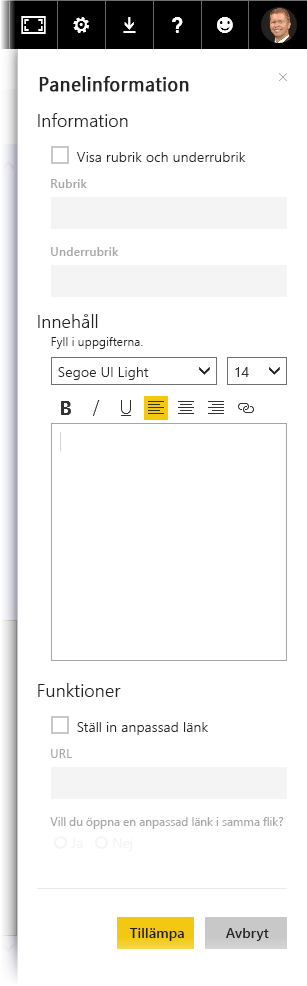

När du har skapat en instrumentpanel kan du redigera dess *-*Paneler* i Power BI-tjänsten om du vill ändra formateringen.

Håll muspekaren över ikonen och välj ellipsen (tre punkter) för att visa en samling av ikoner som du kan använda för att ändra panelen.

Välj **pennikonen** för att öppna fönstret **Panelinformation**. Härifrån kan du ändra på panelens **rubrik**, **underrubrik**, inkludera dess senaste uppdateringstid och -datum samt andra uppgifter, till exempel en anpassad länk.

Som standard när du klickar på en panel på instrumentpanelen kommer du till den rapport som panelen kom från. Ändra detta genom att använda fältet **Ange anpassad länk** i fönstret **Panelinformation**. En populär användning av funktionen är att omdirigera användare till organisationens startsida när de klickar på en logotyp.

## Lägga till widgetar i din instrumentpanel
Du kan också lägga till widgetar i instrumentpanelen. En **widget** är en särskild instrumentpanel som innehåller andra objekt, till exempel en bild, video, textruta eller webbinnehåll i stället för en visualisering.

När du väljer länken Lägg till Widget i övre högra hörnet på en instrumentpanel visas dialogrutan **Lägga till en widget**.

När du lägger till en textruta, visas fönstret **Panelinformation** till höger, där du kan redigera information på liknande sätt som du redigerar informationen i en panel. Men med widgetar, det finns också ett område för att definiera eller ändra widgetinnehåll, till exempel en textredigerare för en textruta.

Du kan anpassa instrumentpanelen och dess utseende med widgetar och möjligheten att redigera detaljer i panelen.

