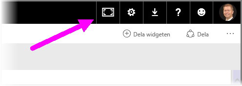
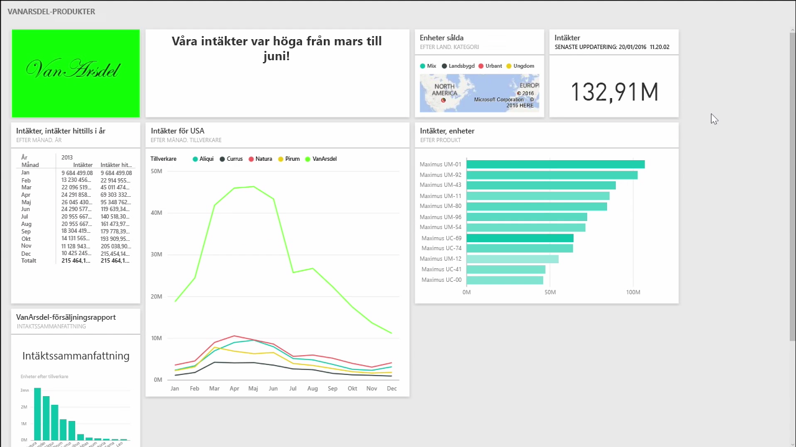
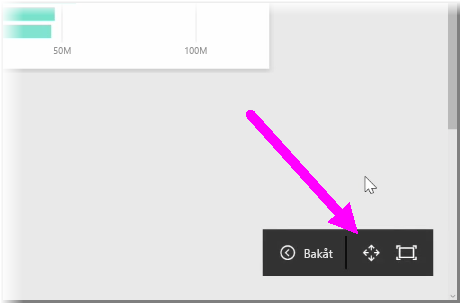
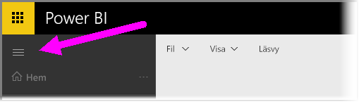

Ibland kan det hända att du har mer innehåll än vad som får plats på arbetsytan när du skapar dina instrumentpaneler. Det finns några lösningar som du kan ta hjälp av när du väljer hur instrumentpanelens yta ska visas, och som ger dig en fullständig överblick över instrumentpanelens innehåll.

Det enklaste sättet att visa hela instrumentpanelen på en skärm är att välja knappen **Helskärmsläge** i instrumentpanelens övre högra hörn.

När du väljer knappen **Helskärmsläge** antar webbläsaren helskärmsläge, och alla Chrome-element runt instrumentpanelen tas bort, vilket ökar storleken på det utrymme som kan visas.

I **Helskärmsläge** kan du välja alternativet **Anpassa till skärmen** och minska alla dina paneler så att alla får plats på skärmen utan att du behöver ta hjälp av rullningslisterna. Detta kallas vanligtvis *TV-läge*, och är användbart för presentationer med instrumentpaneler, eller när du vill visa en instrumentpanel på en hallbildskärm.

Ett annat sätt att hantera instrumentpanelens utrymme på är att komprimera navigeringsfönstret till vänster genom att välja hamburgarikonen. Om du vill visa navigeringsfönstret klickar du på ikonen igen.

Om du vill att en instrumentpanel alltid ska ha ett komprimerat navigeringsfält kan du lägga till följande i slutet av URL:en:

> ? collapseNavigation = true
> 
> 

För användare som följer den länken öppnas instrumentpanelen med ett komprimerad navigeringsfältet.

