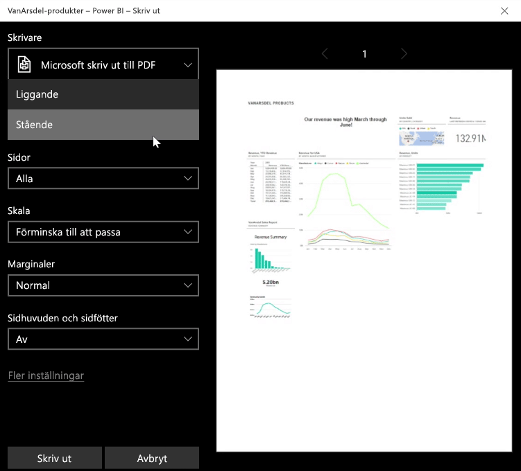
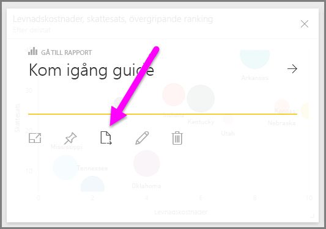
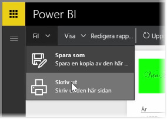

Ibland kanske du vill ta med en utskriven rapport eller instrumentpanel till ett möte så att du kan dela den med andra. Det finns olika sätt att skriva ut visuella objekt på med Power BI.

I Power BI-tjänsten väljer du ellipserna (tre punkter) längst upp till höger och sedan **Skriv ut instrumentpanel**.

Dialogrutan **Skriv ut** visas där du kan välja den skrivare som du vill skicka instrumentpanelen till, samt standardutskriftsalternativ som *stående* eller *liggande* orientering.

## Exportera data från ett visuellt objekt
Du kan också exportera data från valfritt visuellt objekt i Power BI-tjänsten. Välj ellipserna i objektet och sedan knappen **Exportera data** (i mitten). När du gör detta skapas en .CSV-fil som hämtas till den lokala datorn. Ett meddelande visas i webbläsaren (precis som vid alla andra webbläsarinitierade hämtningar) för att visa att hämtningen är slutförd.

Du kan också skriva ut eller exportera direkt från en rapport. När du visar en rapport i Power BI-tjänsten väljer du **Arkiv > Skriv ut** för att öppna dialogrutan Skriv ut.

Och precis som med instrumentpanelen kan du exportera data från ett visuellt objekt i en rapport genom att välja knappen Exportera i objektet.

