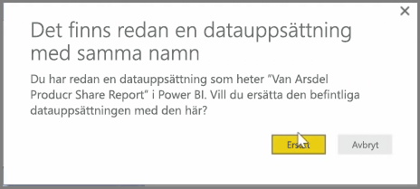
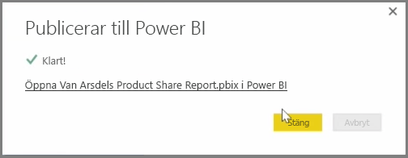

Du kan uppdatera rapporter och datauppsättningar som du redan har publicerat från Power BI Desktop till Power BI-tjänsten. För detta genom att välja **Publicera** på fliken **Start** i menyfliksområdet.

Om du publicerar en rapport som redan finns i Power BI-tjänsten måste du bekräfta att du vill ersätta tidigare datauppsättningar och rapporter med den redigerade version som du har valt att uppdatera med.

När du väljer **Ersätt** skrivs datauppsättningarna och rapporterna i Power BI-tjänsten över med de datauppsättningar och rapporter som finns i den senaste filversionen i Power BI Desktop.

Och precis som när du använder **Publicera** i andra händelser i Power BI Desktop visas en dialogruta som talar om att publiceringen är klar och du får en länk till rapporten i Power BI-tjänsten.

Detta är ett sätt att manuellt uppdatera dina data. Du kan också uppdatera datauppsättningar och rapporter automatiskt. Den processen beskrivs i ett annat avsnitt.

