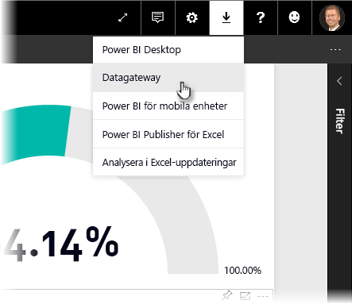
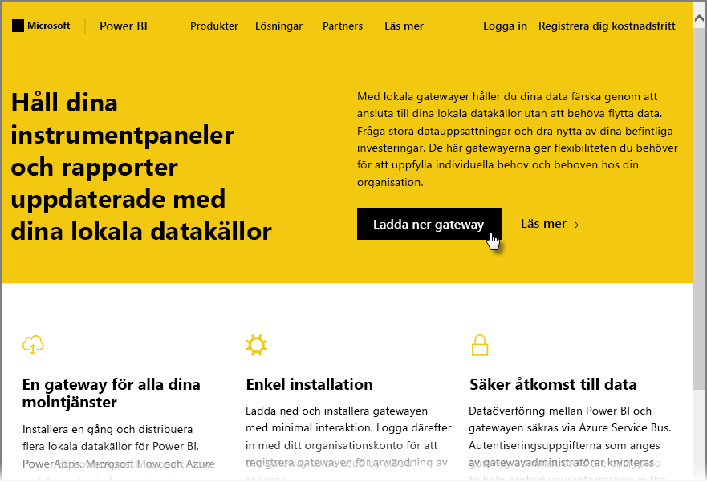
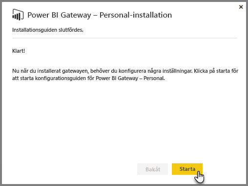
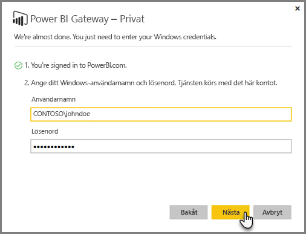
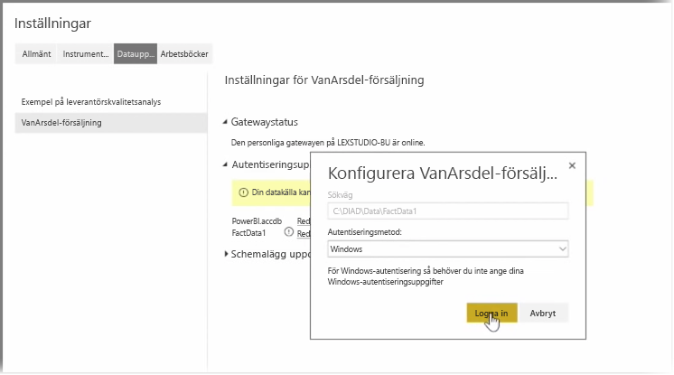
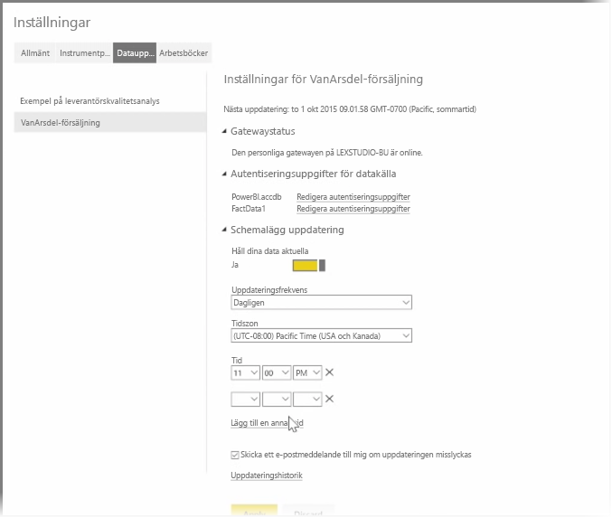

I föregående ämnen har vi tittat på hur du kan använda Power BI för att ansluta till datakällor och hur du manuellt kan uppdatera dina datauppsättningar i Power BI-tjänsten. Du kommer dock inte att vilja uppdatera saker manuellt varje gång dina data ändras, och därför kan du använda Power BI för att ställa in en schemalagd uppdatering som ansluter till dina datakällor och publicera dem i Power BI-tjänsten automatiskt. Detta ger dig också ett sätt att ansluta till tjänsten med valfria lokala datakällor som Excel-filer, Access-databaser, SQL-databaser och annat.

Systemet som låter dig ansluta dina lokala datakällor till Power BI-tjänsten kallas **datagatewayen**. Det är ett litet program som körs på datorn och använder ett på förhand ordnat schema för att ansluta till dina data, samla in alla uppdateringar och push-installera dem i Power BI-tjänsten. Den **personliga gatewayen** är en version av **datagatewayen** som kan användas utan någon administratörskonfiguration.

>[!NOTE]
>Datorn som kör den personliga Power BI-gatewayen *måste* vara påslagen och ansluten till Internet för att den **personliga gatewayen** ska fungera korrekt.
> 

Om du vill ställa in din **personliga gateway** börjar du med att logga in till Power BI-tjänsten. Välj ikonen för att **hämta** i det övre högra hörnet av skärmen och välj sedan **Datagatewayar** på menyn.

Därifrån vidarebefordras du till en sida där du kan välja **Power BI Gateway – Personal**, enligt nedan.

Kör programmet när det har hämtats och slutför installationsguiden.

Du uppmanas därefter att starta konfigurationsguiden för att konfigurera gatewayen.

Du kommer först ombes att logga in på ditt Power BI-tjänstkonto och sedan att logga in på datorns Windows-konto eftersom gateway-tjänsten körs under ditt konto.

Återgå till Power BI-tjänsten. Välj ellipsmenyn (tre punkter) bredvid den datauppsättning som du vill uppdatera och välj sedan **Uppdatera schema**. Då öppnas sidan **Uppdatera inställningar**. Power BI känner av att du har installerat en **personlig gateway** och talar om dess status.

Välj **Redigera autentiseringsuppgifter** bredvid varje tillämplig datakälla och konfigurera autentiseringen.

Ställ slutligen in alternativen under **Uppdatera schema** för att aktivera automatiska uppdateringar och ange när och hur ofta de ska inträffa.

Och sedan är du klar. På de schemalagda tidpunkterna kommer Power BI att gå till dessa datakällor med hjälp av de autentiseringsuppgifter som du angett och anslutningen till den dator som kör din **personlig gateway** och uppdatera rapporterna och datauppsättningarna enligt ditt schema. Nästa gång du går till Power BI kommer dessa instrumentpaneler, rapporter och datauppsättningar att visa data från och med den senaste schemalagda uppdateringen.

## Nästa steg
**Grattis!** Du har slutfört avsnittet **Utforska data** i kursen **Interaktiv utbildning** för Power BI. Power BI-tjänsten är full olika intressanta metoder för att utforska data, dela insikter och interagera med visuella objekt. Och allt är tillgängligt från en webbläsare, från en tjänst som du kan ansluta till var du än är.

En kraftfull och välkänd partner till Power BI är **Excel**. Power BI och Excel är utformade för att fungera bra tillsammans; dina arbetsböcker kommer att känna sig hemma i Power BI och det är enkelt få dem dit.

Hur enkelt? I nästa avsnitt, **Power BI och Excel**, lär du dig mer om precis det.

Vi ses i nästa avsnitt!

