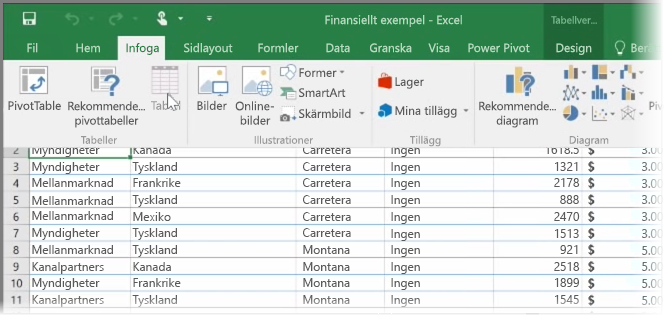
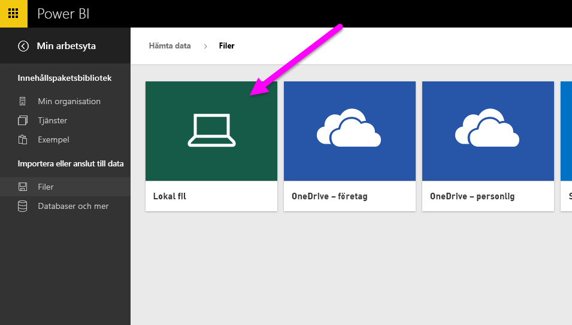
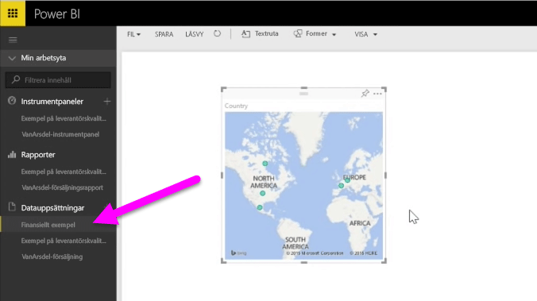

I det här ämnet tar vi först en titt på hur du kan importera en Excel-arbetsboksfil som innehåller en enkel **tabell** från en lokal enhet till Power BI. Sedan lär du dig hur du kan börja utforska tabellens data i Power BI genom att skapa en rapport.

## Säkerställ att dina data är formaterade som en tabell.
För att Power BI ska kunna importera data från din arbetsbok, måste dessa data vara **formaterade som en tabell**. Det är enkelt! I Excel kan du markera ett cellområde och sedan klicka på **Tabell** på fliken **Infoga** i menyfliksområdet i Excel.

Det är viktigt att kontrollera att varje kolumn har ett lämpligt namn. Det gör det lättare att hitta de data du vill använda när du skapar dina rapporter i Power BI.

## Importera från en lokal enhet
Oavsett var du sparar dina filer gör Power BI det enkelt att importera dem. I Power BI kan du använda **Hämta data** > **Filer** > **Lokal fil** för att hitta och välja önskad Excel-fil.

När du importerat till Power BI kan du börja skapa rapporter.

Filerna behöver förstås inte ligga på en lokal enhet. Om du sparar filer på OneDrive eller SharePoint-gruppwebbplatsen är det ännu bättre. Vi ska gå in mer i detalj på detta i ett senare ämne.

## Börja skapa rapporter
När dina arbetsboksdata har importerats, skapas en datauppsättning i Power BI. Den visas under **Datauppsättningar**. Nu kan du börja utforska dina data genom att skapa rapporter och instrumentpaneler. Klicka bara på ikonen **Öppna meny** bredvid datauppsättningen och klicka sedan på **Utforska**. En ny tom rapportarbetsyta visas. Till höger under **Fält** visas dina tabeller och kolumner. Markera bara önskade fält som du vill använda för att skapa en ny visualisering på arbetsytan.

Du kan ändra typen av visualisering och använda **filter** och andra egenskaper under **Visualiseringar**.

