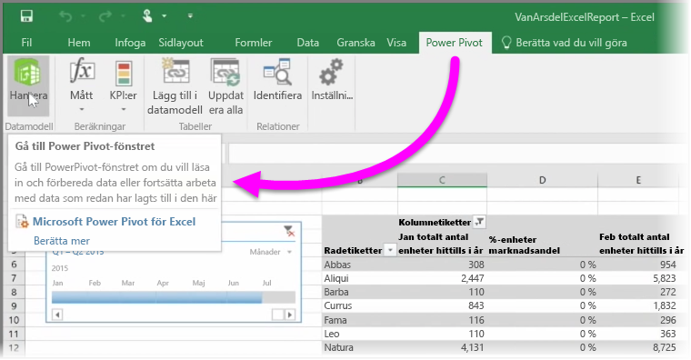

Om du använder någon avancerad funktion för BI i Excel, till exempel **Power Query** (kallas även **Hämta & transformera** i Excel 2016) för att fråga efter och läsa in data, **Power Pivot** för att skapa kraftfulla datamodeller och **Power View** för att skapa dynamiska rapporter, kan du importera dem till Power BI.

Om du använder **Power Pivot** för att skapa avancerade datamodeller med flera relaterade tabeller, mått, beräknade kolumner eller hierarkier kan Power BI importera dessa också.

Om arbetsboken har **Power View-blad** är det inga problem. Power BI kommer att återskapa dem som nya **Rapporter** i Power BI. Du kan börja fästa visualiseringar direkt på instrumentpaneler.

Och här är en av de utmärkta funktionerna i Power BI: Om du använder Power Query eller Power Pivot för att ansluta till, köra frågor mot och läsa in data från en extern datakälla kan du, när du har importerat din arbetsbok till Power BI, konfigurera **schemalagd uppdatering**. Med hjälp av schemalagd uppdatering använder Power BI anslutningsinformationen från arbetsboken för att ansluta direkt till datakällan och fråga och läsa in alla data som har ändrats. Alla visualiseringar i rapporter uppdateras också automatiskt.

