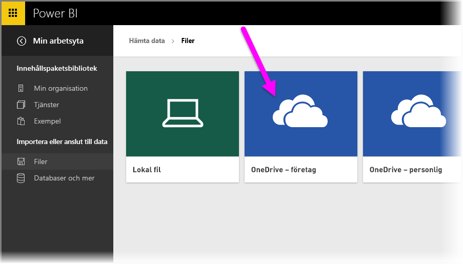
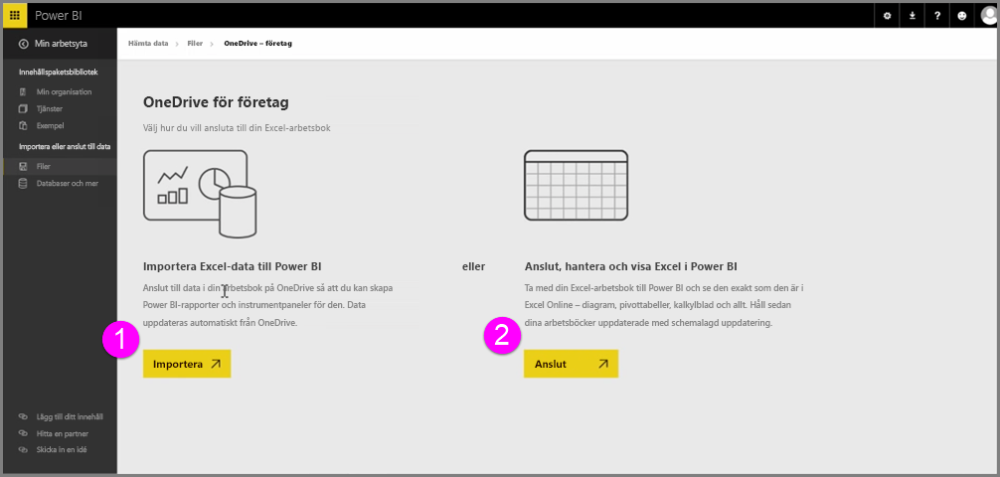
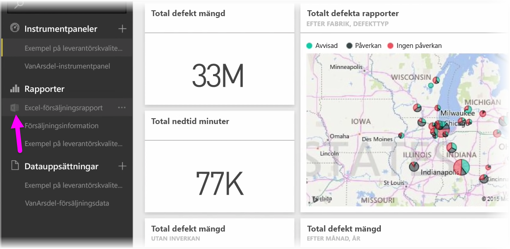
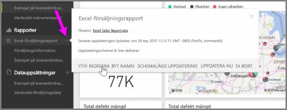

Få sömlös integrering mellan Power BI och Excel när du sparar dina Excel-arbetsböcker på OneDrive.

Eftersom OneDrive befinner sig i molnet, precis som Power BI, upprättas en liveanslutning mellan Power BI och OneDrive. Om du gör ändringar i din arbetsbok på OneDrive, synkroniseras de *automatiskt*  med Power BI. Dina visualiseringar i rapporter och instrumentpaneler hålls uppdaterade. Om din arbetsbok ansluter till externa datakällor, exempelvis en databas eller en OData-feed, kan du använda funktionerna för **Uppdatera schema** i Power BI för att söka efter uppdateringar. Behöver du ställa frågor om data i arbetsboken? Inga problem. Du kan använda funktionerna för **vanliga frågor och svar** i Power BI för just detta.

Det finns två sätt att ansluta till dina Excel-filer på OneDrive för företag:

1. Importera Excel-data till Power BI
2. Anslut, hantera och visa Excel i Power BI

### Importera Excel-data till Power BI
När du väljer att importera Excel-data till Power BI, laddas tabelldata från din arbetsbok i en ny datauppsättning i Power BI. Om du har några **Power View**-blad i arbetsboken importeras de och nya rapporter skapas också automatiskt i Power BI.

Power BI behåller anslutningen mellan den och arbetsboksfilen på din OneDrive för företag. Om du gör några ändringar i din arbetsbok, kommer de när du sparar att *automatiskt synkroniseras** med Power BI, vanligtvis inom en timme. Om din arbetsbok ansluter till externa datakällor kan du konfigurera schemalagd uppdatering så att datauppsättningen i Power BI hålls uppdaterad. Eftersom visualiseringar i rapporter och instrumentpanelen i Power BI använder data från datauppsättningen, blir dina frågor snabba som blixten i takt med att du utforskar vidare.

### Anslut, hantera och visa Excel i Power BI
När du väljer att ansluta till Excel-arbetsboken får du en sömlös upplevelse av att arbeta med din arbetsbok i Excel och Power BI. När du ansluter på det här sättet får arbetsbokens rapport en liten Excel-symbol bredvid sig.

I rapporten ser du din Excel-arbetsbok i Power BI precis som du skulle göra i **Excel Online**. Du kan utforska och redigera dina kalkylblad i Excel Online genom att välja Redigera i ellipsmenyn. Alla visualiseringar som du har fäst på instrumentpaneler uppdateras automatiskt när du gör ändringar.

Ingen datauppsättning skapas i Power BI. Alla data finns kvar i arbetsboken på OneDrive. En av de många fördelarna med denna metod är att du kan konfigurera **schemalagd uppdatering** om din arbetsbok ansluter till externa datakällor. Du kan välja delar som pivottabeller och diagram och **fästa** dem direkt på instrumentpaneler i Power BI. Om du gör några ändringar visas de automatiskt i Power BI. Du kan också använda Power BI:s fantastiska funktioner för **vanliga frågor och svar** för att ställa frågor om data i arbetsboken.  

