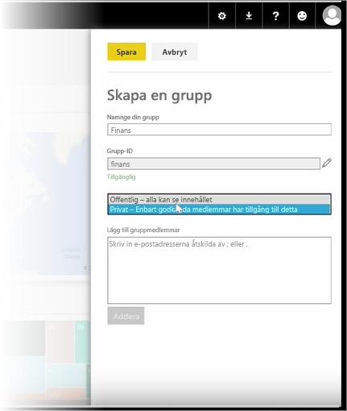
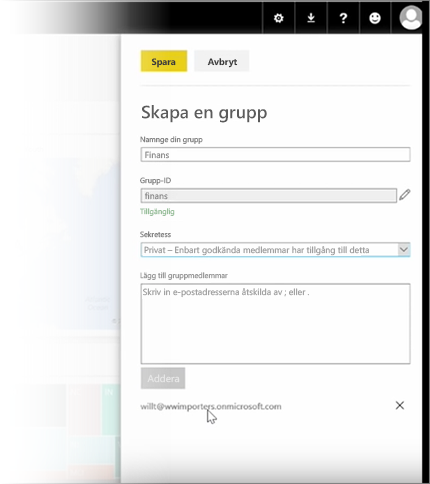

Den här lektionen inleder vi med att skapa en *grupp*. En **grupp** definieras som en uppsättning användare som har åtkomst till specifika instrumentpaneler, rapporter och data.

Grupper i Power BI baseras på grupper i Office 365, så om du har använt Office 365-grupper för att hantera din grupp-e-post, kalender och dokument kommer du att upptäcka att Power BI har samma funktioner, och mycket mer. När du skapar en grupp i Power BI skapar du egentligen en Office 365-grupp.

Den här modulen använder ett scenario om att skapa en ny ekonomigrupp. Vi visar hur du konfigurerar gruppen, delar instrumentpaneler, rapporter och datauppsättningar i gruppen och lägger till medlemmar som har tillgång till objekten i gruppen.

Jag börjar här i Min arbetsyta. Dessa är de instrumentpaneler, rapporter eller datauppsättningar som du har skapat eller som någon har delat med dig.

Om du expanderar Min arbetsyta kan du välja **Skapa en grupp**.

Här kan du ge den ett namn. Vi använder scenariot eller en ekonomigrupp, så du kan kalla den Ekonomi. Power BI kontrollerar att namnet inte finns i domänen.

Du kan ställa in sekretessnivån genom att bestämma om någon i min organisation ska kunna se innehållet i gruppen eller bara dess medlemmar.

Du skriver e-postadresser, säkerhetsgrupper och distributionslistor här. Gör dem till medlemmar i gruppen genom att välja **Lägg till** och spara gruppen.

Till nästa lektion!

