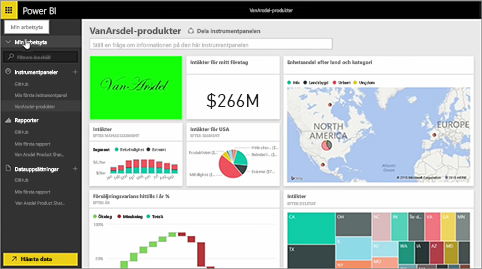
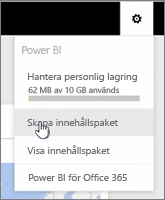
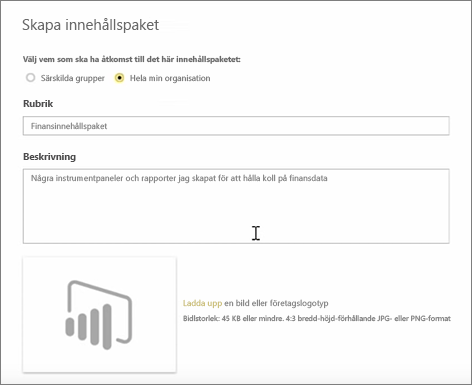
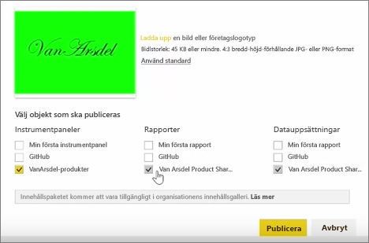
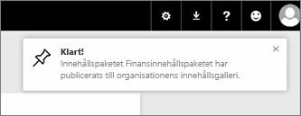

Under den här lektionen skapar vi ett *innehållspaket* med befintliga artefakter som vi redan har i Power BI och delar dem sedan med kollegor.

I **Min arbetsyta** jag har en instrumentpanel, rapporten visas undertill, och datauppsättningen. Jag vill dela dem som ett paket med personer i min organisation så att de kan återanvända dem.

När väljer ikonen **Inställningar** (kugghjulet längst upp till höger i tjänsten) kan jag se hur mycket lagringsutrymme som jag har använt och kan skapa ett innehållspaket.

I den dialogruta som visas kan jag välja om jag vill distribuera det till specifika personer eller grupper och även ge det en titel. Det är också en bra idé att ge en detaljerad beskrivning i rutan **Beskrivning** till personer som söker efter ett innehållspaket så att de kan läsa sig till vad det innehåller eller vad det gör.

Längst ned i dialogrutan har jag möjlighet att ladda upp en bild för innehållspaketet och därefter kommer det viktigaste steget: Jag väljer den instrumentpanel som jag vill inkludera i innehållspaketet och när jag gör det väljer Power BI automatiskt den rapport och den datauppsättning som används på instrumentpanelen. Jag kan inte avmarkera rapporten eller datauppsättningen eftersom instrumentpanelen som jag vill inkludera i innehållspaketet kräver dem.

Jag skulle också kunna välja andra instrumentpaneler, rapporter och datauppsättningar, men det gör jag inte.

Vid publiceringen läggs innehållspaketet till i organisationens innehållsgalleri.

Till nästa lektion!

