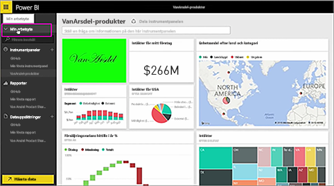
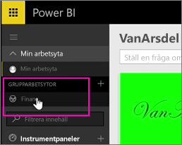
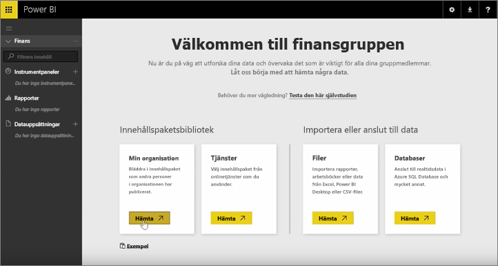
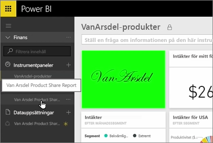
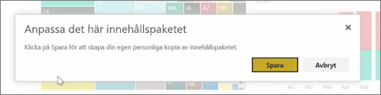
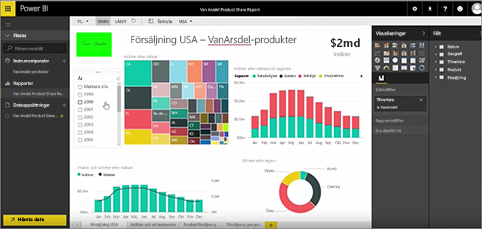

I de föregående lektionerna har vi redan skapat ett innehållspaketet och en grupp. I den här lektionen ska vi skapa en instans av innehållspaketet för alla i gruppen.

Du börjar i Min arbetsyta...

... och växlar tillbaka till den finansgrupp som du skapade under en tidigare lektion.

Den här gruppen har inte några instrumentpaneler, rapporter eller datauppsättningar ännu. Du använder det innehållspaket du skapaade tidigare. Bläddra bland din organisations innehållspaket snarare än bland sådana från leverantörer av tredjepartstjänster.

Du hittar det innehållspaket som du skapade för någon minut sedan. Du förstår inte varför det är viktigt att ge det ett bra namn, en bra beskrivning och en bild, så att personer kan hitta det. Ansluter till det.

Power BI importerar de instrumentpaneler, rapporter och datauppsättningar som finns i innehållspaketet.

När du markerar datauppsättningen frågar Power BI om du vill anpassa innehållspaketet.

Du skapar en kopia av innehållspaketet, så att du kan göra ändringar i det och kopplar bort det från den publicerade versionen av innehållspaketet. Om innehållspaketets skapare gör ändringar i den publicerade versionen, så får du inte automatiskt dessa uppdateringar.

Men om du vill kan du redigera instrumentpanelen, rapporten och t.o.m. datauppsättningen.

Så innehållspaketen representerar ett enkelt sätt på vilket du kan återanvända innehåll som har skapats av andra personer i din organisation.

Vidare till nästa lektion: [Skapa ett innehållspaketet i Power BI](6-4-update-content-pack.md).

