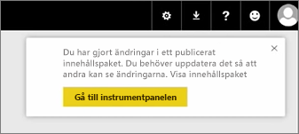
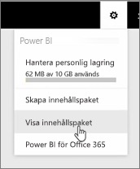
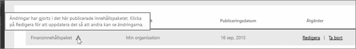

I den här kursen kommer vi att redigera det första innehållspaketet som vi skapade nyss och se hur andra personer som är anslutna uppdateras.

Jag är tillbaka i Min arbetsyta och redigerar min ursprungliga instrumentpanel.

När jag ändrar instrumentpanelen visas den här påminnelsen att jag har ändrat något som jag har delat med andra i ett innehållspaket som uppmanar mig att uppdatera den delade versionen.

Jag återgår till ikonen för inställningar och väljer **Visa innehållspaket** för att se de innehållspaket som jag har redan publicerat.

Jag kan se mitt innehållspaket. Den här lilla ikonen visar att jag har ändrat något i innehållspaketet och jag behöver för att redigera innehållspaketet så att andra kan se ändringarna.

När väljer **redigera** kommer jag tillbaka till skärmen där jag kan redigera namnet och beskrivningen, men nu har den en **uppdateringsknapp** som jag kan välja.

Power BI tar ändringarna och publicerar uppdaterade innehållspaketet i galleriet för innehållspaket.

Vem som helst som har anslutit till mitt innehållspaketet hämtar ett meddelande som innehållspaketet har ändra och frågar om de vill godkänna ändringarna eller behålla den tidigare versionen.

Som ägare till innehållspaketet kan du hantera de versioner som används av dina kollegor.

