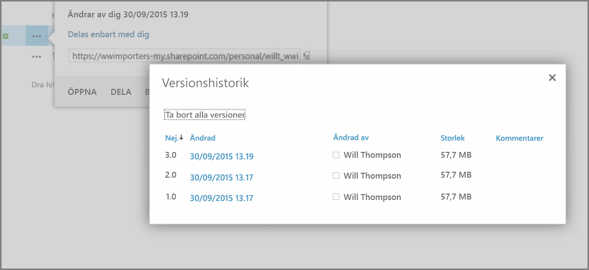
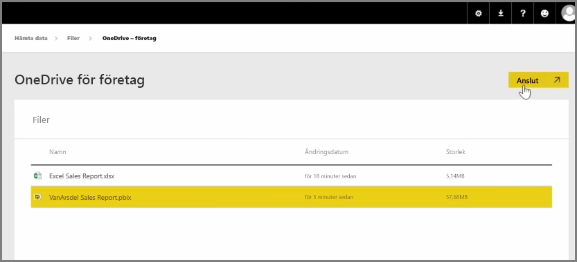
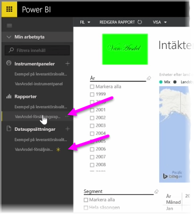

I en tidigare artikel granskade vi skapa grupper för att hjälpa din organisation att hantera och samarbeta med innehåll i Power BI. Du kan också använda Power BI-/Office365-grupper för att samarbeta och dela med hjälp av **OneDrive för företag**.

Med OneDrive för företag som källa för ditt innehåll i Power BI får du tillgång till många användbara verktyg, till exempel versionshistorik. Du kan också dela filer med en Office 365-grupp från OneDrive för företag för att ge åtkomst och tillåta att många arbetar med samma Power BI- eller Excel-filer.

Logga in på Power BI-tjänsten för att ansluta till en PBIX-fil (Power BI Desktop) på OneDrive för företag och välj **Hämta data**. Välj **Filer** under Importera eller Anslut till data och välj sedan **OneDrive – företag**. Markera önskad fil och välj **Anslut**.

Innehållet visas i navigeringsfältet till vänster.

Nu kan alla ändringar i filen på **OneDrive för företag** visas i Power BI-miljön och automatiskt registreras i versionshistoriken.

