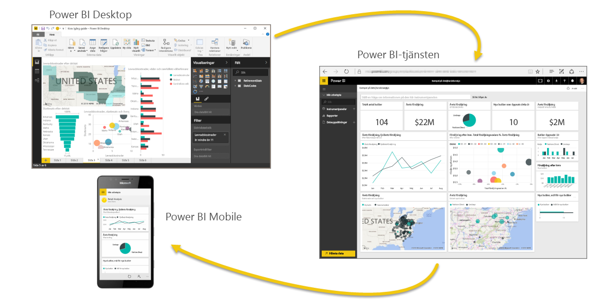
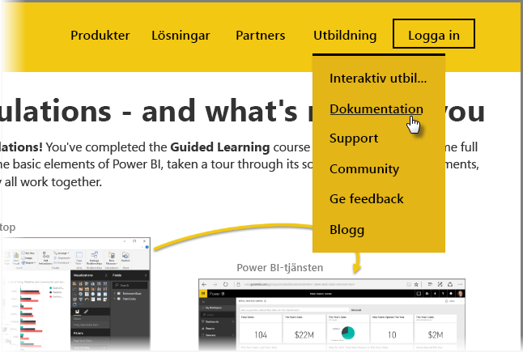

Du klarade det! **Grattis!** Du har slutfört kursen **Interaktiv utbildning** för Power BI. Du har nu gått igenom hela processen och lärt dig allt om de grundläggande delarna i Power BI, tagit en rundtur bland programvarufunktionerna och -delarna och lärt dig hur alltihop fungerar tillsammans.

Detta är det sista avsnittet (och det sista ämnet, om du inte vill veta mer om DAX) i kursen, så om du har gått igenom alla dessa avsnitt i ordning, kan du känna dig nöjd med dig själv. Bra jobbat! Du är nu väl insatt i alla dessa **viktiga koncept**:

* Vad [Power BI är](0-0-what-is-power-bi.md)
* [Byggstenarna](0-0b-building-blocks-power-bi.md) i Power BI
* [Hämta](1-2-connect-to-data-sources-in-power-bi-desktop.md) och [modellera](2-1-intro-modeling-data.md) data
* [Visualiseringar](3-1-intro-visualizations.md)
* [Utforska data](4-0-intro-power-bi-service.md) i Power BI-tjänsten
* Använda [Excel och Power BI](5-1-intro-excel-data.md) tillsammans
* Och [publicera och dela](6-0-intro-content-packs-groups.md) ditt arbete

Det är mycket kunskaper och nu när du har allt detta i huvudet är du redo att använda det! Här följer några **länkar för att hämta filer** eller för att ansluta din webbläsare **till Power BI-tjänsten**:

* Du kan alltid [hämta senaste Power BI Desktop](https://powerbi.microsoft.com/desktop)
* Att gå till [Power BI-tjänsten](https://powerbi.microsoft.com/) är enkelt
* Hämta [mobilappar för Power BI](https://powerbi.microsoft.com/mobile/) är bara en tryckning bort

Det finns även mer **hjälp- och referensinnehåll** tillgängligt. Du behöver bara gå överst på den här sidan och välja **Inlärning > Dokumentation** för att se vår omfattande uppsättning referensinnehåll för Power BI.

Vi hoppas att du har haft glädje av din resa genom denna **interaktiva utbildningsupplevelse i Power BI**. Lycka till och må dina visuella Power BI-objekt alltid vara fördjupande och övertygande.

## Ytterligare ett avsnitt för DAX-användare
Vill du veta mer? Vill du använda **DAX (Data Analysis Expressions)** för att skapa, filtrera, använda eller anpassa kolumner och tabeller i Power BI? Det finns ytterligare ett avsnitt som är avsett för personer vill utföra kodarbete i Power BI och det heter **Introduktion till DAX**. Ta en titt om du är intresserad – den har samma vänliga anslag som resten av den interaktiva utbildningen.

