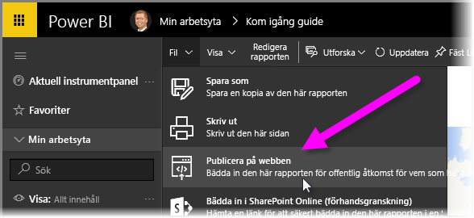
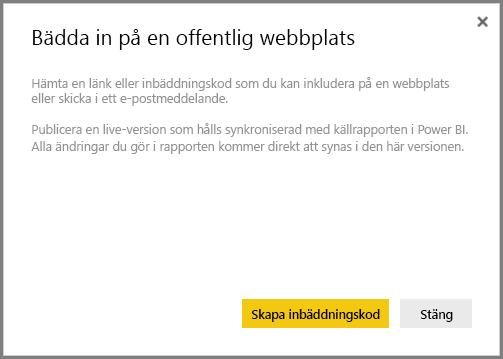
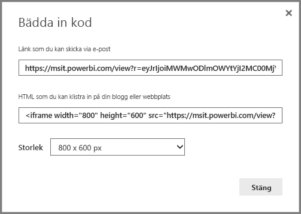
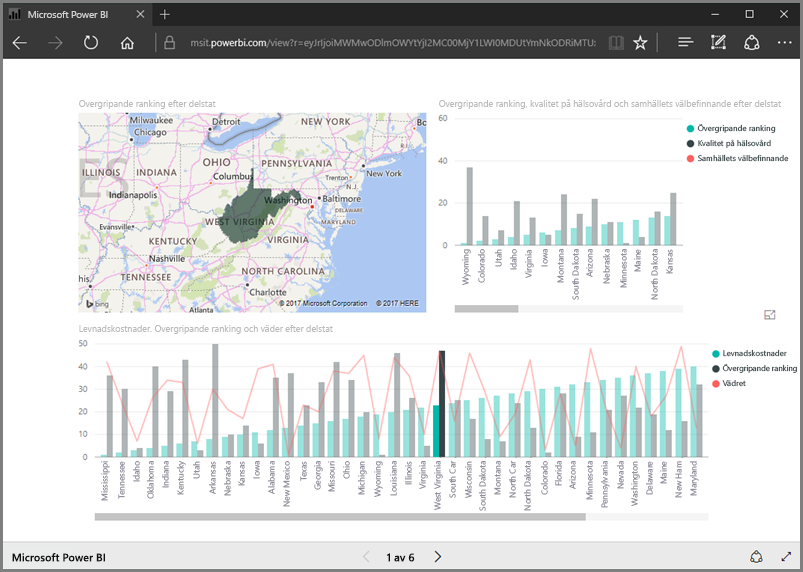
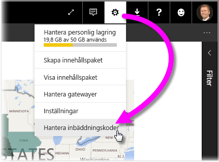
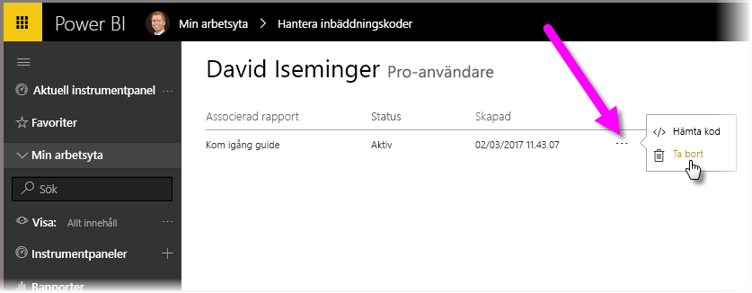

I kursen lär vi dig att dela en Power BI-rapport på en webbsida eller via e-post i några enkla steg. Den här funktionen i Power BI kallas ofta **Publicera på webben** och är enkel att använda och hantera.

I Power BI väljer du den rapport som du vill dela, så att den visas på arbetsytan. I menyn väljer du sedan **Arkiv > Publicera på webben**.

En dialogruta visas om att du kommer att få en *inbäddningskod* för att du ska kunna lägga till rapporten på en webbplats eller i ett e-postmeddelande.

När du väljer **Skapa inbäddningskod** visar Power BI en annan dialogruta som en gång till talar om att du håller på att dela data med alla på Internet. Se till att det är rätt!

Power BI visar en dialogruta med två länkar:

* En länk som du kan dela i e-postmeddelanden, som visar rapporten som en webbsida
* En HTML-kod (en länk i en iframe) för att du ska kunna bädda in rapporten direkt på en webbsida

För HTML-länken kan du välja bland fördefinierade storlekar för den inbäddade rapporten, eller ändra iframe-koden själv och anpassa dess storlek.

Du kan helt enkelt klistra in e-postlänken i en webbläsare och se rapporten som en webbsida. Du kan interagera med webbsidan precis som om du såg rapporten i Power BI. Följande bilder visar sidan **Publicera på webben** när länken har kopierats direkt från dialogrutan till en webbläsare:

Du kan också bädda in iframe-länken i ett blogginlägg, på en webbplats eller i Sway.

Vill du ta bort en inbäddningskod som du har skapat? Inga problem. I Power BI väljer du **kugghjulsikonen** i det övre högra hörnet och sedan **Hantera inbäddningskoder**.

Power BI-arbetsytan visar de inbäddningskoder som du har skapat (i bilden nedan finns det bara en). När du klickar på ellipserna kan du sedan välja att hämta koden för den inbäddade koden eller ta bort den inbäddade koden helt.

Och det är allt som behövs för att publicera Power BI-rapporten på webben och dela den med världen. Det är enkelt!

