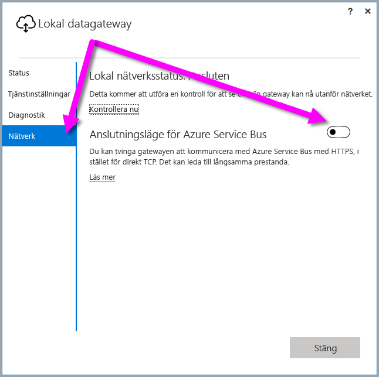
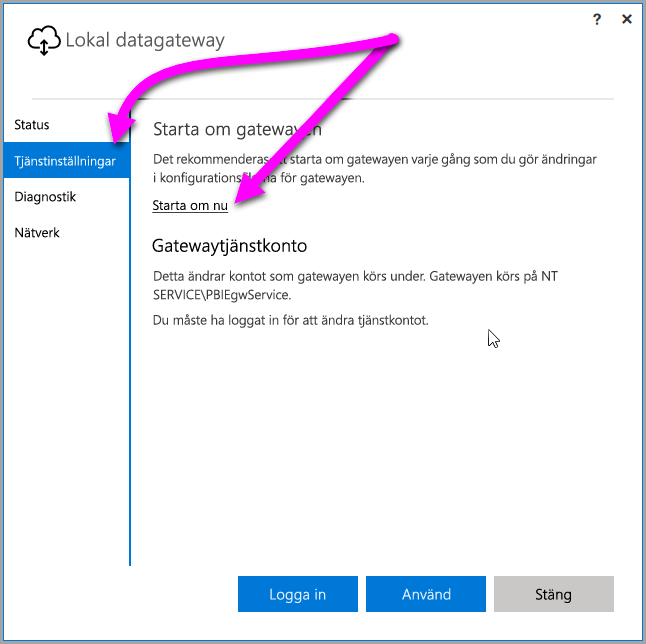

## <a name="sign-in-account"></a>Inloggningskonto

Användarna loggar in med ett arbets- eller skolkonto. Det här kontot är ditt **organisationskonto**. Om du har registrerat dig för ett Office 365-erbjudande och inte angav din faktiska e-postadress till arbetet, kan det se ut så här nancy@contoso.onmicrosoft.com. Ditt konto lagras i en klientorganisation i Azure Active Directory (AAD). I de flesta fall matchar AAD-kontots UPN e-postadressen.

## <a name="windows-service-account"></a>Windows-tjänstkonto

Den lokala datagatewayen är konfigurerad för att använda *NT SERVICE\PBIEgwService* för inloggning med Windows-tjänstens autentiseringsuppgifter. Som standard har det behörigheten för inloggning som en tjänst, i kontexten för den dator som du installerar gatewayen på. Kontot är inte samma konto som används för att ansluta till lokala datakällor. Kontot är inte heller det arbets- eller skolkonto som du loggar in på molntjänsterna med.

> [!NOTE]
> Om du har valt personligt läge konfigurerar du Windows-tjänstkontot separat.

Om du får autentiseringsproblem med proxyservern så försök att ändra Windows-tjänstkontot till en domänanvändare eller ett hanterat tjänstkonto. Mer information finns i [proxykonfiguration](../service-gateway-proxy.md#changing-the-gateway-service-account-to-a-domain-user).

## <a name="ports"></a>Portar

Gatewayen skapar en utgående anslutning till Azure Service Bus. Den kommunicerar via utgående portar: TCP 443 (standard), 5671, 5672, 9350 till 9354.  Gatewayen behöver inte några ingående portar.

Vi rekommenderar att du godkänner IP-adresserna för ditt dataområde i brandväggen. Du kan hämta listan [Microsoft Azure-Datacenter IP-adresser](https://www.microsoft.com/download/details.aspx?id=41653) som uppdateras varje vecka. Gatewayen kommunicerar med Azure Service Bus via IP-adressen, tillsammans med det fullständiga domännamnet (FQDN). Om du tvingar gatewayen att kommunicera via HTTPS kommer den endast att använda FQDN och ingen kommunikation kommer att ske via IP-adresser.

> [!NOTE]
> De IP-adresser som finns i IP-listan för Azure Datacenter använder CIDR-notering. 10.0.0.0/24 betyder t.ex. inte 10.0.0.0 till 10.0.0.24. Läs mer om [CIDR-notering](http://whatismyipaddress.com/cidr).

Här är en lista med de fullständiga domännamn som används av gatewayen.

| Domännamn | Utgående portar | Beskrivning |
| --- | --- | --- |
| *.download.microsoft.com |80 |HTTP används för att hämta installationsprogrammet. |
| *.powerbi.com |443 |HTTPS |
| *.analysis.windows.net |443 |HTTPS |
| *.login.windows.net |443 |HTTPS |
| *.servicebus.windows.net |5671–5672 |Advanced Message Queuing Protocol (AMQP) |
| *.servicebus.windows.net |443, 9350–9354 |Lyssnare på Service Bus Relay via TCP (kräver 443 för att hämta token för åtkomstkontroll) |
| *.frontend.clouddatahub.net |443 |HTTPS |
| *.core.windows.net |443 |HTTPS |
| login.microsoftonline.com |443 |HTTPS |
| *.msftncsi.com |443 |Används för att testa Internetanslutningen om denna gateway inte kan nås av Power BI-tjänsten. |
| *.microsoftonline-p.com |443 |Används för autentisering beroende på konfiguration. |

> [!NOTE]
> Trafik till visualstudio.com eller visualstudioonline.com är för App Insights och måste inte finnas för att denna gateway ska fungera.

## <a name="forcing-https-communication-with-azure-service-bus"></a>Tvinga HTTPS-kommunikation med Azure Service Bus

Du kan tvinga gatewayen att kommunicera med Azure Service Bus med HTTPS, i stället för direkt TCP. om du använder HTTPS kan det påverka prestanda. Det gör du genom att ändra filen *Microsoft.PowerBI.DataMovement.Pipeline.GatewayCore.dll.config* genom att ändra värdet från `AutoDetect` till `Https`, som visas i kodfragmentet direkt efter detta stycke. Filen finns (som standard) på *C:\Program\Lokal datagateway*.

```xml
<setting name="ServiceBusSystemConnectivityModeString" serializeAs="String">
    <value>Https</value>
</setting>
```

Värdet för parametern *ServiceBusSystemConnectivityModeString* är skiftlägeskänsligt. Giltiga värden är *AutoDetect* och *Https*.

Alternativt kan du tvinga gatewayen att införa beteendet med hjälp av gatewayens användargränssnitt. Gå till gatewayens användargränssnitt och välj **Nätverk**. Växla sedan **anslutningsläget för Azure Service Bus** till **På**.



När det har ändrats och du väljer **Tillämpa** (en knapp som endast visas när du gör en ändring) kommer *gatewayens Windows-tjänst* att startas om automatiskt, så att ändringen träder i kraft.

I framtiden kan du starta om *gatewayens Windows-tjänst* från gränssnittets dialogruta genom att välja **Tjänstinställningar** och sedan *Starta om nu*.



## <a name="support-for-tls-12"></a>Stöd för TLS 1.2

Den lokala datagatewayen använder som standard TLS (Transport Layer Security) 1.2 för att kommunicera med Power BI-tjänsten. För att säkerställa att all gatewaytrafik använder TLS 1.2, kan du behöva lägga till eller ändra följande registernycklar på den dator som kör gatewaytjänsten:

```
[HKEY_LOCAL_MACHINE\SOFTWARE\Microsoft\.NETFramework\v4.0.30319]"SchUseStrongCrypto"=dword:00000001
[HKEY_LOCAL_MACHINE\SOFTWARE\Wow6432Node\Microsoft\.NETFramework\v4.0.30319]"SchUseStrongCrypto"=dword:00000001
```

> [!NOTE]
> När du lägger till eller ändrar registernycklarna tillämpas ändringen på alla .NET-program. Information om registerändringar som påverkar TLS för andra program finns i [Registerinställningar för Transport Layer Security (TLS)](https://docs.microsoft.com/windows-server/security/tls/tls-registry-settings).

## <a name="how-to-restart-the-gateway"></a>Starta om gatewayen

Gatewayen körs som en Windows-tjänst. Du kan starta och stoppa den på samma sätt som med andra Windows-tjänster. Här visar vi hur du gör det från kommandotolken.

1. Starta en kommandotolk för administratör på datorn där gatewayen körs.
2. Använd följande kommando för att stoppa tjänsten.
   
   net stop PBIEgwService
3. Använd följande kommando för att starta tjänsten.
   
   net start PBIEgwService

