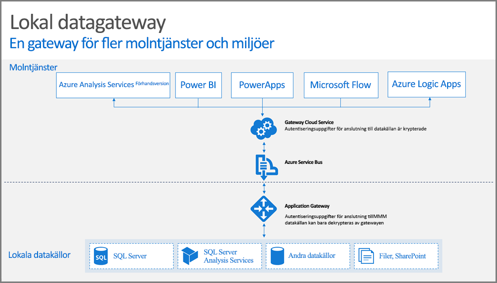

## Så här fungerar gatewayen

Först tittar vi på vad som händer när en användare interagerar med ett element som är anslutet till en lokal datakälla. 

> [!NOTE]
> För Power BI måste du konfigurera en datakälla för gatewayen.

1. Molntjänsten skapar en fråga, tillsammans med de krypterade autentiseringsuppgifterna för den lokala datakällan och skickar den till den kö som gatewayen ska bearbeta.
2. Gatewaymolntjänsten analyserar frågan och skickar en begäran till [Azure Service Bus](/azure/service-bus-messaging/service-bus-messaging-overview/).
3. Den lokala datagatewayen avsöker Azure Service Bus efter väntande begäranden.
4. Gatewayen hämtar frågan, dekrypterar autentiseringsuppgifterna och ansluter till datakällan/datakällorna med autentiseringsuppgifterna.
5. Gatewayen skickar frågan till datakällan för körning.
6. Resultaten skickas från datakällan tillbaka till gatewayen och sedan till molntjänsten. Tjänsten använder sedan resultaten.

