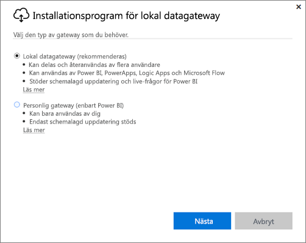
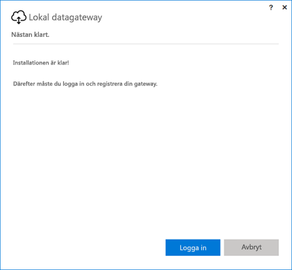
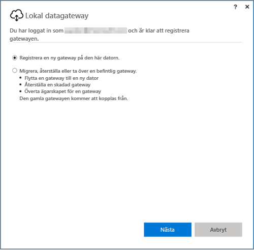
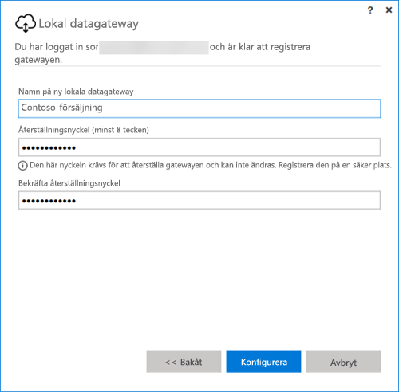

## Installera den lokala datagatewayen
Datagatewayen installeras och körs på datorn. Det är bäst att installera gatewayen på en dator som är igång hela tiden.

> [!NOTE]
> Gatewayen stöds bara på 64-bitars Windows-operativsystem.
> 
> 

Första valet du behöver göra för Power BI är vilket läge gatewayen ska ha.

* **Lokal datagateway:** Flera användare kan dela och återanvända en gateway i det här läget. Gatewayen kan användas av Power BI, PowerApps, Flow eller Logic Apps. För Power BI inkluderar detta stöd för både schemalagd uppdatering och DirectQuery
* **Personlig:** Detta gäller endast för Power BI och kan användas enskilt utan någon administratörskonfiguration. Det kan endast användas för uppdatering på begäran och schemalagd uppdatering. Det här valet startar installationen av den personliga gatewayen.

Det finns några saker att observera för installation i de två gatewaylägena:

* båda gatewayerna kräver 64-bitars Windows-operativsystem
* ingen gateway kan installeras på en domänkontrollant
* du kan installera upp till två lokala datagatewayer på samma dator, en i varje läge (personlig och standard). 
* du kan inte ha fler än en gateway som körs i samma läge på samma dator.
* du kan installera flera lokala datagatewayer på olika datorer och hantera dem från samma hanteringsgränssnitt för Power BI-gatewayen (exklusive personlig, se följande punkt)
* Du kan bara köra en gateway i personligt läge för varje Power BI-användare. Om du installerar en annan gateway i personligt läge för samma användare, även om det är på en annan dator, ersätter den senaste installationen den befintliga tidigare installationen.

Här följer några saker att tänka på innan du installerar gatewayen.

* Om du installerar på en bärbar dator och din bärbara dator är avstängd, inte ansluten till Internet eller i viloläge, fungerar inte gatewayen och data i molntjänsten kommer inte att synkroniseras med dina lokala data.
* Om din dator är ansluten till ett trådlöst nätverk kan gatewayen bli långsam, vilket gör att det tar längre tid att synkronisera data i molntjänsten med dina lokala data.

När gatewayen har installerats måste du logga in med ditt arbets- eller skolkonto.

När du är inloggad har du möjlighet att konfigurera en ny gateway eller migrera, återställa eller ta över en befintlig gateway.

## Konfigurera en ny gateway
1. Ange ett **namn** för gatewayen
2. Ange en **återställningsnyckel**. Den måste bestå av minst 8 tecken.
3. Välj **Konfigurera**.

> [!NOTE]
> Du måste ha återställningsnyckeln om du behöver migrera, återställa eller ta över en gateway. Förvara nyckeln på en säker plats.
> 
> 

### Migrera, återställa eller ta över en befintlig gateway
Du måste välja den gateway som du vill återställa och ange återställningsnyckeln som användes när gatewayen skapades.

### Ansluten lokal datagateway
När gatewayen är konfigurerad kan du använda den för att ansluta till lokala datakällor.

Om det är en gateway för Power BI måste du lägga till dina datakällor till gatewayen i Power BI-tjänsten. Detta görs i området **Hantera gatewayer**. Se artiklarna om att hantera datakällor för mer information.

För PowerApps behöver du ange en gateway för en definierad anslutning till datakällor som stöds. För Flow och Logic Apps är den här gatewayen redo att användas med dina lokala anslutningar.

