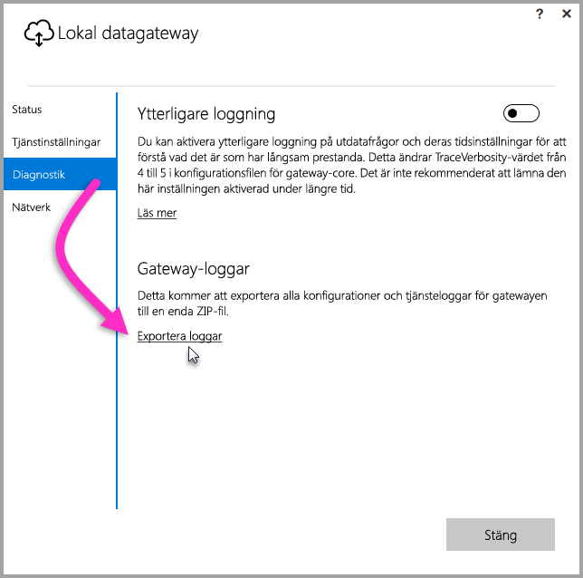
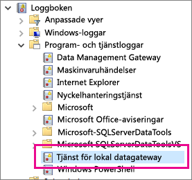

## Verktyg för felsökning
<a name="logs" />

### Samla in loggar från gatewayens konfigurator
Det finns flera loggar som du kan samla in för gatewayen och du bör alltid börja med loggarna. Det enklaste sättet att samla in loggar på när du har installerat gatewayen är via användargränssnittet. I användargränssnittet för den **lokala datagatewayen** väljer du **Diagnostik** och sedan länken **Exportloggar** längst ned på sidan, enligt följande bild.

**Installationsloggar**

    %localappdata%\Temp\On-premises_data_gateway_*.log

**Konfigurationsloggar**

    %localappdata%\Microsoft\On-premises Data Gateway\GatewayConfigurator*.log

**Tjänstloggar för lokal datagateway**

    C:\Users\PBIEgwService\AppData\Local\Microsoft\On-premises Data Gateway\Gateway*.log

### Händelseloggar
Händelseloggar för den **lokala datagatewaytjänsten** finns under **Program- och tjänstloggar**.

<a name="fiddler" />

### Fiddlerspårning
[Fiddler](http://www.telerik.com/fiddler) är ett kostnadsfritt verktyg från Telerik som övervakar HTTP-trafik.  Du kan se trafiken från och till med Power BI-tjänsten från klientdatorn. Här visas fel och annan relaterad information.

