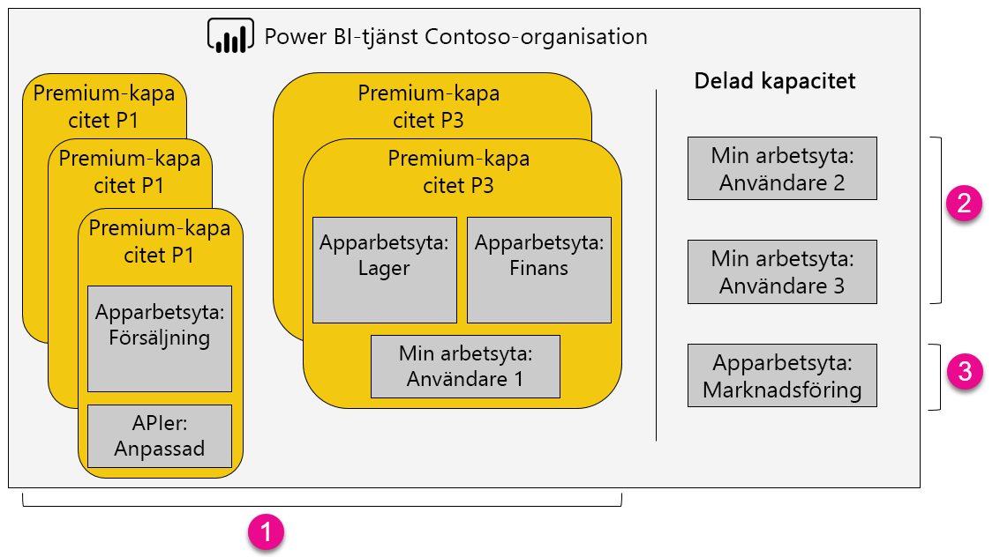

1. Objekt inom en Premium-kapacitet
   
   * Åtkomst till apparbetsytor (som medlemmar eller administratörer) och publicering av appar kräver en licens för Power BI Pro.
   * Appanvändare kan använda Power BI Pro eller den kostnadsfria versionen.
   * Delning kräver en licens för Power BI Pro men mottagarna kan vara använda Power BI Pro eller den kostnadsfria versionen.
   * Instrumentpanelsmottagare kan ställa in datavarningar, oavsett om de har en Power BI Pro-licens eller en kostnadsfri licens.
   * REST API:er för inbäddning använder ett tjänstkonto med en licens för Power BI Pro i stället för en användare.
2. Min arbetsyta, delning
   
   * Delning kräver en Pro-licens. Mottagarna behöver också Pro-licenser.
3. Apparbetsytor, delning
   
   * All appanvändning kräver Pro licenser.

