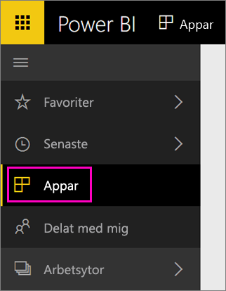

När importen är klar visas den nya appen på sidan appar.

1. Välj **Appar** i det vänstra navigeringsfönstret > välj appen.
   
     
2. Du kan ställa en fråga genom att skriva i Frågor och svar eller klicka på en panel för att öppna den underliggande rapporten. 

