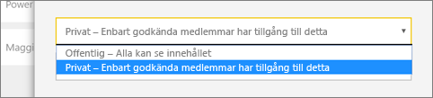
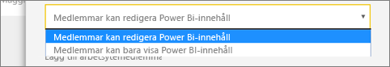
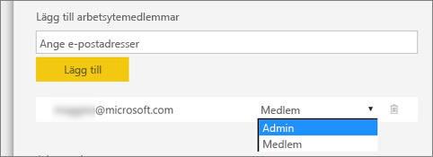

1. Börja med att skapa arbetsytan. Välj **Arbetsytor** > **Skapa arbetsyta**. 
   
     
   
    Här placerar du innehåll som du och dina kolleger arbetar tillsammans med.

2. I banderollen **som visar att du skapar en uppgraderad arbetsyta** klickar du på **Återgå till klassisk**. 

    

3. Ge arbetsytan ett namn. Om motsvarande **Arbetsyte-ID** inte är tillgängligt, kan du redigera det för att få fram ett unikt ID.
   
     Appen får samma namn.
   
     

3. Det finns ett par alternativ som du måste ställa in. Om du väljer **Offentlig** kan alla i din organisation se vad som finns på arbetsytan. Om du väljer **Privat** kan bara medlemmar i arbetsytan se innehållet.
   
     
   
    Du kan inte ändra inställningen för Offentlig/Privat när du har skapat gruppen.

4. Du kan också välja om medlemmarna ska kunna **redigera** eller ha **skrivskyddad** åtkomst.
   
     
   
     Lägg endast till personer i arbetsytan som ska kunna redigera innehållet. Om de endast ska kunna se innehållet behöver du inte lägga till dem i arbetsytan. Du kan inkludera dem när du publicerar appen.

5. Lägg till e-postadresserna för de personer som du vill ska ha åtkomst till arbetsytan och välj **Lägg till**. Du kan inte lägga till gruppalias, bara enskilda användare.

6. Bestäm för varje person om den vara medlem eller administratör.
   
     
   
    Administratörer kan redigera arbetsytan samt lägga till andra medlemmar. Medlemmar kan redigera innehållet i arbetsytan, såvida de inte har skrivskyddad åtkomst. Både administratörer och medlemmar kan publicera appen.

7. Välj **Spara**.

Power BI skapar arbetsytan och öppnar den. Den visas i listan med arbetsytor som du är medlem i. Eftersom du är administratör kan du välja **Fler alternativ** (...) för att gå tillbaka och göra ändringar, lägga till nya medlemmar eller ändra deras behörigheter.

