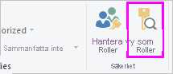
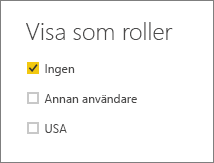
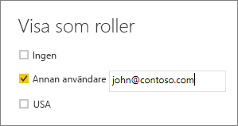

## Verifiera rollerna i Power BI Desktop
När du har skapat rollerna kan du testa rollresultaten i Power BI Desktop.

1. Välj **Visa som roller**. 

    

    Du kan se roller som du har skapat i **Visa som roller**.

    

3. Välj en roll som du har skapat > **OK** för att tillämpa rollen. Rapporterna återger de data som är relevanta för rollen. 

4. Du kan också välja **Annan användare** och ange en viss användare. Det är bäst att ange användarens huvudnamn (UPN), eftersom det är det som Power BI-tjänsten och Power BI-rapportservern använder.

    

1. När du väljer **OK** renderas rapporterna baserat på vad användaren kan se. 

I Power BI Desktop visas endast **Other user** (Annan användare) olika resultat om du använder dynamisk säkerhet som baseras på DAX-uttryck. 

