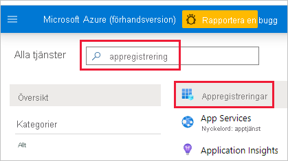
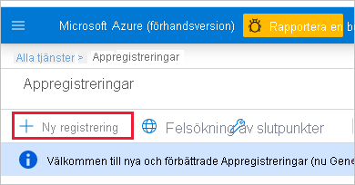

1. Logga in på [Microsoft Azure](https://ms.portal.azure.com/#allservices).

2. Sök efter **Appregistreringar** och klicka på länken **Appregistreringar**.

    

3. Klicka **Ny registrering**.

    

4. Fyll i nödvändig information:
    * **Namn** – Ange ett namn för ditt program
    * **Kontotyper som stöds** – Välj kontotyper som stöds
    * (Valfritt) **Omdirigerings-URI** – ange en URI om det behövs

5. Klicka på **Registrera**.

6. Efter registreringen är *Program-ID* tillgängligt på fliken **Översikt**. Kopiera och spara *Program-ID* för senare användning.

    