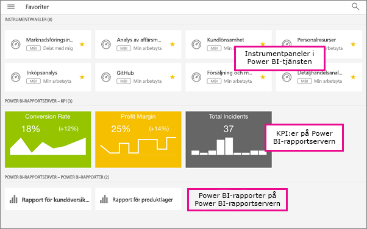

# Skapa och visa favoriter i Power BI-mobilappar
Gäller för:

|  |  |  |  |  |
|:--- |:--- |:--- |:--- |:--- |
| iPhone-telefoner |iPad-surfplattor |Android-telefoner |Android-surfplattor |Windows 10-enheter |

Läs om hur du kan skapa och visa dina Power BI-favoritinstrumentpaneler, rapporter och appar, tillsammans med dina lokala Power BI-rapportserver- och Reporting Services-KPI:er och rapporter i mobilappar.

När du skapar en favorit i Power BI-mobilappar visas den på sidan Favoriter i Power BI-tjänsten ([https://powerbi.com](https://powerbi.com)) och alla dina mobila enheter. 

Du kan också [göra Power BI-instrumentpaneler och appar till favoriter i Power BI-tjänsten](service-dashboard-favorite.md). Då visas de på sidan Favoriter i mobilappen.

Du kan markera KPI:er och rapporter som favoriter i en webbportal för Power BI-rapportserver eller Reporting Services, och sedan visa dem i en lämplig mapp på din mobila enhet, tillsammans med dina Power BI-favoritinstrumentpaneler.

## Visa dina Power BI-favoriter
* Tryck på den översta  och sedan på **Favoriter**.
  
  
  
  Alla dina favoriter visas tillsammans på den här sidan:
  
  

## Göra en app till en favorit
1. Tryck på (...) bredvid appen i listan över appar i mobilappen > **Favorit**.
   
    
   
    Nu visas den med dina andra instrumentpanels- och appfavoriter.
   
    

## Gör en instrumentpanel eller rapport till en favorit i iOS- och Windows 10-mobilappar
Du kan göra en Power BI-instrumentpanel eller rapport till en favorit från listan med instrumentpaneler eller rapporter från själva instrumentpanelen eller rapporten i sig.

* Tryck på den tomma stjärnan bredvid namnet i listan över instrumentpaneler eller rapporter i mobilappen . Stjärnan blir gul .
  
    
* Tryck på den tomma stjärnan i instrumentpanelens eller rapportens menyfliksområde . Stjärnan blir gul .
  
    

## Gör en instrumentpanel eller rapport till en favorit i Android-mobilappar
Du kan göra en instrumentpanel eller rapport till en favorit från listan med instrumentpaneler eller rapporter från själva instrumentpanelen eller rapporten i sig.

* Tryck på den vertikala ellipsen (...) intill namnet i listan över instrumentpaneler eller rapporter i mobilappen, och tryck sedan på **Favorit**. En gul stjärna visas intill namnet .
  
    
* Tryck på den tomma stjärnan i instrumentpanelens eller rapportens menyfliksområde . Stjärnan blir mörkgrå .
  
    

## Gör Power BI-rapportserver- och Reporting Services-rapporter och KPI:er till favoriter
Du kan visa dina Power BI-rapportserver- och Reporting Services-favoritrapporter och KPI:er i Power BI-mobilappar, men du kan inte göra dem till favoriter i mobilapparna. Du [tagga dem som favoriter i webbportalen](report-server/getting-around.md#tag-your-favorite-reports-and-kpis). 

## Nästa steg
* [Favoritinstrumentpaneler i Power BI-tjänsten](service-dashboard-favorite.md) 
* Har du några frågor? [Fråga Power BI Community](http://community.powerbi.com/)

