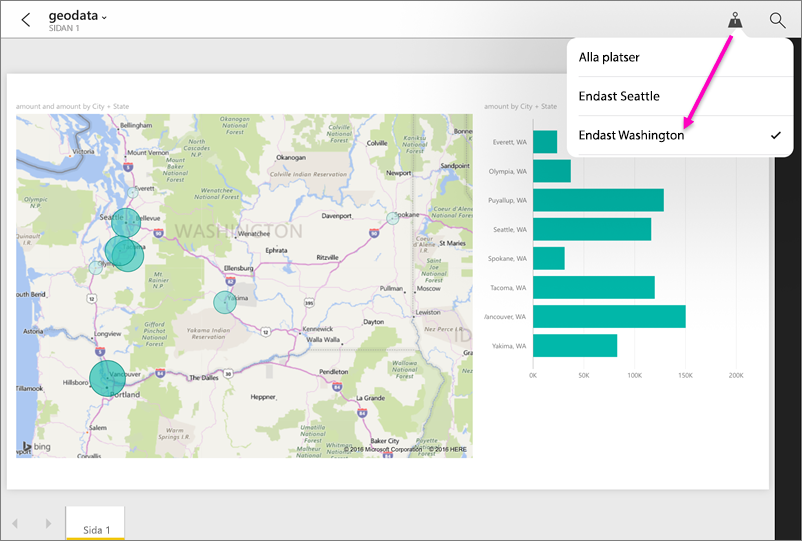

# Filtrera en rapport efter geografisk plats i Power BI-mobilappar
Gäller:

|  |  |  |  |  |
|:--- |:--- |:--- |:--- |:--- |
| iPhone-telefoner |iPad-surfplattor |Android-telefoner |Android-surfplattor |Windows 10-telefoner |

Ser du en liten kartnålsikon i det övre högra hörnet när du tittar på en Power BI-rapport på din mobila enhet? I så fall kan du filtrera rapporten baserat på var du befinner dig.

> [!NOTE]
> Du kan bara filtrera efter plats om geografiska namn i rapporten är på engelska, t.ex. New York City eller Germany. Windows 10-surfplattor och datorer stöder inte geografisk filtrering, men det gör Windows 10-telefoner.
> 
> 

## Filtrera din rapport efter geografisk plats
1. Öppna en rapport i Power BI-mobilappen på din mobila enhet.
2. Om rapporten innehåller geografiska data visas ett meddelande där Power BI ber dig om åtkomst till din plats. Klicka på **Tillåt**, och tryck sedan på **Tillåt** igen.
3. Tryck på kartnålen . Du kan filtrera efter ort, region eller land/region, beroende på rapportens data. Filtret innehåller endast alternativ som matchar din aktuella plats.
   
    

## Varför ser jag inga platstaggar i rapporten?
Alla följande tre villkor måste vara uppfyllda för att du ska kunna se platstaggar. 

* Den person som skapade rapporten i Power BI Desktop [kategoriserade geografiska data](desktop-mobile-geofiltering.md) för minst en kolumn, t.ex. City, State eller Country/Region.
* Du befinner dig på en av de platser som har data i den kolumnen.
* Du använder någon av följande mobila enheter:
  * iOS (iPad, iPhone, iPod).
  * Android-telefon eller surfplatta.
  * Windows 10-telefon (andra Windows 10-enheter, t.ex. stationära datorer och surfplattor stöder inte geografisk filtrering).

Läs mer om [Konfigurera geografiskt filtrering](desktop-mobile-geofiltering.md) i Power BI Desktop.

### Nästa steg
* [Ansluta till Power BI-data från verkligheten](mobile-apps-data-in-real-world-context.md) med mobilapparna
* [Datakategorisering i Power BI Desktop](desktop-data-categorization.md) 
* Har du några frågor? [Fråga Power BI Community](http://community.powerbi.com/)

