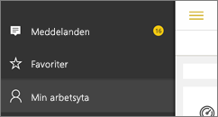

# Få aviseringar i Power BI-mobilapparna
Gäller:

|  |  |  |  |  |
|:--- |:--- |:--- |:--- |:--- |
| iPhone-telefoner |iPad-surfplattor |Android-telefoner |Android-surfplattor |Windows 10-enheter |

Meddelanden ger dig information som rör din Power BI-användning direkt i Power BI-tjänsten eller på din mobila enhet. När du öppnar Meddelanden visas ett sekventiellt flöde av meddelanden om [aviseringar som du har ställt in](mobile-set-data-alerts-in-the-mobile-apps.md), nya instrumentpaneler har delats med dig, ändringar i din grupparbetsyta, information om Power BI-händelser och -möten med mera.

> [!NOTE]
> Första gången som du loggar in på den [uppdaterade version av Power BI-apparna](https://powerbi.microsoft.com/mobile/) på en iOS-enhet, så visas ett meddelande som frågar om du vill att Power BI ska skicka dig meddelanden. Du kan också konfigurera hur Power BI meddelar dig i **Inställningar** för din enhet. 
> 
> 

## Visa meddelanden på din mobila enhet
1. När du tar emot meddelanden på din mobila enhet så avger Power BI ett ljud och visar en meddelandebanderoll som standard.
   
   
   
   Eller på en iPad:
   
   
   
   Du kan [ändra hur Power BI meddelar dig](mobile-apps-notification-center.md#change-or-turn-off-notifications-on-your-mobile-device).
2. Om du har fått meddelanden när du loggar in till Power BI på din mobila enhet visas en gul punkt på den globala navigeringsknappen  (Android) eller på ikonen **Meddelanden**. 
   
   
3. Välj meddelandeikonen  (Windows 10).
   
    Meddelandena visas med de senaste överst, och olästa meddelanden är markerade. Meddelanden behålls under 90 dagar, såvida du inte tar bort dem eller når maxgränsen på 100.
   
   
4. Om du vill ignorera en avisering, så tryck på och håll kvar den och välj **Ignorera**.

## Ändra eller stäng av meddelanden på din mobila enhet
Du kan ändra hur du får meddelanden i Power BI.

1. Gå till **Inställningar** > **Meddelanden** på en iOS-enhet. 
   
    Gå till **Meddelandeinställningar** på en Android-telefon.
   
    Gå till **System** > **Meddelanden och åtgärder** i **Inställningar** på en Windows-enhet.
2. Välj **Power BI** i listan med appar. 
3. Här kan du stänga av meddelanden helt och hållet, eller ange vilka meddelanden du vill ha.
   
    **På en iPhone**
   
    
   
    **På en Android-telefon**
   
    

    **På en Windows 10-enhet**

    

## Nästa steg
* [Dataaviseringar i Power BI-tjänsten](service-set-data-alerts.md)
* [Ställ in dataaviseringar i iPhone-appen (Power BI för iOS)](mobile-set-data-alerts-in-the-mobile-apps.md)
* [Ställ in dataaviseringar i Power BI-mobilappen för Windows 10](mobile-set-data-alerts-in-the-mobile-apps.md)
* [Hämta den senaste versionen av Power BI-apparna](https://powerbi.microsoft.com/mobile/) för mobila enheter

