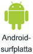

# Dela en instrumentpanel eller rapport från Power BI-mobilapparna
Gäller för:

|  |  |  |  |  |
|:--- |:--- |:--- |:--- |:--- |
| iPhone-telefoner |iPad-surfplattor |Android-telefoner |Android-surfplattor |Windows 10-enheter |

Med en [Power BI Pro-licens](service-free-vs-pro.md) kan du bjuda in andra att visa dina instrumentpaneler och rapporter genom att dela länkar från Power BI-mobilapparna. Du kan dela med vem som helst, inom eller utanför din organisation, och med eller utan ett e-postkonto som tillhör företaget. De måste även ha en Power BI Pro-licens, eller så måste innehållet finnas i en [Premium-kapacitet](service-premium.md).

Du kan [kommentera på eller lägga till en ögonblicksbild i en panel, rapport eller visualisering](mobile-annotate-and-share-a-tile-from-the-mobile-apps.md) och sedan dela den med vem som helst med hjälp av Power BI-mobilapparna för iOS- och Android-enheter. 

## Dela från din iPhone
1. Klicka på ikonen **Dela**  i aktivitetsfältet längst ner på instrumentpanelen eller i rapporten.
   
   
2. Ange namn, avgränsade med komman, och ett meddelande som medföljer din inbjudan.
3. Om du vill tillåta omdelning låter du **Tillåt mottagare att dela vidare** vara markerad.
   
   Med omdelning kan dina kollegor vidarebefordra din e-postinbjudan till andra i din organisation, antingen via webben eller mobila appar.
5. Tryck på **Skicka** i det övre högra hörnet.
   
   Mottagarna får en e-postinbjudan med en direktlänk till instrumentpanelen eller rapporten. Inbjudan upphör att gälla efter en månad. När de öppnar den i en webbläsare eller Power BI-mobilappen, läggs den till i området **Delas med mig** i deras Power BI-konto.
   
   
   
   Läs mer [information om att dela med dina kollegor](service-share-dashboards.md).

### Sluta dela från din iPhone
Du kan bara avsluta delningen om du är ägaren.

1. Klicka på ikonen **Dela**  i aktivitetsfältet längst ner på instrumentpanelen eller i rapporten.
2. Peka på **Bjud in en kollega**.
   
   Du kan se en lista över kollegor med vilka du har delat den här instrumentpanelen eller rapporten med dessa fraser:
   
   * **Kan visa**: De kan visa men inte dela.
   * **Kan visa och bjuda in**: De kan visa och dela med kollegor.
1. Tryck på **Redigera**.
   
    
4. För att ta bort delningen, tryck på den röda cirkeln bredvid ett namn och tryck på **Ta bort**.

## Dela från din iPad
1. Tryck på ikonen **Dela**  högst upp till höger på instrumentpanelen eller i rapporten.
2. Skriv e-postadresser och ett meddelande som medföljer din inbjudan.
3. Om du vill tillåta omdelning låter du **Tillåt mottagare att dela vidare** vara markerad.
   
   Med omdelning kan dina kollegor vidarebefordra din e-postinbjudan till andra i din organisation, antingen via webben eller mobila appar. 

4. Tryck på **Skicka** i det övre högra hörnet.
   
   Mottagarna får en e-postinbjudan med en direktlänk till instrumentpanelen eller rapporten. Inbjudan upphör att gälla efter en månad. När de öppnar den i en webbläsare eller Power BI-mobilappen, läggs den till i området **Delat med mig** i deras Power BI-konto
   
   
   
   Läs mer [information om att dela med dina kollegor](service-share-dashboards.md).

### Sluta dela från din iPad
Du kan bara avsluta delningen om du är ägaren.

1. Tryck på ikonen **Dela** högst upp till höger på instrumentpanelen eller i rapporten.
   
   Du kan se en lista över kollegor med vilka du har delat den här instrumentpanelen eller rapporten med dessa fraser:
   
   * **Kan visa**: De kan visa men inte dela.
   * **Kan visa och bjuda in**: De kan visa och dela med kollegor.
2. Tryck på **Redigera**.
3. För att ta bort delningen, tryck på den röda cirkeln bredvid ett namn och tryck på **Ta bort**.

## Dela från din Android-enhet
1. På startsidan för instrumentpaneler eller rapporter trycker du på ellipsen (...) och på **Bjud in en kollega**.
   
   
2. Eller tryck på inbjudningsikonen på en instrumentpanel eller i en rapport .

    Om du äger instrumentpanelen kan du se en lista över kollegor med vilka du har delat den här instrumentpanelen eller rapporten med dessa anteckningar:

    -   **Kan visa**: De kan visa men inte dela.
    -   **Kan visa och bjuda in**: De kan visa och dela med kollegor.

1. Skriv e-postadresser och ett meddelande som medföljer din instrumentpanelinbjudan. Annars skickar Power BI ett standardmeddelande.
2. Om du vill tillåta omdelning låter du **Tillåt mottagarna att dela den här instrumentpanelen** vara markerad.
   
   Med omdelning kan dina kollegor vidarebefordra din e-postinbjudan till andra i din organisation, antingen via webläsare eller mobila appar.
   
1. Tryck på ikonen **Skicka** i det övre högra hörnet för att skicka e-postmeddelandet.
   
   Mottagarna får en e-postinbjudan med en direktlänk till instrumentpanelen. Inbjudan upphör att gälla efter en månad. När de öppnar den i en webbläsare eller Power BI-mobilappen, läggs den till i området **Delat med mig** i deras Power BI-konto
   
   
   
   Läs mer [information om att dela instrumentpaneler med dina kollegor](service-share-dashboards.md).

### Sluta dela från din Android-enhet
Du kan bara avsluta delningen om du är ägaren.

1. Tryck på ikonen för inbjudan i det övre högra hörnet på en instrumentpanel eller i en rapport . 
   
   Du kan se en lista över kollegor med vilka du har delat den här instrumentpanelen eller rapporten.
2. Om du vill sluta dela med en kollega trycker du på **X** bredvid namnet \> **Ta bort**.

## Dela från din Windows 10-enhet
1. På en instrumentpanel eller i en rapport trycker du på ikonen för inbjudan .
   
   Eller högerklicka, eller tryck och håll kvar, och tryck på **Bjud in** på instrumentpanelens eller rapportens startsida.
   
   
   
   Om du äger instrumentpanelen kan du se en lista över kollegor med vilka du har delat den här instrumentpanelen med dessa anteckningar:
   
   **Kan visa**: De kan visa men inte dela.
   
   **Kan visa och bjuda in**: De kan visa och dela med kollegor.
2. Skriv e-postadresser och ett meddelande som medföljer din inbjudan. Annars skickar Power BI ett standardmeddelande.
   
   
3. Om du vill tillåta omdelning låter du **Tillåt mottagare att dela vidare** vara markerad.
   
   Med omdelning kan dina kollegor dela med andra i din organisation, antingen via webbläsaren eller mobilapparna.
   
1. Tryck på ikonen **Skicka** .
   
   Mottagarna får en e-postinbjudan med en direktlänk till instrumentpanelen eller rapporten. Inbjudan upphör att gälla efter en månad. När de öppnar den i en webbläsare eller Power BI-mobilappen, läggs den till i området **Delat med mig** i deras Power BI-konto
   
   
   
   Läs mer [information om att dela med dina kollegor](service-share-dashboards.md).

## Nästa steg
* [Lägga till anteckningar och dela ögonblicksbild av en panel, en rapport eller ett visuellt objekt i mobilapparna](mobile-annotate-and-share-a-tile-from-the-mobile-apps.md)
* [Dela en instrumentpanel eller rapport i Power BI](service-share-dashboards.md)
* Har du några frågor? [Fråga Power BI Community](http://community.powerbi.com/)

