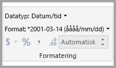
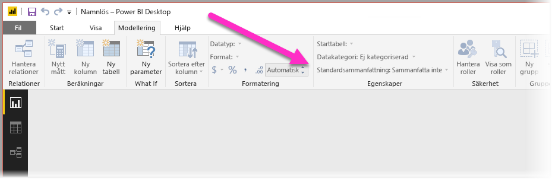
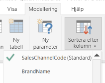

# Metodtips för att optimera Frågor och svar i Power BI
Användning av vanliga fraser och naturligt språk för att ställa frågor till dina data är kraftfullt. Det är ännu mer kraftfullt när dina data svarar, vilket är precis vad du kan åstadkomma med Frågor och svar i Power BI.

Om du vill aktivera frågor och svar för att tolka det stora antal frågor som denna funktion kan svara på måste frågor och svar göra antaganden om modellen. Om strukturen för din modell inte uppfyller ett eller flera av dessa antaganden behöver du justera modellen. Dessa justeringar för frågor och svar har samma metodtips för optimeringarna för alla modeller i Power BI, oavsett om du använder frågor och svar eller inte.

I följande avsnitt beskrivs hur du ändrar modellen så att den fungerar bra med frågor och svar i Power BI.

## Automatiska justeringar i Frågor och svar

### Måttabeller

I tidigare versioner av Frågor och svar kunde måttabeller förvirra verktyget när den underliggande tabellen kopplades bort. Nu fungerar måttabeller bra i Frågor och svar.

### Tabellnamn som står i konflikt med kolumnnamn

I tidigare versioner av Frågor och svar skulle tabellen ha företräde om en tabell och en kolumn hade samma namn. Det här problemet har åtgärdats, så du behöver inte åtgärda det här problemet i dina modeller längre.

## Manuella steg för att förbättra Frågor och svar

### Använd de nya verktygen i Frågor och svar till att rätta till dina frågor

Med verktygen i Frågor och svar kan du lära tjänsten de centrala begreppen i din verksamhet och rätta till de frågor som slutanvändarna ställer. Ibland går det inte att besvara vissa frågor eftersom data har fel format eller saknas. I så fall kan du få optimeringshjälp i avsnitten nedan. Läs mer om [verktygen i Frågor och svar](q-and-a-tooling-intro.md).

## Lägg till saknade relationer

Om din modell saknar relationer mellan tabeller kan varken Power BI-rapporter eller Frågor och svar tolka hur du tabellerna ska kopplas. Relationer är hörnstenen i en bra modell. Du kan till exempel inte fråga om ”total försäljning för Seattle-kunder” om relationen mellan tabellen *orders* och tabellen *customers* saknas. I de här bilderna ser du en modell som behöver bearbetas och en modell som är redo för frågor och svar. 

**Behöver bearbetas**

I den första bilden finns det inga relationer mellan tabellerna Customers, Sales och Products.

**Redo för frågor och svar**

I den första bilden definieras relationer mellan tabellerna.

## Byt namn på tabeller och kolumner

Valet av tabeller och kolumner är viktigt för frågor och svar. Anta exempelvis att du har en tabell med namnet *Kundsammanfattning* som innehåller en lista över dina kunder. Du skulle behöva ställa frågor som ”Lista kundsammanfattningarna i Chicago” i stället för ”Lista kunderna i Chicago”. 

Även om Frågor och svar kan utföra vissa grundläggande radbrytningar och identifiera plural, så förutsätter Frågor och svar att tabell- och kolumnnamn återger innehållet korrekt.

Överväg ett annat exempel. Anta att du har en tabell med namnet *Personalstyrka* som innehåller för- och efternamn och antal anställda. Du har en annan tabell med namnet *Anställda* som innehåller antal anställda, antal arbeten och olika startdatum. Människor som är bekanta med modellen kan förstå strukturen. Någon annan som ställer frågan ”Räkna antal anställda” kommer att få en sammanräkning av raderna i tabellen ”Anställda”. Resultatet är förmodligen inte vad de hade i åtanke, eftersom det är en uppräkning av alla jobb som varje anställd någonsin har haft. Det skulle vara bättre att byta namn på dessa tabeller för att verkligen återspegla vad de innehåller.

**Behöver bearbetas**

Tabellnamn som *StoreInfo* och *Product List* behöver ändras.

**Redo för frågor och svar**

Tabeller med namnen *Store* och *Products* fungerar bättre.

## Åtgärda felaktiga datatyper

Importerade data kan ha felaktiga datatyper. I synnerhet kommer kolumner för *datum* och *antal* som importeras som *strängar* inte att tolkas av frågor och svar som datum och antal. Kontrollera att du väljer rätt datatyp i Power BI-modellen.

## Markera kolumnerna för år och identifierare som Sammanfatta inte

Power BI aggregerar aggressivt numeriska kolumner som standard, så frågor som ”total försäljning per år” kan ibland resultera i en totalsumma för försäljning tillsammans med en totalsumma av år. Om du har specifika kolumner där du inte vill att Power BI ska fungera så här ställer du in egenskapen **Standardsammanfattning** för kolumnen till **Sammanfatta inte**. Beakta också kolumnerna **år**, **månad**, **dag**, och **ID** eftersom dessa kolumner är de vanligaste problemen. För andra kolumner som inte heller är lämpliga att summera, som *ålder*, kan du också ändra **Standardsammanfattning** till **Sammanfatta inte** eller **Medelvärde**. Du hittar den här inställningen under fliken **Modellering**.

## Välj en datakategori för varje kolumn med datum och geografisk plats

**Datakategorin** ger ytterligare semantisk kunskap om innehållet i en kolumn utöver dess datatyp. Du kan till exempel markera en heltalskolumn som postnummer, en strängkolumn som en stad, land/region och så vidare. Den här informationen används på två viktiga sätt i Frågor och svar: för visualiseringsval och för språkavvikelser.

Först måste frågor och svar använda informationen i **datakategorin** för att fatta beslut om vilken typ av visuell information som ska användas. Exempelvis identifieras att **Datakategorier** med datum och tid vanligtvis är ett bra alternativ för linjediagrammets horisontella axel eller bubbeldiagrammets uppspelningsaxel. Och det förutsätter att resultat som innehåller kolumner med geografiska **Datakategorier** kan se bra ut på en karta.

Härnäst gör frågor och svar vissa kvalificerade gissningar om hur användare kan komma att prata om kolumner för datum och geografisk plats för att få hjälp att förstå vissa typer av frågor. Till exempel kommer ”när” i ”när anställdes John Smith?” nästan helt säkert att kartlägga en datumkolumn, och ”Brown” i ”antal kunder i Brown” är mer troligt en stad än en hårfärg.

## Välj Sortera efter kolumn för relevanta kolumner

Egenskapen **Sortera efter kolumn** gör att sorteringen i en kolumn automatiskt görs enligt en annan kolumn istället. När du till exempel begär ”sortera kunder efter skjortstorlek” vill du förmodligen att kolumnerna för skjortstorlek ska sorteras enligt storlek (XS, S, M, L, XL) i stället för i alfabetisk ordning (L, M, S, XL, XS).

## Normalisera din modell

Du behöver inte oroa dig för att vi menar att du ska omforma hela din modell. Dock är vissa strukturer så svåra att frågor och svar inte kan hantera dem bra. Om du utför viss grundläggande normalisering av din modells struktur blir Power BI-rapporterna mycket mer användbara, och även tillförlitligheten hos dina Frågor och svar-resultat.

Följ den här allmänna regeln: Varje unik ”sak” som användaren pratar om ska representeras av exakt ett modellobjekt (tabell eller kolumn). Så om användarna pratar om kunder, bör det finnas ett objekt för *kunder*. Och om användarna pratar om försäljning, bör det finnas ett objekt för *försäljning*. Det låter enkelt, eller hur? Beroende på vilken form av data du startar med kan det vara det. Det finns funktioner för bearbetning av innehållsrika data tillgängliga i **Frågeredigeraren** om du behöver dem, även om många av de enklare omvandlingarna kan göras genom att använda beräkningar i Power BI-modellen.

Följande avsnitt innehåller vissa vanliga transformationer som du kan behöva utföra.

### Skapa nya tabeller för flera kolumentiteter

Om du har flera kolumner som fungerar som en distinkt enhet i en större tabell ska dessa kolumner delas upp i sin egen tabell. Anta som exempel att du har en kolumn för Kontaktnamn, Kontakts titel och Kontakts telefonnummer i en tabell med namnet *Företag*. En bättre utformning skulle vara att ha en separat *Kontakter*-tabell som innehåller Namn, Titel och Telefon och en länk tillbaka till tabellen *Företag*. Det gör det enklare att ställa frågor om kontakter oberoende av frågor om vilka företag de är kontakt för, vilket ger bättre flexibilitet för visning.

**Behöver bearbetas**

**Redo för frågor och svar**

### Pivotera för att eliminera egenskapsuppsättningar

Om du har *egenskapsuppsättningar* i din modell bör de omstruktureras så att du har en kolumn per egenskap. Egenskapsuppsättningar har, även om de är praktiska för att hantera stora antal egenskaper, ett stort antal inneboende begränsningarna som varken Power BI-rapporter eller frågor och svar är utformade för att kringgå.

Anta till exempel att du har tabellen *CustomerDemographics* med kolumnerna KundID, Egenskap och Värde, där varje rad motsvarar en viss egenskap hos kunden (till exempel, ålder, civilstånd, stad och så vidare). Genom att överbelasta betydelsen av kolumnen Värde baserat på innehållet i kolumnen Egenskap, blir det omöjligt för frågor och svar att tolka de flesta frågorna som refererar till den. En enkel fråga som ”Visa ålder på varje kund” kanske kan fungera eftersom den kan tolkas som ”visa kunder och kunddemografi där egenskapen är ålder”. Men strukturen för modellen stöder helt enkelt inte något mer komplexa frågor som ”genomsnittlig ålder på kunder i Chicago”. Användare som skapar Power BI-rapporter direkt kan ibland hitta smarta sätt att hämta data för det de letar efter, medan frågor och svar bara fungerar när varje kolumn endast innehåller en enda betydelse.

**Behöver bearbetas**

**Redo för frågor och svar**

### Förena för att eliminera partitionering

Om du har partitionerat data i flera tabeller, eller har pivoterat värden i flera kolumner, kommer ett antal vanliga åtgärder vara svåra eller omöjliga för användarna att utföra. Överväg först en typisk tabellpartitionering: en *Försäljning2000–2010*-tabell och en *Försäljning2011–2020*-tabell. Om alla viktig rapporter är begränsade till ett specifikt årtionde kan du förmodligen lämna den så här för Power BI-rapporter. Dock gör flexibiliteten i Frågor och svar att användarna förväntar sig svar på frågor som ”total försäljning per år”. För att den här frågan ska fungera behöver du förena dina data till en enda Power BI-modelltabell.

På samma sätt kan du överväga ett vanligt pivoterat värde: en *BookTour*-tabell som innehåller kolumnerna Författare, Bok, Ort1, Stad2 och Stad3. Med en struktur som denna kan inte ens enkla frågor som ”antal böcker per ort” tolkas korrekt. För att den här frågan ska fungera skapar du en separat *BookTourCities*-tabell som förenar stadsvärdena i en enda kolumn.

**Behöver bearbetas**

**Redo för frågor och svar**

### Dela upp formaterade kolumner

Om källan som du importerar data från innehåller formaterade kolumner kommer inte Power BI-rapporter (eller Frågor och svar) åt och kan tolka kolumnens innehåll. Om du har en kolumn för **Fullständig adress** som innehåller adress, ort och land bör du också dela upp den i kolumner med Adress, Ort och Land så att användarna kan ställa frågor mot dem individuellt.

**Behöver bearbetas**

**Redo för frågor och svar**

Om du har kolumner med en persons fullständiga namn ska du på samma sätt lägga till kolumner för **Förnamn** och **Efternamn**, om någon vill ställa frågor med delar av namnet. 

### Skapa nya tabeller för flera kolumner med flera värden

En liknande situation är om källan du importerar data från innehåller kolumner med flera värden, då kommer inte heller Power BI-rapporter (eller Frågor och svar) åt och kan tolka kolumnens innehåll. Så om du till exempel har en kolumn för Kompositör som innehåller namnen på flera kompositörer för en låt, bör du dela upp den i flera rader i en separat tabell för *Kompositörer*.

**Behöver bearbetas**

**Redo för frågor och svar**

### Avnormalisera för att ta bort inaktiva relationer

Det enda undantaget från regeln ”normalisering är bättre” inträffar när det finns fler än en väg att gå från en tabell till en annan. Om du till exempel har en tabell med namnet *Flyg* och kolumnerna KällStadID och MålStadID som är relaterade till tabellen *Städer*, En av dessa relationer måste markeras som inaktiv. Eftersom frågor och svar endast kan använda aktiva relationer, kan du inte ställa frågor om antingen källan eller målet, beroende på vilket du har valt. Om du i stället avnormaliserar kolumner med stadsnamn i tabellen *Flyg*, kan du ställa frågor som: ”Ange flyg för imorgon med källstad Seattle och målstad San Francisco”.

**Behöver bearbetas**

**Redo för frågor och svar**

### Lägg till synonymer i tabeller och kolumner

Det här steget gäller specifikt för frågor och svar (och inte för Power BI-rapporter i allmänhet). Användare har ofta en mängd olika termer som de använder för att referera till samma sak, till exempel total försäljning, nettoförsäljning, total nettoförsäljning. Du kan lägga till de här synonymerna i tabeller och kolumner i Power BI-modellen. 

Det här steget kan vara viktigt. Även om tabeller och kolumner heter enkla saker kan de som använder Frågor och svar ställa frågor på sitt eget sätt. De väljer inte från en fördefinierad lista med kolumner. Ju bättre synonymer du lägger till desto bättre blir användarnas upplevelse av rapporten. Om du vill lägga till synonymer i Power BI Desktop går du till modellvyn, väljer fliken Modellering och väljer sedan ett fält eller en tabell. Du kan lägga till synonymer i rutan **Synonymer** i fönstret Egenskaper.

 Var försiktig när du lägger till synonymer. Om du lägger till samma synonym för fler än en kolumn eller tabell uppstår tvetydighet. Om det är möjligt använder Frågor och svar kontexten till att välja mellan tvetydiga synonymer, men alla frågor har inte tillräcklig kontext. Om du till exempel har tre saker med synonymen ”kund” i din modell och användaren ställer frågan ”antal kunder” kanske svaret inte blir som förväntat. Kontrollera i dessa fall att den primära synonymen är unik, eftersom det är den som används i omformuleringen. Den kan göra användaren uppmärksam på tvetydigheten (till exempel en omformulering ”visa antalet arkiverade kundposter”), och antyda att hen kanske vill ställa frågan annorlunda.
