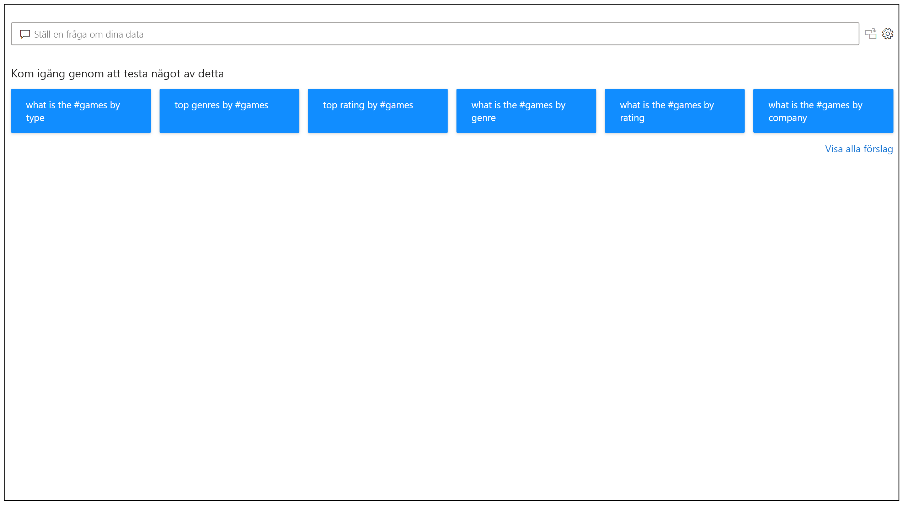
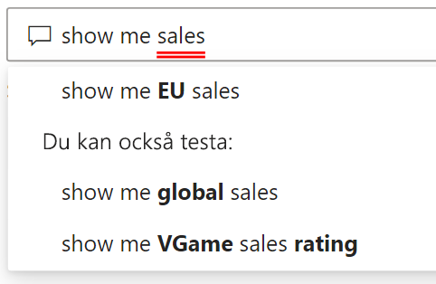
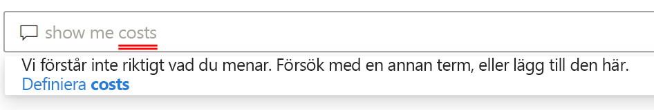
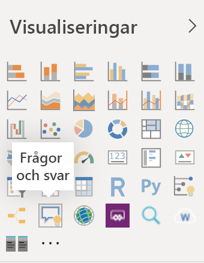
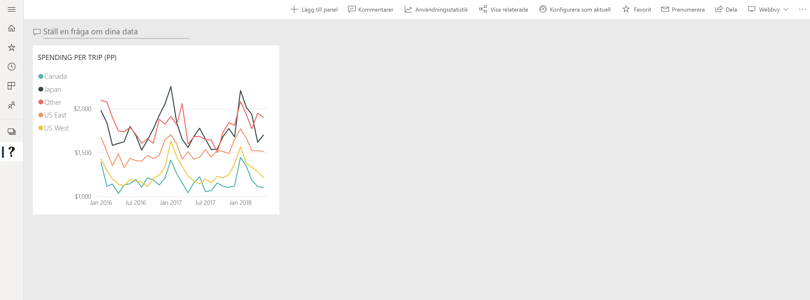

# Introduktion till Power BI Frågor och svar

Ibland är det snabbaste sättet att få svar från dina data att söka med hjälp av naturligt språk. Med funktionen Frågor och svar i Power BI kan du utforska dina data med egna ord på naturligt språk. Frågor och svar är både interaktivt och roligt att använda. En fråga leder ofta till en annan när visualiseringarna avslöjar intressanta ledtrådar. Att ställa frågan är bara början. Ta dig fram genom dina data och förfina eller utöka din fråga. Hitta ny information och gå till botten med information, eller zooma ut för att få överblick. Den här funktionen är interaktiv och snabb, och den bygger på minnesintern lagring. 

Power BI Frågor och svar är kostnadsfritt och tillgängligt för alla användare. Rapportdesigners i Power BI Desktop kan använda Frågor och svar till att utforska data och skapa visualiseringar. I Power BI-tjänsten kan alla använda Frågor och svar till att utforska sina data. Våra mobilappar har stöd för Frågor och svar, med en virtuell assistent i iOS och ett visuellt objekt på Android-enheter. Om du har behörighet att redigera en instrumentpanel eller rapport kan du även fästa resultat från Frågor och svar.

## Så här använder du Frågor och svar

Innan du ens börjar skriva, visar frågor och svar en ny skärm med förslag för att hjälpa dig formulera din fråga. Börja antingen med någon av de föreslagna frågorna eller skriv egna frågor. Frågor och svar har stöd för en mängd olika frågor. Här är några exempel:

- **Ställ naturliga frågor** Vilken försäljning har störst intäkter?
- **Använd relativ datumfiltrering** Visa försäljningen ett år bakåt i tiden
- **Returnera endast de N översta** De 10 främsta produkterna efter försäljning
- **Ange ett filter** Visa försäljningen i USA
- **Ange komplexa villkor** Visa försäljningen där produktkategori är antingen kategori 1 eller kategori 2
- **Returnera ett visst visuellt objekt** Visa försäljningen efter produkt som ett cirkeldiagram
- **Använd komplexa aggregeringar** Visa medianförsäljningen per produkt
- **Sortera resultat** Visa de 10 främsta länderna efter försäljning sorterade efter landskod
- **Jämför data** Visa datum efter total försäljning jämfört med total kostnad
- **Visa trender** Visa försäljning över tid

### Komplettera automatiskt

När du skriver din fråga visar Power BI Frågor och svar relevanta och sammanhangsbaserade förslag som hjälper dig att bli mer produktiv med naturligt språk. När du skriver får du feedback och resultat omedelbart. Upplevelsen liknar att skriva i en sökmotor.

### Röda/blå understreck

Frågor och svar visar understreck för ord så att du ser vilka ord som systemet förstår och inte. En heldragen blå understrykning visar att systemet har matchat ordet till ett fält eller värde i datamodellen. I det här exemplet ser du att Frågor och svar känner igen ordet *EU Sales*.

När du skriver in ord i Frågor och svar kan du även se röda understrykningar. En röd understrykning innebär ett av två möjliga problem. Den första typen av problem handlar om *låg konfidensbedömning*. Om du skriver ett vagt eller tvetydigt ord får det röd understrykning. Ett exempel kan vara ordet Försäljning. Flera fält kan innehålla ordet Försäljning, så systemet använder en röd understrykning för att du ska välja önskat fält. Ett annat exempel på låg konfidensgrad är om du skriver ”area”, men kolumnen som matchas är ”region”. Power BI Frågor och svar känner igen ord som betyder samma sak, tack vare integreringen med Bing och Office. Frågor och svar använder röd understrykning så att du ser att matchningen inte är exakt.

Den andra typen av problem är när Frågor och svar inte känner igen ordet alls. Du kan stöta på det här problemet när du använder domänspecifika termer som inte förekommer i dina data, eller om datafälten har fel namn. Ett exempel kan vara om du använder ordet ”kostnad” utan att det förekommer i dina data. Ordet finns med i ordlistan, men Frågor och svar stryker under termen i rött.

> [!NOTE]
> Du kan anpassa färgerna för understrykningar i fönstret **Visuell formatering** för Frågor och svar. I artikeln om [verktyg för Frågor och svar](q-and-a-tooling-teach-q-and-a.md) förklaras även *Träna Frågor och svar*, som du använder till att definiera termer som Frågor och svar inte känner igen.

### Visualiseringsresultat

När du skriver din fråga försöker Frågor och svar direkt att tolka och visualisera svaret. En av de senaste uppdateringarna innebär att Frågor och svar nu försöker tolka frågan och automatiskt placera ut fälten längs rätt axel. Om du till exempel skriver ”försäljning per år” så identifierar Frågor och svar att År är ett datumfält som normalt ska hamna längs X-axeln. Om du vill ändra typen av visualisering skriver du ”som *diagramtyp*” efter frågan. Frågor och svar har för närvarande stöd för de här visualiseringarna:

- Linjediagram
- Stapeldiagram
- Matris
- Tabell
- Kort
- Område
- Cirkeldiagram
- Punkt-/bubbeldiagram
 

## Lägga till Frågor och svar i en rapport

Du kan lägga till Frågor och svar i en rapport i Power BI Desktop eller Power BI-tjänsten på två olika sätt:

- Lägga till ett visuellt Frågor och svar-objekt.
- Lägga till en knapp för Frågor och svar.

Om du vill lägga till ett visuellt Frågor och svar-objekt väljer du den nya ikonen för **Frågor och svar** och sedan Visuella frågor och svar i fönstret Visualisering. Du kan också dubbelklicka var som helst på rapportens arbetsyta för att infoga det visuella Frågor och svar-objektet.

Om du vill lägga till en knapp går du till menyfliksområdet **Start** och väljer **Knappar** > **Frågor och svar**. Du kan anpassa bilden för Frågor och svar-knappen som du vill.

> [!NOTE]
> När du startar Frågor och svar från knappen används fortfarande det ursprungliga Frågor och svar. Det här kommer ändras i kommande versioner av Power BI.

## Använda Frågor och svar på instrumentpaneler

Frågor och svar är som standard tillgängligt längst upp på instrumentpaneler. Om du vill använda Frågor och svar skriver du i fältet **Ställ en fråga om dina data**.

## Nästa steg

Du kan integrera naturligt språk i dina rapporter på flera olika sätt. Mer information finns i de här artiklarna:

* [Visuella frågor och svar](../visuals/power-bi-visualization-q-and-a.md)
* [Frågor och svar – metodtips](q-and-a-best-practices.md)
