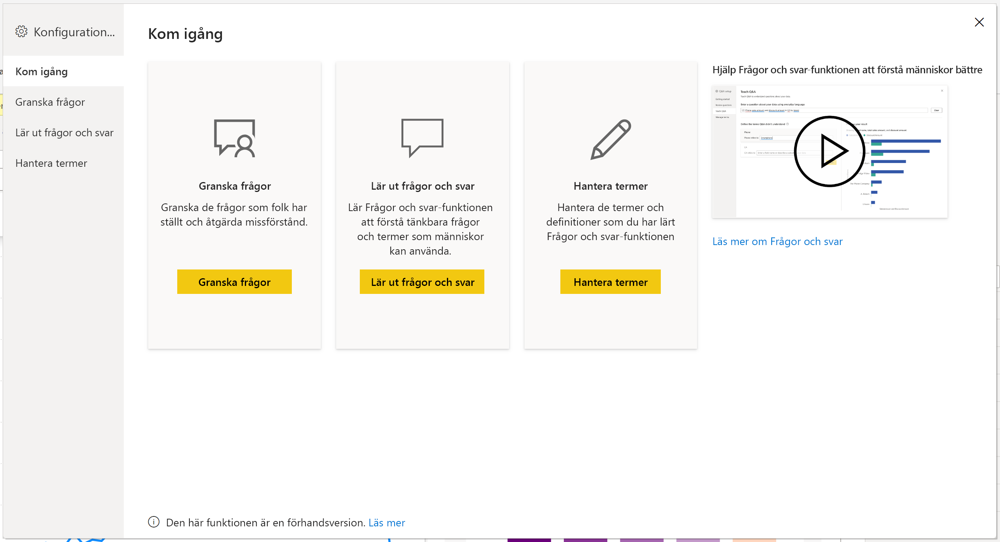
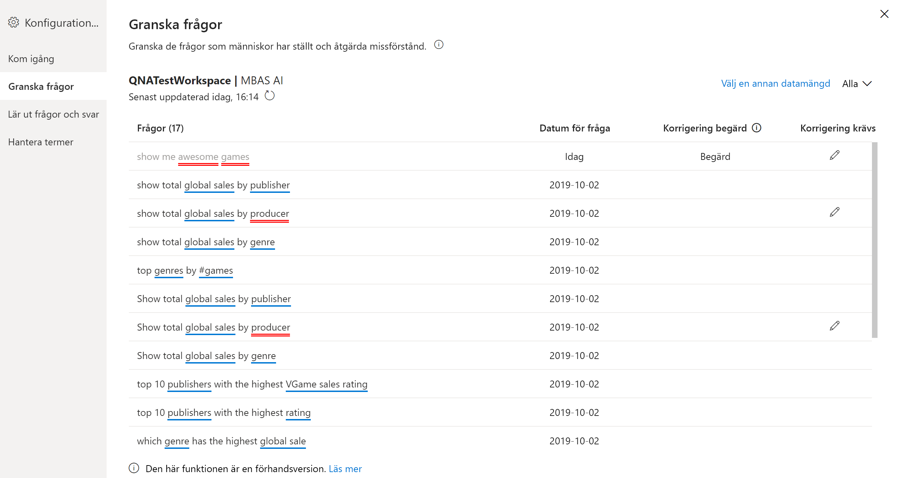
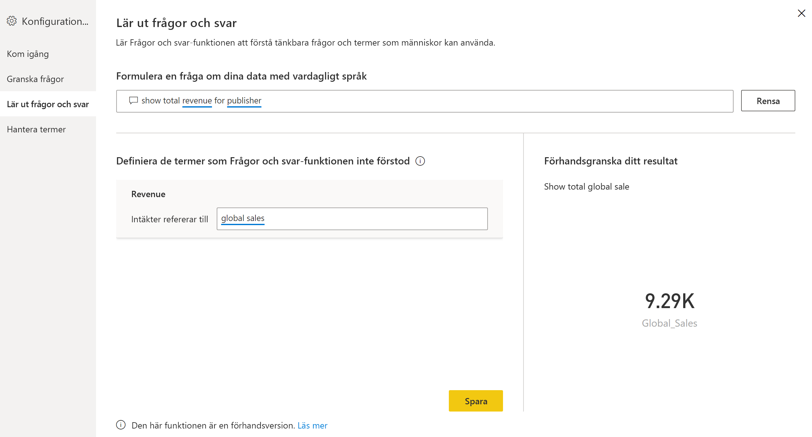
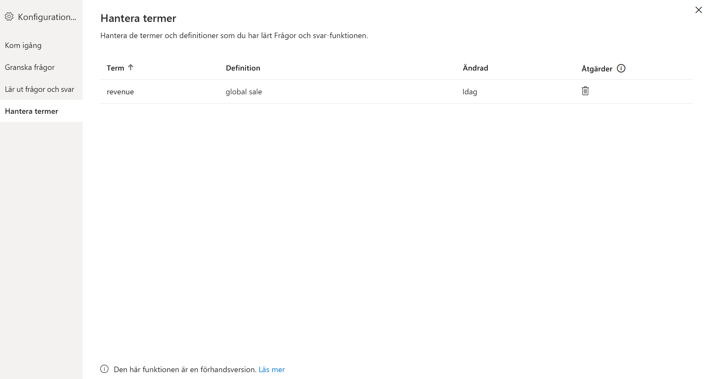
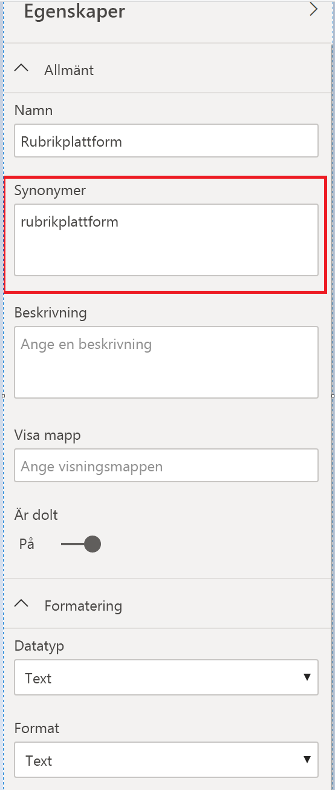

# Introduktion till verktyg i Frågor och svar för att träna upp Power BI Frågor och svar (förhandsversion)

Med *verktygen* i Power BI Frågor och svar kan du ge användarna en bättre upplevelse med naturligt språk. Som designer eller administratör interagerar du med motorn för naturligt språk och gör förbättringar inom tre områden: 

- Granska frågorna som användarna har ställt.
- Träna Frågor och svar att förstå de här frågorna.
- Hantera termer som du har lärt Frågor och svar.

Förutom de här särskilda verktygsfunktionerna så finns det fler alternativ på fliken **Modellering** i Power BI Desktop:  

- Synonymer
- Radetiketter
- Dölj i Frågor och svar
- Konfigurera språkschema (avancerat)

## Kom igång med verktyg i Frågor och svar

Verktyg i Frågor och svar är bara tillgängligt i Power BI Desktop, och för närvarande stöds endast importläget.

1. Öppna Power BI Desktop och skapa ett visuellt objekt med Frågor och svar. 
2. Välj kugghjulsikonen i hörnet av det visuella objektet. 

    

    Sidan Kom igång öppnas.  

    

### Granska frågor

Välj **Granska frågor** om du vill se en lista med de datamängder som används i Power BI-tjänsten för din klientorganisation. På sidan **Granska frågor** ser du även datamängdens ägare, arbetsytan och datumet för senaste uppdatering. Här kan du välja en datamängd och se vilka frågor som användarna har ställt. Du ser även ord som inte känts igen. De data som visas här är för de senaste 28 dagarna.

### Lär ut frågor och svar

I avsnittet **Träna Frågor och svar** kan du träna Frågor och svar på att identifiera ord. Börja genom att skriva en fråga som innehåller ett eller flera ord som Frågor och svar inte känner igen. Frågor och svar uppmanar dig att ange en definition av termen. Ange antingen ett filter eller ett fältnamn som motsvarar vad ordet representerar. Frågor och svar tolkar sedan om den ursprungliga frågan. Om du är nöjd med resultatet kan du spara dina indata. Läs mer i [Träna Frågor och svar](q-and-a-tooling-teach-q-and-a.md)

### Hantera termer

Här visas allt du har sparat från Träna Frågor och svar, så att du kan granska och eventuellt ta bort de termer du har definierat. För närvarande kan du inte redigera befintliga definitioner, så om du vill definiera om en term måste du ta bort och återskapa den.

## Andra inställningar i Frågor och svar

### Flera synonymer

På fliken **Modellering** i Power BI Desktop finns fler alternativ för att förbättra Frågor och svar-miljön. 

1. Välj vyn Modellering i Power BI Desktop.

2. Välj ett fält eller en tabell så att fönstret **Egenskaper** öppnas.  Det här fönstret innehåller flera Frågor och svar-åtgärder och visas till höger på arbetsytan. Ett alternativ är **Synonymer**. I rutan **Synonymer** kan du snabbt definiera alternativ till den tabell eller det fält du väljer. Du kan också definiera synonymer i avsnittet **Träna Frågor och svar** i dialogrutan Verktyg, men om det gäller många fält i en tabell går det ofta snabbare att göra det här.

    

3. Om du vill definiera flera synonymer för ett enda fält använder du kommatecken till att avgränsa dem.

### Dölj i Frågor och svar

Du kan också dölja fält och tabeller så att de inte visas i resultat från Frågor och svar. 

1. Välj vyn Modellering i Power BI Desktop.

2. Välj ett fält eller en tabell så att fönstret **Egenskaper** öppnas och ange egenskapen **Är dold** till **På**.

    Frågor och svar respekterar inställningen och ser till att fältet inte används i Frågor och svar. Du kan till exempel dölja ID-fält och sekundärnycklar så att du undviker onödiga dubbletter med samma namn. Även om du döljer ett fält kan du fortfarande använda det i visuella objekt i Power BI Desktop utanför Frågor och svar.

### Ange en radetikett

Med en radetikett kan du definiera vilken kolumn (eller vilket *fält*) som bäst identifierar en enskild rad i en tabell. För en tabell med kunder är till exempel visningsnamnet oftast en bra radetikett. När du anger dessa extra metadata kan Frågor och svar visa bättre visualiseringar när användare till exempel skriver in ”Visa försäljningen per kund”. I stället för att ”kund” behandlas som en tabell så kan tjänsten använda visningsnamnet och visa ett stapeldiagram med försäljningen till varje kund. Du kan bara ange radetiketter i vyn Modellering. 

1. Välj vyn Modellering i Power BI Desktop.

2. Välj en tabell så att fönstret **Egenskaper** öppnas.

3. Välj ett fält i rutan **Radetikett**.

## Konfigurera språkschemat (avancerat)

I Power BI kan du träna upp och förbättra motorn för naturligt språk helt inom ramen för Frågor och svar, och du kan även ändra poängsättningen och viktningen för de underliggande naturliga språkresultaten. Du kan läsa mer i [Redigera språkschemat för Frågor och svar och lägga till fraser](q-and-a-tooling-advanced.md).

## Nästa steg

Det finns ett antal metodtips för att förbättra motorn för naturligt språk. Mer information finns i följande artikel:

* [Metodtips för Frågor och svar](q-and-a-best-practices.md)
