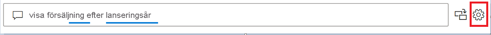

# Introduktion till verktyg i Frågor och svar för att träna upp Power BI Frågor och svar (förhandsversion)

Med *verktygen* i Power BI Frågor och svar kan du ge användarna en bättre upplevelse med naturligt språk. Som designer eller administratör interagerar du med motorn för naturligt språk och gör förbättringar inom tre områden: 

- Granska frågorna som användarna har ställt.
- Träna Frågor och svar att förstå de här frågorna.
- Hantera termer som du har lärt Frågor och svar.

Förutom de här särskilda verktygsfunktionerna så finns det fler alternativ på fliken **Modellering** i Power BI Desktop:  

- Synonymer
- Radetiketter
- Dölj i Frågor och svar
- Konfigurera språkschema (avancerat)

## Kom igång med verktyg i Frågor och svar

Verktyg i Frågor och svar är bara tillgängligt i Power BI Desktop, och för närvarande stöds endast importläget.

1. Öppna Power BI Desktop och skapa ett visuellt objekt med Frågor och svar. 
2. Välj kugghjulsikonen i hörnet av det visuella objektet. 

    

    Sidan Kom igång öppnas.  

    

### Fältsynonymer

Välj **Fältsynonymer** om du vill se alla tabeller och kolumner som tillhör modellen. I den här vyn kan du lägga till alternativa namn som matchar kolumnerna för att hjälpa användarna. Du kan också välja om kolumnen eller tabellen ska vara dold i Frågor och svar.

Klicka på en av tabellerna för att expandera den, så visas en dialogruta som liknar den nedan.

I dialogrutan visas alla kolumner och tabeller med respektive termer/synonymer som användarna kan använda när de ställer frågor om datamängden. Du kan snabbt se alla termer på en och samma plats, och lägga till eller ta bort termer för flera kolumner. 

- Lägg till termer – om du har ett fält som heter Försäljning kan du lägga till termen Intäkter så att användarna kan använda det här ordet i stället för Försäljning. Klicka på Lägg till-symbolen för att snabbt lägga till en ny term

- Ta med i Frågor och svar – med det här alternativet kan du utelämna en kolumn eller tabell från Frågor och svar. Då visas inte kolumnen, och det visas heller inga resultat med kolumnen. En situation där du kan välja att inte ta med en kolumn är när du hanterar datum. Om det finns flera datumfält eller sekundärnycklar kan du välja att ta bort alla utom ett av datumfälten så att rätt datumkolumn väljs när användare ställer datumrelaterade frågor.

- Föreslagna termer – Frågor och svar rekommenderar även föreslagna termer som hämtas från vår förslagsmotor så att du snabbt kan lägga till termer/synonymer. Om förslagen inte läggs till fungerar de fortfarande, men användaren ser en orange streckad linje som visar att Frågor och svar tror att det här är ett svar, men verktyget är inte säkert. Om den föreslagna synonymen stämmer klickar du på +-ikonen så att den kan användas som synonym. Om förslaget är felaktigt klickar du på x-ikonen så att termen tas bort. Då används den inte som term/synonym i Frågor och svar. Förslagen hämtas från Office-ordlistan och namn som finns med i rapporten

### Granska frågorna

Välj **Granska frågor** om du vill se en lista med de datamängder som används i Power BI-tjänsten för din klientorganisation. På sidan **Granska frågor** ser du även datamängdens ägare, arbetsytan och datumet för senaste uppdatering. Här kan du välja en datamängd och se vilka frågor som användarna har ställt. Du ser även ord som inte känts igen. De data som visas här är för de senaste 28 dagarna.

### Lär ut frågor och svar

I avsnittet **Träna Frågor och svar** kan du träna Frågor och svar på att identifiera ord. Börja genom att skriva en fråga som innehåller ett eller flera ord som Frågor och svar inte känner igen. Frågor och svar uppmanar dig att ange en definition av termen. Ange antingen ett filter eller ett fältnamn som motsvarar vad ordet representerar. Frågor och svar tolkar sedan om den ursprungliga frågan. Om du är nöjd med resultatet kan du spara dina indata. Läs mer i [Träna Frågor och svar](q-and-a-tooling-teach-q-and-a.md)

### Hantera termer

Här visas allt du har sparat från Träna Frågor och svar, så att du kan granska och eventuellt ta bort de termer du har definierat. För närvarande kan du inte redigera befintliga definitioner, så om du vill definiera om en term måste du ta bort och återskapa den.

### Föreslå frågor

> [!NOTE]
> De föreslagna frågorna visas för alla instanser av Frågor och svar-kontrollen. Det går inte att skapa en separat uppsättning förslag för alla visuella frågor och svar.
> 
> 

Om du inte konfigurerar någon inställning föreslår Visuella frågor och svar flera frågor att komma igång med. Frågorna genereras automatiskt baserat på din datamodell. I **Föreslå frågor**kan du skriva över de automatiskt genererade frågorna med dina egna frågor.

Börja med att skriva den fråga som du vill lägga till i textrutan. I avsnittet förhandsversion ser du hur resultatet kommer att se ut i Visuella frågor och svar. 

:::image type="content" source="media/q-and-a-tooling-intro/power-bi-qna-suggest-questions.png" alt-text="Föreslå frågor och svar":::
 
Välj knappen **Lägg till** för att lägga till den här frågan till **dina föreslagna frågor**. Alla ytterligare frågor läggs till i slutet av den här listan. Frågorna visas i Visuella frågor och svar i samma ordning som i den här listan. 

:::image type="content" source="media/q-and-a-tooling-intro/power-bi-qna-save-suggest-questions.png" alt-text="Spara föreslagna frågor":::
 
Se till att välja **Spara** för att visa en lista över föreslagna frågor i Visuella frågor och svar. 

## Andra inställningar i Frågor och svar

### Ange en radetikett

Med en radetikett kan du definiera vilken kolumn (eller vilket *fält*) som bäst identifierar en enskild rad i en tabell. För en tabell med kunder är till exempel visningsnamnet oftast en bra radetikett. När du anger dessa extra metadata kan Frågor och svar visa bättre visualiseringar när användare till exempel skriver in ”Visa försäljningen per kund”. I stället för att ”kund” behandlas som en tabell så kan tjänsten använda visningsnamnet och visa ett stapeldiagram med försäljningen till varje kund. Du kan bara ange radetiketter i vyn Modellering. 

1. Välj vyn Modellering i Power BI Desktop.

2. Välj en tabell så att fönstret **Egenskaper** öppnas.

3. Välj ett fält i rutan **Radetikett**.

## Konfigurera språkschemat (avancerat)

I Power BI kan du träna upp och förbättra motorn för naturligt språk helt inom ramen för Frågor och svar, och du kan även ändra poängsättningen och viktningen för de underliggande naturliga språkresultaten. Du kan läsa mer i [Redigera språkschemat för Frågor och svar och lägga till fraser](q-and-a-tooling-advanced.md).

## Nästa steg

Det finns ett antal metodtips för att förbättra motorn för naturligt språk. Mer information finns i [Frågor och svar – metodtips](q-and-a-best-practices.md).
