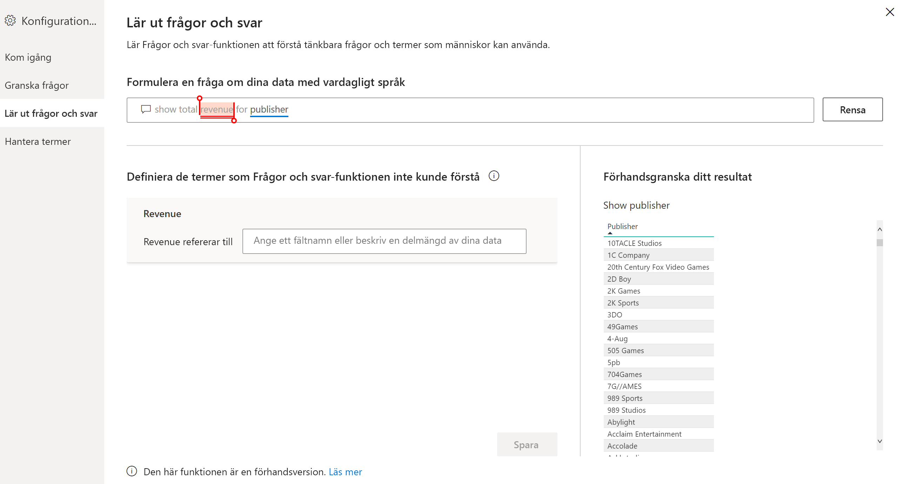
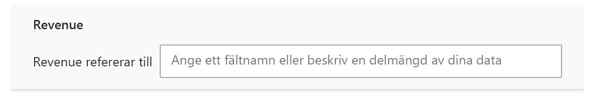
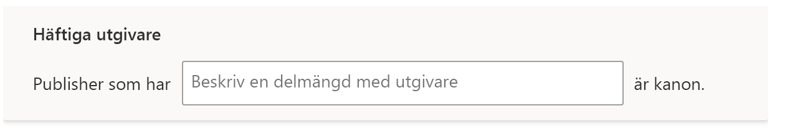

# Träna Frågor och svar att förstå frågor och termer i Power BI Frågor och svar

I avsnittet **Träna Frågor och svar** i Frågor och svar-konfigurationen tränar du upp Frågor och svar att förstå frågor på naturligt språk och termer som inte känns igen. Börja genom att skicka en fråga som innehåller ett eller flera ord som Frågor och svar inte känner igen. Frågor och svar uppmanar dig då att definiera termen. Ange antingen ett filter eller fältnamn som motsvarar vad ordet representerar. Frågor och svar tolkar sedan om den ursprungliga frågan. Om du är nöjd med resultatet sparar du det.

> [!NOTE]
> Funktionen Träna Frågor och svar har bara stöd för importläget. Dessutom saknas för närvarande stöd för anslutning till en lokal datakälla eller en Azure Analysis Services-datakälla. Den här begränsningen bör försvinna i kommande versioner av Power BI.

## Börja träna Frågor och svar

1. Öppna menyfliksområdet **Modellering** i Power BI Desktop och välj **Konfiguration av Frågor och svar** > **Träna Frågor och svar**.

    

2. Skriv en mening med en term som Frågor och svar inte känner igen och välj **Skicka**.

3. Välj ordet med röd understrykning. 

    Frågor och svar ger dig förslag och du uppmanas att ange rätt definition av termen. 
    
3. Ange en definition under **Definiera de termer som Frågor och svar inte förstod**.

    

4. Välj **Spara** för att förhandsgranska det uppdaterade visuella objektet.

5. Ange nästa fråga eller välj **X** för att stänga fönstret.

Rapportanvändarna ser inte den här ändringen förrän du publicerar rapporten till tjänsten igen.

## Definiera substantiv och adjektiv

Du kan träna två typer av termer i Frågor och svar:

- Substantiv
- Adjektiv

### Definiera en synonym till ett substantiv

När du arbetar med data kan du ha namn på fält som användarna kan referera till med andra namn. Ett exempel kan vara Försäljning. Många ord eller fraser kan referera till försäljning, till exempel ”intäkter”. Om en kolumn heter Försäljning och rapportanvändaren skriver ”intäkter” kanske inte Frågor och svar kan välja rätt kolumn för att besvara frågan. I det här fallet vill du ange för Frågor och svar att ”försäljning” och ”intäkter” syftar på samma sak.

Frågor och svar identifierar automatiskt när ett okänt ord är ett substantiv, med hjälp av information från Microsoft Office. Om Frågor och svar identifierar ett substantiv visas följande uppmaning:

- <your term> **refererar till** 

Du fyller i rutan med termen från dina data.

Om du anger något annat än ett fält från datamodellen kan du få oönskade resultat.

### Definiera ett filtervillkor för adjektiv

Ibland kanske du vill definiera termer som fungerar som ett villkor för underliggande data. Ett exempel kan vara ”utmärkta utgivare”. ”Utmärkta” kan vara ett villkor där du bara väljer utgivare som har publicerat X antal produkter. Frågor och svar försöker identifiera adjektiv och visar då en annan uppmaning:

- <field name> **som har**  

Du fyller i rutan med villkoret.

Här är några exempel på villkor du kan definiera:

- ”Land” som är ”USA”
- ”Land” som inte är ”USA”
- ”Vikt” > 2000
- ”Vikt” = 2000
- ”Vikt” < 2000

Du kan bara definiera enstaka villkor i verktyget. Om du vill definiera mer komplicerade villkor använder du DAX och skapar en beräknad kolumn. Sedan kan du skapa ett villkor för den beräknade kolumnen i verktyget. Du kan inte använda mått. Använd beräknade kolumner i stället.

## Hantera termer

När du har angett definitioner kan du gå tillbaka för att se dina ändringar och redigera eller ta bort dem. 

1. I **Konfiguration av Frågor och svar** går du till avsnittet **Hantera termer**.

2. Ta bort de termer du inte vill använda längre. Du kan för närvarande inte redigera termer. Om du vill definiera om en term tar du bort termen och definierar den på nytt.

    

## Nästa steg

Det finns ett antal metodtips för att förbättra motorn för naturligt språk. Mer information finns i följande artikel:

* [Metodtips för Frågor och svar](q-and-a-best-practices.md)
