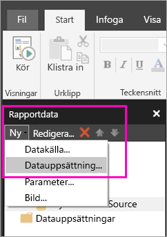
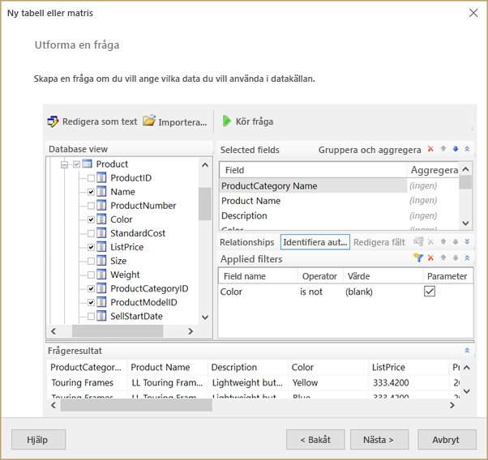
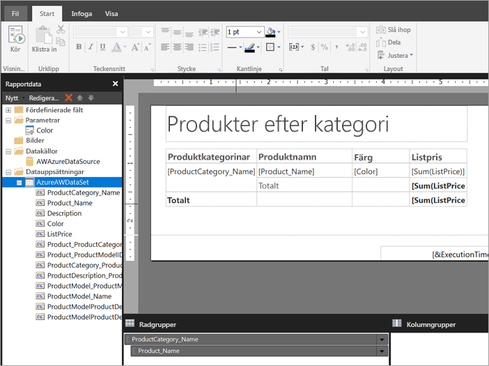

# Skapa en inbäddad datamängd för en sidnumrerad rapport i Power BI-tjänsten (förhandsversion)

I den här artikeln får du lära dig att skapa en inbäddad datamängd som baseras på en inbäddad datakälla för en sidnumrerad rapport i Power BI-tjänsten. Inbäddade datamängder finns i en enda sidnumrerad rapport och används enbart i den rapporten. För närvarande behöver sidnumrerade rapporter som publiceras till Power BI-tjänsten innehålla både inbäddade datamängder och inbäddade datakällor. Du skapar inbäddad datakälla och datauppsättning i Power BI Report Builder, medan du skapar din rapport. 

Du måste skapa en datakälla innan du kan skapa datamängden. Se [Inbäddade datakällor för sidnumrerade rapporter](paginated-reports-embedded-data-source.md) i Power BI-tjänsten för mer information om hur du gör.
  
## Skapa en inbäddad datauppsättning
  
1. I fönstret rapportdata i Power BI Report Builder, Välj **New** > **datauppsättning**.

1. På fliken **Fråga** i dialogrutan **Egenskaper för datamängd** ger du datamängden ett namn. Den inbäddade datakällan finns redan i rutan **Datakälla**, men du kan också välja **Nytt** för att skapa en annan inbäddad datakälla.
 
     

3. Under **Frågetyp** väljer du typ för det kommando eller den fråga som du vill använda för datamängden. 
    - **Text** kör en fråga för att hämta data från databasen. Det är standard och används för de flesta frågor. Skriv en fråga eller importera en befintlig fråga genom att välja **Importera**. Om du vill skapa frågan grafiskt väljer du **Frågedesigner**. Om du använder frågedesignern till att skapa en fråga, visas texten för frågan i den här rutan. Välj knappen **Uttryck** (**fx**) om du vill använda ett uttryck som genererar frågan dynamiskt. 
    - **Tabell** väljer alla fält i en tabell. Ange namnet på den tabell som du vill använda som en datamängd.
    - **Lagrad procedur** kör en lagrad procedur efter namn.

4. I frågedesignern kan du se och interagera med tabeller och fält i datamängden, importera en fråga eller redigera som text. Du kan också lägga till filter och parametrar här. 

    

5. I frågedesignern väljer du **Kör fråga** för att testa den. Välj sedan **OK**.

1. När du är tillbaka i dialogrutan Egenskaper för datamängd går du till rutan **Tidsgräns (i sekunder)** och skriver antal sekunder innan tidsgränsen uppnås för frågan. Standardvärdet är 30 sekunder. Värdet i **Tidsgräns** måste vara större än noll eller tomt. Om det är tomt har inte frågan någon tidsgräns.

7.  Du kan ange andra egenskaper för datamängden på andra flikar:
    - Skapa beräknade fält på fliken **Fält**.
    - Ange avancerade alternativ på fliken **Alternativ**.
    - Lägg till eller uppdatera **Filter** och **Parametrar** på respektive flik.

8. Välj **OK**
 
   Rapporten öppnas i rapportdesignvyn. Datakällan, datamängden och datamängdens fältsamling visas i fönstret Rapportdata och du kan fortsätta att utforma din sidnumrerade rapport.  

     
 
## Nästa steg 

- [Vad är sidnumrerade rapporter i Power BI Premium? (Förhandsversion)](paginated-reports-report-builder-power-bi.md)  
- [Självstudier: Skapa en sidnumrerad rapport och ladda upp den till Power BI-tjänsten](paginated-reports-quickstart-aw.md)
- [Publicera en sidnumrerad rapport i Power BI-tjänsten](paginated-reports-save-to-power-bi-service.md)

