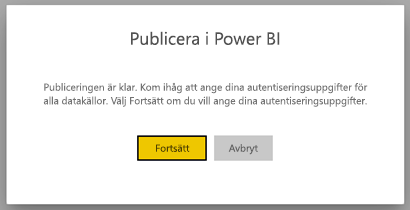
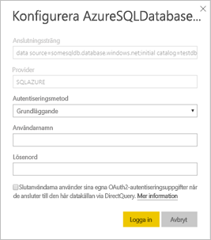

# Datakällor som stöds för sidnumrerade Power BI-rapporter

Den här artikeln går igenom datakällor som stöds för sidnumrerade rapporter i Power BI-tjänsten samt hur du ansluter till Azure SQL Database-datakällor. Vissa datakällor har inbyggt stöd. Du kan ansluta till andra med hjälp av datagatewayer.

## Datakällor med inbyggt stöd

Sidnumrerade rapporter har inbyggt stöd för följande lista av datakällor:

| Datakälla | Autentisering | Anteckningar |
| --- | --- | --- |
| Azure SQL Database  Azure SQL Data Warehouse | Grundläggande, enkel inloggning, OAuth2 |   |
| Azure Analysis Services | Enkel inloggning, OAuth2 |   |
| Power BI-datamängd | Enkel inloggning | Premium- och icke-Premium Power BI-datamängder |
| Premium Power BI-datamängd (XMLA) | Enkel inloggning |   |
| Ange data | Saknas | Data bäddas in i rapporten. |

Förutom Azure SQL Database är alla data källor redo att användas när du har laddat upp rapporten till Power BI-tjänsten. Datakällorna använder som standard enkel inloggning (SSO) där det är tillämpligt. För Azure Analysis Services kan du ändra autentiseringstypen till OAuth2.

För Azure SQL Database-datakällor behöver du ange mer information, enligt beskrivningen i avsnittet [Azure SQL Database-autentisering](#azure-sql-database-authentication).

## Andra datakällor

Utöver datakällorna med inbyggt stöd ovan kan följande datakällor nås via en [Power BI-datagateway](service-gateway-onprem.md):

- SQL Server
- SQL Server Analysis Services
- Oracle
- Teradata

För sidnumrerade rapporter kan Azure SQL Database och Azure Analysis Services för närvarande inte nås via en Power BI-datagateway.

## Azure SQL Database-autentisering

För Azure SQL Database-datakällor behöver du ange en autentiseringstyp innan du kör rapporten. Detta gäller endast när du använder en datakälla för första gången på en arbetsyta. Första gången visas följande meddelande:

Om du inte anger några autentiseringsuppgifter inträffar ett fel när du kör rapporten. Välj **Fortsätt** för att gå till sidan **Autentiseringsuppgifter för datakälla** för den rapport som du just laddade upp:

Välj länken **Redigera autentiseringsuppgifter** för en specifik datakälla för att öppna dialogrutan **Konfigurera**:

För Azure SQL Database-datakällor är följande de autentiseringstyper som stöds:

- Grundläggande (användarnamn och lösenord)
- Enkel inloggning
- OAuth2 (lagrad AAD-token)

För att enkel inloggning och OAuth2 ska fungera korrekt behöver den Azure SQL Database-server som datakällan ansluter till ha [AAD-autentiseringsstöd aktiverat](https://docs.microsoft.com/azure/sql-database/sql-database-aad-authentication-configure). För autentiseringsmetoden OAuth2 genererar AAD en token och lagrar den för framtida datakällsåtkomst. Om du vill använda [autentiseringsmetoden enkel inloggning](https://docs.microsoft.com/power-bi/service-azure-sql-database-with-direct-connect#single-sign-on) i stället väljer du alternativet för enkel inloggning direkt nedanför, **Slutanvändare använder sina egna OAuth2-autentiseringsuppgifter när de använder denna datakälla via DirectQuery**.
  
## Nästa steg

[Visa en sidnumrerad rapport i Power BI-tjänsten](paginated-reports-view-power-bi-service.md)

Har du fler frågor? [Prova Power BI Community](http://community.powerbi.com/)
