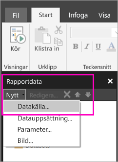

# Skapa en inbäddad datakälla för sidnumrerade rapporter i Power BI-tjänsten (förhandsversion)

I den här artikeln får du lära dig att skapa och ändra en inbäddad datakälla för en sidnumrerad rapport i Power BI-tjänsten. Du definierar en inbäddad datakälla i en enda rapport och använder den endast i den rapporten. För närvarande måste sidnumrerade rapporter som publiceras till Power BI-tjänsten innehålla inbäddade datamängder och inbäddade datakällor. De kan anslutas till följande datakällor:

- Azure SQL Database och Data Warehouse
- SQL Server
- SQL Server Analysis Services
- Oracle 
- Teradata 

För dessa datakällor använder den [SQL Server Analysis Services-anslutning](service-premium-connect-tools.md) alternativet:

- Azure Analysis Services
- Power BI-datauppsättningar

Sidnumrerade rapporter ansluter till lokala datakällor via en gateway. Du ställer in gatewayen när du har publicerat rapporten till Power BI-tjänsten. Läs mer om [Power BI-gatewayer](service-gateway-getting-started.md). 

## Skapa en inbäddad datakälla
  
1. Öppna Power BI Report Builder.

1. I verktygsfältet i fönstret Rapportdata väljer du **Nytt** > **Datakälla**. Dialogrutan **Egenskaper för datakälla** öppnas.

    
  
2.  I textrutan **Namn** skriver du ett namn på datakällan, eller så godkänner du standardinställningen.  
  
3.  Välj **Använd en anslutning som är inbäddad i min rapport**.  
  
1.  I listan **Välj anslutningstyp** väljer du en typ av datakälla. 

1.  Ange en anslutningssträng med hjälp av någon av följande metoder:  
  
    -   Skriv anslutningssträngen direkt i textrutan **Anslutningssträng**. 
  
    -   Välj uttrycksknappen (**fx)** för att skapa ett uttryck som blir en anslutningssträng. I dialogrutan **Uttryck** skriver du uttrycket i rutan Uttryck. Välj **OK**. 
  
    -   Välj **Skapa** för att öppna dialogrutan **Anslutningsegenskaper** för den datakälla som du valde i steg 2.  
  
        Fyll i lämpliga fält i dialogrutan **Anslutningsegenskaper** för typen av datakälla. Anslutningsegenskaper är bl.a. typ av datakälla, namnet på datakällan och de autentiseringsuppgifter som används. När du har angett värden i dialogrutan väljer du **Testa anslutningen** för att kontrollera att datakällan är tillgänglig och att de autentiseringsuppgifter som du angav är korrekta.  
  
4.  Välj **Autentiseringsuppgifter**.  
  
     Ange de autentiseringsuppgifter som ska användas för den här datakällan. Ägaren av datakällan väljer vilken typ av autentiseringsuppgifter som stöds. Mer information finns i [Ange autentiseringsuppgifter och anslutningsinformation för Rapport över datakällor](https://docs.microsoft.com/sql/reporting-services/report-data/specify-credential-and-connection-information-for-report-data-sources).
  
5.  Välj **OK**.  
  
     Datakällan visas i fönstret Rapportdata.  

## Nästa steg

- [Skapa en inbäddad datamängd för en sidnumrerad rapport i Power BI-tjänsten](paginated-reports-create-embedded-dataset.md)
- [Vad är sidnumrerade rapporter i Power BI Premium? (Förhandsversion)](paginated-reports-report-builder-power-bi.md)
