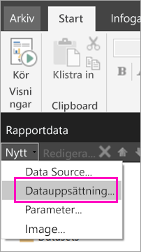
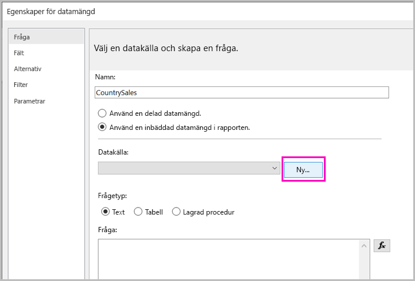
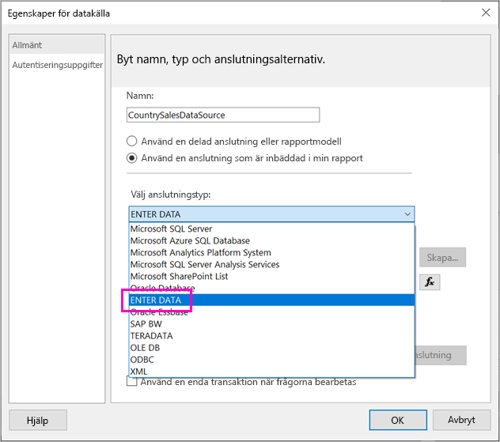
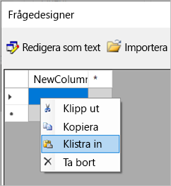
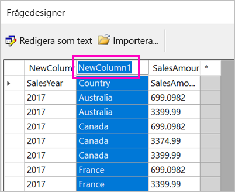
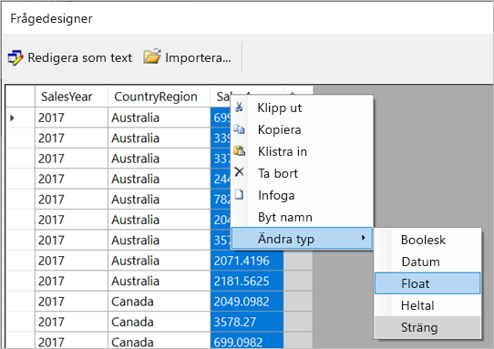
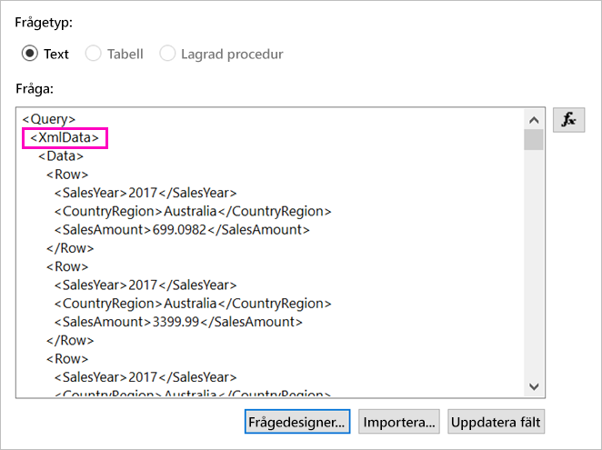
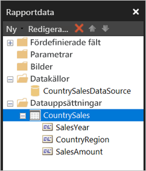

# <a name="enter-data-directly-in-a-paginated-report-in-report-builder---power-bi"></a>Ange data direkt i en sidnumrerad rapport i Report Builder – Power BI

I den här artikeln får du lära dig om en funktion i den nya versionen av SQL Server 2016 Report Builder där du kan ange data direkt i en RDL-rapport som en inbäddad datamängd.  Den här funktionen liknar Power BI Desktop. Du kan ange data direkt i en datamängd i rapporten eller klistra in dem från ett annat program som Microsoft Excel. När du har skapat en datamängd genom att ange information kan du använda den precis på samma sätt som andra inbäddade datamängder som du har skapat. Dessutom kan du lägga till mer än en tabell och använda en som ett filter för den andra. Den här funktionen är särskilt användbar för små, statiska datamängder som du kan behöva använda i rapporten, t.ex. rapportparametrar.
 
## <a name="prerequisites"></a>Förutsättningar

- Om du vill ange data direkt i en sidnumrerad rapport installerar du den nya versionen av [Report Builder från Microsoft Download Center](https://www.microsoft.com/download/details.aspx?id=53613). 
- För att spara din sidnumrerade rapport i Power BI-tjänsten behöver du ett [Power BI Pro-konto](service-self-service-signup-for-power-bi.md) och skrivåtkomst till en arbetsyta i en [Power BI Premium-kapacitet](service-premium-what-is.md).
- Om du vill spara din sidnumrerade rapport till en rapportserver behöver du behörigheter för att [redigera filen Rsreportserver.config](#upload-the-paginated-report-to-a-report-server).

## <a name="get-started"></a>Kom igång

När du har hämtat och installerat Report Builder följer du samma arbetsflöde som du använder för att lägga till en inbäddad datamängd och datamängd i rapporten. I följande procedur under **Datakällor** så ser du ett nytt alternativ: **Ange data**.  Du behöver bara konfigurera den här datakällan en gång i en rapport. Efter det kan du skapa flera tabeller för data som har angetts som separata datamängder med den enda datakällan.

1. I fönstret **Rapportdata** i Report Builder väljer du **Nytt** > **Datamängd**.

    

1. I dialogrutan **Egenskaper för datamängd** väljer du alternativet att **använda en inbäddad datamängd i rapporten**.

1. Bredvid **Datakälla**väljer du **Nytt**.

    

1. I dialogrutan **Egenskaper för datamängd** väljer du alternativet att **använda en inbäddad anslutning i rapporten**.
2. I rutan **Välj anslutningstyp** väljer du **ANGE DATA** > **OK**.

    

1. I dialogrutan **Egenskaper för datamängd** klickar du på **Frågedesigner**.
2. I **Frågedesigner**  högerklickar du och klistrar in dina data i tabellen.

    

1. För att ange namn på kolumnerna dubbelklickar du på varje **NewColumn** och anger kolumnens namn.

    

1. Om den första raden innehåller kolumnrubriker i den ursprungliga informationen högerklickar du på den och tar bort den.
    
9. Som standard är datatypen för varje kolumn String. Högerklicka på kolumnrubriken om du vill ändra datatypen > **Ändra typ** och ange en annan datatyp för den, till exempel Datum eller Flyttal.

    

1. När du har skapat tabellen väljer du **OK**.  

    Den fråga som skapas är samma som visas med en XML-datakälla. Under försättsbladen använder vi XML som dataleverantör.  Vi har ändrat syfte för att även aktivera det här scenariot.

    

12. I dialogrutan **Egenskaper för datamängd** klickar du på **OK**.

13. Du ser din datakälla och datamängd i fönstret **Rapportdata**.

    

Du kan använda din datamängd som grund för datavisualiseringar i rapporten. Du kan också lägga till ytterligare en datamängd och använda samma datakälla för den.

## <a name="upload-the-paginated-report-to-the-power-bi-service"></a>Ladda upp en sidnumrerad rapport i Power BI-tjänsten

Nu när sidnumrerade rapporter stöds i Power BI-tjänsten kan du överföra din sidnumrerade rapport till en Premium-kapacitet. I [Ladda upp en sidnumrerad rapport](paginated-reports-save-to-power-bi-service.md#upload-a-paginated-report) finns mer information.

## <a name="upload-the-paginated-report-to-a-report-server"></a>Ladda upp den sidnumrerade rapporten till en rapportserver

Du kan också ladda upp din sidnumrerade rapport till en Power BI-rapportserver eller SQL Server Reporting Services 2016 eller 2017-rapportservern. Innan du gör det måste du lägga till följande objekt i din RsReportServer.config som en utökning av ytterligare data. Säkerhetskopiera filen RsReportServer.config innan du gör ändringen, ifall du stöter på problem.

```xml
<Extension Name="ENTERDATA" Type="Microsoft.ReportingServices.DataExtensions.XmlDPConnection,Microsoft.ReportingServices.DataExtensions">
    <Configuration>
        <ConfigName>ENTERDATA</ConfigName>
    </Configuration>
</Extension>
```

När du har redigerat det ska listan med dataleverantörer i konfigurationsfilen se ut så här:


Det var allt – du kan nu publicera rapporter som använder den här nya funktionen till rapportservern.

## <a name="next-steps"></a>Nästa steg

- [Vad är sidnumrerade rapporter i Power BI Premium?](paginated-reports-report-builder-power-bi.md)
- [Vad är Power BI-rapportservern?](report-server/get-started.md)
