# Självstudie: Skapa en sidnumrerad rapport och ladda upp den till Power BI-tjänsten (förhandsversion)

I den här självstudien ansluter du till en Azure SQL-exempeldatabas. Sedan använder du en guide i Power BI Report Builder för att skapa en sidnumrerad rapport med en tabell som radbryts till flera sidor. Sedan överför du den sidnumrerade rapporten till en arbetsyta i en Premium-kapacitet i Power BI-tjänsten. Sidnumrerade rapporter i Power BI-tjänsten är för närvarande i förhandsversion.

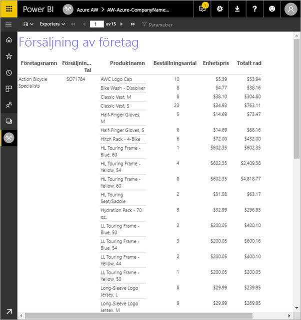

Här är de steg som du har slutfört i den här självstudien:

> [!div class="checklist"]
> * Skapa en Azure-exempeldatabas.
> * Skapa en matris i Power BI Report Builder med hjälp av en guide.
> * Formatera rapporten med rubrik, sidnummer och kolumnrubriker på varje sida.
> * Formatera valutan.
> * Ladda upp rapporten till Power BI-tjänsten.

Om du inte har någon Azure-prenumeration kan du [skapa ett kostnadsfritt konto](https://azure.microsoft.com/free/?WT.mc_id=A261C142F) innan du börjar.
 
## Förutsättningar  

Här följer förutsättningarna för att skapa den sidnumrerade rapporten:

- Installera [Power BI Report Builder från Microsoft Download Center](https://go.microsoft.com/fwlink/?linkid=2086513). 

- Följ snabbstarten [Skapa ett Azure SQL-exempeldatabas i Azure Portal](https://docs.microsoft.com/azure/sql-database/sql-database-get-started-portal). Kopiera och spara värdet i rutan **Servernamn** på fliken **Översikt**. Kom ihåg det användarnamn och det lösenord som du skapade i Azure.

Här är förutsättningarna för att ladda upp din sidnumrerade rapport till Power BI-tjänsten:

- Du måste ha en [Power BI Pro-licens](service-admin-power-bi-pro-in-your-organization.md).
- Du måste ha en apparbetsyta i tjänsten i en [Power BI Premium-kapacitet](service-premium-what-is.md). Den visas med en diamantikon  bredvid arbetsytans namn.

## Skapa matrisen med en guide
  
1.  Starta Power BI Report Builder från datorn.  
  
     Dialogrutan **Komma igång** öppnas.  
  
     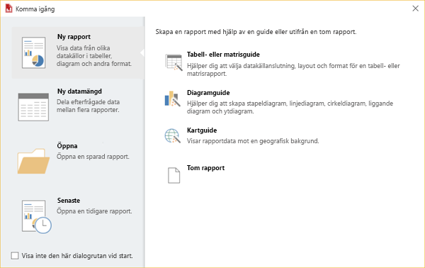
  
1.  Kontrollera att **Ny rapport** har markerats i den vänstra rutan och välj **Tabell- eller matrisguide** i den högra rutan.  
  
4.  Välj **Skapa en datauppsättning** > **Nästa** på sidan **Välj en datauppsättning**.  

    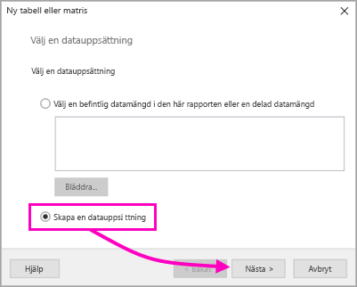
  
5.  Välj **Ny** på sidan **Välj en anslutning till en datakälla**. 

    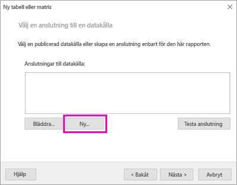
  
     Dialogrutan **Egenskaper för datakälla** öppnas.  
  
6.  Du kan ge en datakälla vilket namn du vill med hjälp av tecken och understreck. Skriv **MyAzureDataSource** i rutan **Namn** i den här självstudiekursen.  
  
7.  Välj **Microsoft Azure SQL Database** i rutan **Välj anslutningstyp**.  
  
8.  Välj **Skapa** intill rutan **Anslutningssträng**. 

    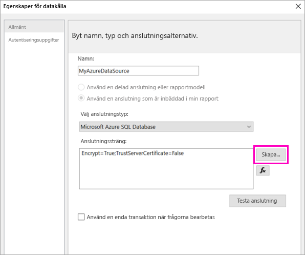

9. **I Azure:** Gå tillbaka till Azure Portal och välj **SQL-databaser**.

1. Välj den Azure SQL-databas som du skapade i snabbstarten ”Skapa en Azure SQL-exempeldatabas i Azure Portal” i avsnittet **Förutsättningar** i den här artikeln.

1. Kopiera värdet i rutan **Servernamn** på fliken **Översikt**.

2. **I Report Builder**: Klistra in det servernamn som du kopierade under **Servernamn** i dialogrutan **Anslutningsegenskaper**. 

1. Kontrollera att **Använd SQL Server-autentisering** har valts för **Logga in på servern** och skriv sedan det användarnamn och det lösenord som du skapade i Azure för exempeldatabasen.

1. Klicka på listrutepilen under **Anslut till en databas** och välj namnet på databasen som du skapade i Azure.
 
    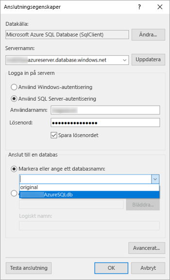

1. Välj **Testanslutning**. **Testresultat**-meddelandet **Testanslutningen lyckades** visas.

1. Välj **OK** > **OK**. 

   Report Builder visar den anslutningssträng som du nyss skapade i rutan **Anslutningssträng**. 

    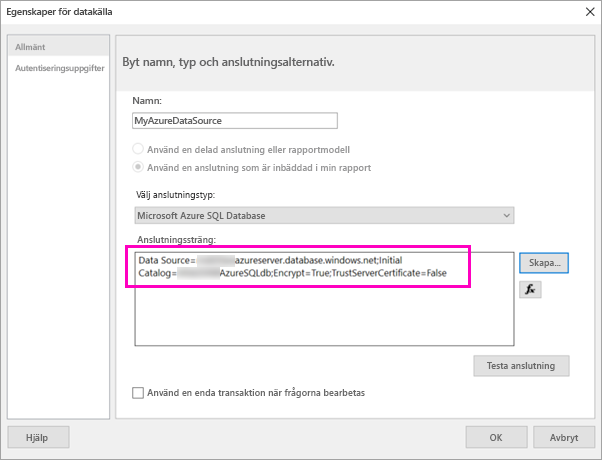

1. Välj **OK**.
  
9. På sidan **Välj en anslutning till en datakälla** visas ”(i den här rapporten)” under den anslutning till datakälla som du just har skapat. Välj den datakällan > **Nästa**.  

    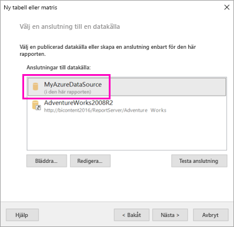

10. Skriv samma användarnamn och lösenord i rutan. 
  
10. Expandera SalesLT på sidan **Utforma en fråga**, expandera Tabeller och välj följande tabeller:

    - Adress
    - Kund
    - Produkt
    - ProductCategory
    - SalesOrderDetail
    - SalesOrderHeader

     Eftersom du har valt **Relationer** > **Automatisk identifiering** identifierar Report Builder relationer mellan dessa tabeller. 
    
    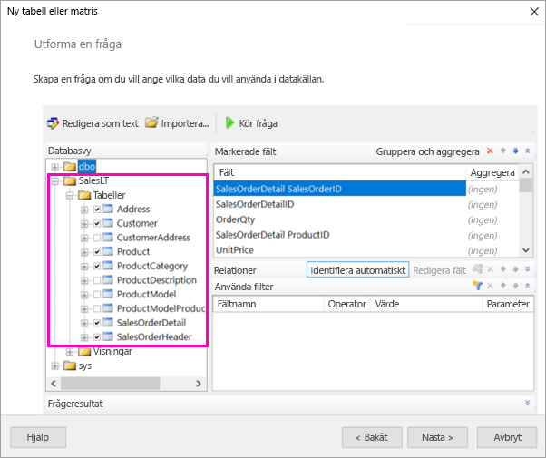
 
1.  Välj **Kör fråga**. Report Builder visar **Frågeresultat**. 
 
     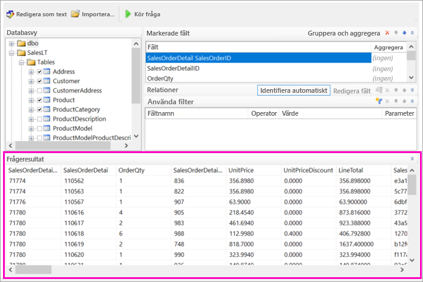

18. Välj **Nästa**. 

19. Välj den datauppsättning du just har skapat i **Välj en datauppsättning** > **Nästa**.

    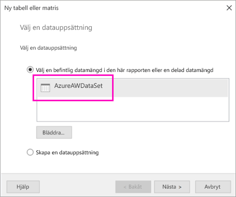

1. Dra dessa fält från rutan **Tillgängliga fält** på sidan **Ordna fält** till rutan **Radgrupper**:

    - CompanyName
    - SalesOrderNumber
    - Product_Name

1. Dra dessa fält från rutan **Tillgängliga fält** till rutan **Värden**:

    - OrderQty
    - UnitPrice
    - LineTotal

    Report Builder görs automatiskt fälten i rutan **Värden** till summor.

    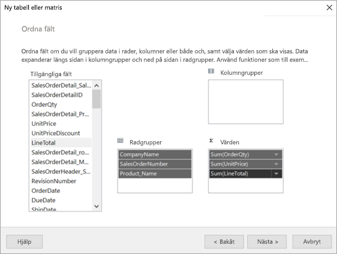

24. Behåll alla standardinställningar på sidan **Välj layout**, men avmarkera **Visa/dölj grupper**. Funktionen Visa/dölj grupper är bra, men den här gången vill du att tabellen att sträcka sig över flera sidor.

1. Välj **Nästa** > **Slutför**. Tabellen visas på designytan.
 
## Det du har skapat

Låt oss pausa för att titta på guidens resultat.

1. Den inbäddade Azure-datakällan och den inbäddade datauppsättningen som baseras på den, vilka du har skapat, visas i fönstret Rapportdata. 

2. Designytan är ungefär 6 tum bred. Matrisen visas på designytan med kolumnrubriker och platshållarvärdena. Matrisen innehåller sex kolumner och verkar bara vara fem rader lång. 

3. Beställningsantal, Enhetspris och Radtotal är alla summor och varje radgrupp har en delsumma. 

    De faktiska datavärdena visas ännu inte. Du måste köra rapporten för att de ska visas.

4. Den valda matrisen kallas Tablix1 i fönstret Egenskaper. En *tablix* i Report Builder är ett dataområde som visar data på rader och i kolumner. Det kan vara en tabell eller en matris.

5. De tre gupper som du skapade i guiden visas i fönstret Gruppering: 

    - CompanyName
    - Försäljningsorder
    - Produktnamn

    Den här matrisen har inte några kolumngrupper.

### Kör rapporten

Du måste köra rapporten för att kunna se de faktiska värdena.

1. Välj **Kör** i verktygsfältet **Start**.

   Nu visas värdena. Matrisen har många fler rader än de som visas i vyn Design! Observera att i Report Builder anges sidan som **1** av **2?** . Report Builder läser in rapporten så snabbt som möjligt, vilket innebär att den endast hämtar tillräckligt med data för några sidor i taget. Frågetecknet anger att Report Builder inte har lästs in alla data ännu.

   

2. Välj **Utskriftslayout**. Rapporten är i det här formatet när du skriver ut den. Report Builder har nu registrerat att rapporten innehåller 33 sidor och har automatiskt lagt till en datum- och tidsstämpel i sidfoten.

## Formatera rapporten

Nu har du en rapport med en matris som sträcker sig över 33 sidor. Låt oss lägga till några fler funktioner och förbättra utseendet. Du kan köra rapporten efter varje steg om du vill se hur den artar sig.

- Välj **Design** på filken **Kör** i menyfliksområdet, så att du kan fortsätta att ändra den.  

### Ange sidbredd

En sidnumrerad rapport förmateras normalt för utskrift och en normal sida är 8 1/2 x 11 tum. 

1. Dra linjalen så att designytan blir 7 tum bred. Standardmarginalerna är 1 tum på varje sida, så båda sidmarginalerna måste vara smalare.

1. Visa **Rapport**-egenskaperna genom att klicka i det grå området runt designytan.

    Om fönstret Egenskaper inte visas klickar du på fliken **Visa** > **Egenskaper**.

2. Expandera **Marginaler** och ändra **Vänster** och **Höger** från 1 tum till 0,75 tum. 

    
  
### Lägga till en rapportrubrik  

1. Markera orden **Klicka om du vill lägga till rubrik** högst upp på sidan, och skriv sedan **Försäljning efter företag**.  

2. Markera rubriktexten, och ändra **Färg** till **Blå** under **Teckensnitt** i fönstret Egenskaper.
  
### Lägg till ett sidnummer

Du kan se att rapporten innehåller en datum- och tidsstämpel i sidfoten. Du kan även lägga till ett sidnummer i sidfoten.

1. Längst ned på designytan visas [&ExecutionTime] till höger i sidfoten. 

2. Expandera mappen Inbyggda fält i fönstret Rapportdata. Dra **Sidnummer** till vänster sida av sidfoten på samma höjd som [&ExecutionTime].

3. Dra till höger sida av rutan [&PageNumber] rutan så att den blir kvadratisk.

4. Välj **Textruta** på fliken **Infoga**.

5. Klicka till höger om [&PageNumber], skriv ”av” och gör sedan textrutan kvadratisk.

6. Dra **Totalt antal sidor** i sidfoten till höger om ”av”, och dra sedan dess högra sida så att den också blir kvadratisk.

    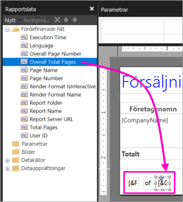

### Gör tabellen bredare  

Nu kan du göra matrisen tillräckligt bred för att fylla sidans bredd och göra textkolumnerna bredare så att namnen inte rullar så mycket. 
 
1. Välj matrisen och välj sedan kolumnen Företagsnamn.

3. Hovra över det grå fältet högst upp i matrisen till höger i kolumnen Företagsnamn. Dra till höger tills kolumnen slutar vid 1 3/8 tum. 

    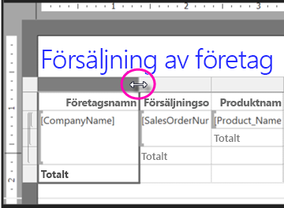

4. Dra den högra kanten av Produktnamn tills kolumnen slutar vid 3 3/4 tum.   

Matrisen är nästan lika stor som utskriftsområdet.

### Formatera valutan

Som du kanske märkte när du körde rapporten så har dollarbeloppen ännu inte formaterats som valuta.

1. Välj övre vänstra cellen [Sum(OrderQty)], håll ned Skift-tangenten och markera cellen [Sum(LineTotal)] nere till höger.

    

2. Välj valutasymbolen för dollar ( **$** ) på fliken **Start** och sedan pilen bredvid **Platshållarformat** > **Exempelvärden**.
 
    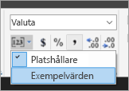

    Nu kan du se att värdena har formaterats som valuta.

    

### Lägg till kolumnrubriker på varje sida

Ytterligare en formateringsförbättring innan du publicerar rapporten till Power BI-tjänsten: Gör så att kolumnrubrikerna visas på varje sida i rapporten.

1. Välj listrutepilen > **Avancerat läge** längst ut till höger i det översta fältet i fönstret Gruppering.

    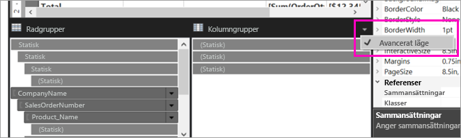

2. Välj den översta **Statiska** stapeln i **Radgrupper**. Cellen Företagsnamn i matrisen har valts.

   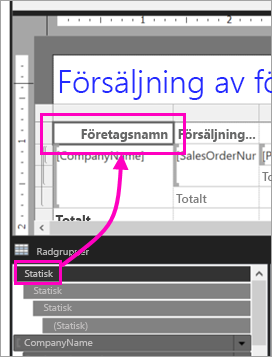

3. Kontrollera egenskaperna för **Tablixmedlem** i fönstret **Egenskaper**. Ställ in **KeepWithGroup** på **Efter** och **RepeatOnNewPage** på **Sant**.

    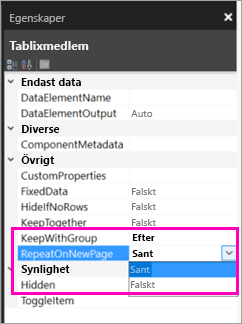

    Nu är det dags att köra rapporten och se hur den ser ut.

5. Välj **Kör** på fliken **Start**.

6. Välj alternativet **Utskriftslayout** om det inte redan har valts. Nu innehåller rapporten 29 sidor. Bläddra igenom några sidor. Du kan se att valutan är formaterad, att kolumnerna har rubriker på varje sida och att rapporten innehåller en sidfot med sidnummer och datum- och tidsstämpel på varje sida.
 
    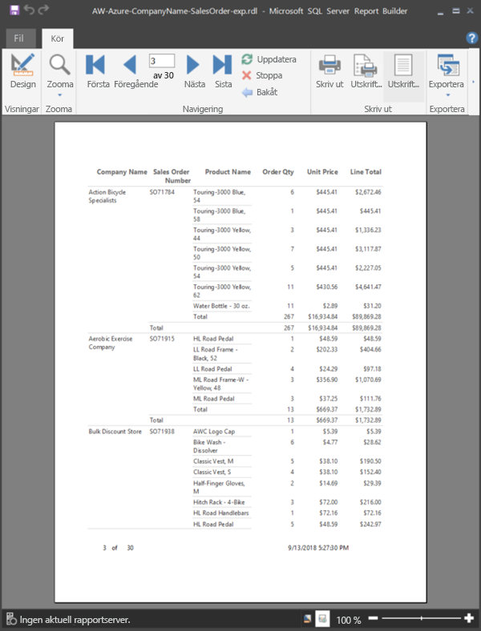

7. Spara rapporten på datorn.
 
##  Ladda upp rapporten till tjänsten

Nu när du har skapat den här sidnumrerade rapporten är det dags att överföra den till Power BI-tjänsten.

1. Välj **Arbetsytor** > **Skapa apparbetsyta** i Power BI-tjänsten (http://app.powerbi.com) i det vänstra navigeringsfönstret.

2. Ge arbetsytan namnet **Azure AW** eller något annat unikt namn. Du är den enda medlemmen för tillfället. 

3. Välj pilen bredvid **Avancerat** och aktivera **Dedikerad kapacitet**. 

    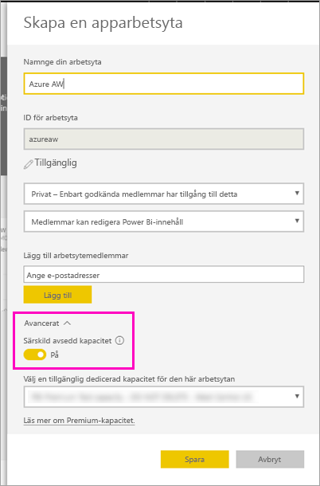

    Om du inte kan aktivera arbetsytan måste du be Power BI-administratören att ge dig behörighet att lägga till den i den dedikerade Premium-kapaciteten.

4. Välj en **tillgänglig dedicerad kapacitet för den här arbetsytan**, om så behövs > **Spara**.
    
    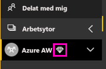

    Om arbetsytan inte är i en Premium-kapacitet så visas meddeladet ”Det går inte att lada upp sidnumrerad rapport” när du försöker att ladda upp rapporten. Kontakta Power BI-administratören om du vill flytta arbetsytan.

1. Välj **Hämta data** på din nya arbetsyta.

2. Välj **Hämta** i rutan **Filer**.

3. Välj **Lokal fil**, navigera till platsen där du sparade filen > **öppna**.

   Power BI har importerar filen, och du kan se den under **Rapporter** på lista med applistor.

    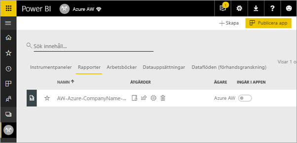

4. Visa rapporten genom att markera den.

5. Om dett uppstår ett fel kan du behöva ange dina autentiseringsuppgifter på nytt. Välj ikonen **Hantera**.

    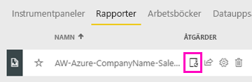

6. Välj **Redigera autentiseringsuppgifter** och ange de autentiseringsuppgifter som du använde i Azure när du skapade Azure-databasen.

    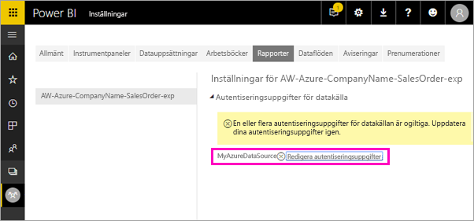

7. Nu kan du visa din sidnumrerade rapport i Power BI-tjänsten.

    

## Nästa steg

[Vad är sidnumrerade rapporter i Power BI Premium? (Förhandsversion)](paginated-reports-report-builder-power-bi.md)

