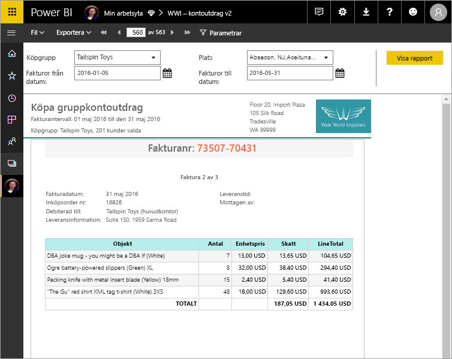

# Vad är sidnumrerade rapporter i Power BI Premium? (Förhandsgranskning)

Sidnumrerade rapporter, som länge varit standardrapportformat i SQL Server Reporting Services, är nu tillgängliga i Power BI-tjänsten. De här rapporterna kan skrivas ut eller delas. De kallas ”sidnumrerade” eftersom de är formaterade för att passa på en sida. De visar alla data i en tabell, även om tabellen sträcker sig över flera sidor. Rapporterna kallas ibland ”pixelperfekta” eftersom du kan kontrollera deras sidlayout i minsta detalj. Sidnumrerade rapporter baseras på tekniken för RDL-rapporter i SQL Server Reporting Services. Report Builder är ett fristående verktyg för redigering av sidnumrerade rapporter. 

Sidnumrerade rapporter kan ha många sidor. Den här rapporten har till exempel 563 sidor. Varje sida har en exakt utformning med en sida per faktura och upprepande sidhuvuden och sidfötter.

Du kan förhandsgranska rapporten i Report Builder och sedan publicera den i Power BI-tjänsten http://app.powerbi.com. Du måste ha en Power BI Pro-licens för att kunna publicera en rapport i tjänsten. Du kan publicera och dela sidnumrerade rapporter på Min arbetsyta eller på apparbetsytor, så länge arbetsytan finns i en Power BI Premium-kapacitet. Dessutom måste en Power BI-administratör aktivera sidnumrerade rapporter i Power BI-administratörsportalen. 

## Skapa rapporter i Power BI Report Builder

Sidnumrerade rapporter har sina egna designverktyget och Power BI Report Builder. Det är ett nytt verktyg som delar samma grund som de verktyg som du tidigare hade används för att skapa sidnumrerade rapporter för Power BI Report Server eller SQL Server Reporting Services (SSRS). Sidnumrerade rapporter som du skapar för SSRS 2016 och 2017, eller lokalt för Power BI Report Server, är i själva verket kompatibla med Power BI-tjänsten. Power BI-tjänsten har bakåtkompatibilitet så att du kan flytta dina rapporter framåt och uppgradera alla sidnumrerade rapporter av äldre version. Alla funktioner är inte tillgängliga vid start. Se [Begränsningar och överväganden](#limitations-and-considerations) i den här artikeln för mer information.
     
## Rapportera från en mängd olika datakällor

En enskild sidnumrerad rapport kan ha flera olika datakällor. Den har inte, till skillnad från Power BI-rapporter, en underliggande datamodell. För denna första version av sidnumrerade rapporter i Power BI-tjänsten skapar du inbäddade datakällor och datamängder i själva rapporten. Du kan inte använda delade datakällor eller delade datamängder för tillfället. Du skapar rapporter i Report Builder på din lokala dator. Om en rapport ansluter till lokala data när du har överfört rapporten till Power BI-tjänsten måste du skapa en gateway och omdirigera dataanslutningen. Här följer de datakällor som du kan ansluta till just nu:

- Azure SQL Database och Data Warehouse
- Azure Analysis Services (via SSO)
- SQL Server via en gateway
- SQL Server Analysis Services via en gateway
- Power BI-datauppsättningar
- Oracle
- Teradata
 
Fler datakällor kommer under förhandsversionsperioden.

## Utforma din rapport  

### Skapa sidnumrerade rapporter med matriser, diagram och layouter för fritt format

Tabellrapporter fungerar bra för kolumnbaserade data. Matrisrapporter är, precis som korstabulerings- eller pivottabellrapporter, användbara för sammanfattade data. Diagramrapporter presenterar data i ett grafiskt format och friformslistrapporter *kan* användas för att presentera nästan allt annat, som fakturor. 
  
Du kan börja med någon av Report Builder-guiderna. Med hjälp av tabell-, matris- och diagramguider lär du dig att skapa en inbäddad datakällsanslutning och en inbäddad datamängd. Sedan skapar du en datamängdsfråga genom att dra och släppa fält, väljer en layout och anpassar din rapport.  
  
Med kartguiden kan du skapa rapporter som visar aggregerade data mot en geografisk eller geometrisk bakgrund. Kartdata kan vara rumsliga data från en Transact-SQL-fråga eller en formfil från Environmental Systems Research Institute, Inc. (ESRI). Du kan också lägga till en Microsoft Bing-kartrutebakgrund.  

### Lägga till mer i din rapport

Ändra dina data genom att filtrera, gruppera och sortera data, eller genom att lägga till formler eller uttryck. Lägg till diagram, mätare, miniatyrdiagram och indikatorer som sammanfattar data i ett visuellt format.  Filtrera data för anpassade vyer med hjälp av parametrar och filter. Bädda in eller referera till bilder och andra resurser, inklusive externt innehåll.  

Allt innehåll i en sidnumrerad rapport, från rapporten i sig till varje textruta, bild, tabell och diagram, har en matris med egenskaper som du kan konfigurera så att rapporten ser ut exakt som du vill ha den.

## Skapa en rapportdefinition

När du utformar en sidnumrerad rapport skapar du i själva verket en *rapportdefinition*. Den innehåller inte data. Den anger var data ska hämtas, vilka data som ska hämtas och hur dessa data ska visas. När du kör rapporten tar rapportprocessorn den rapportdefinitionen som du har angett, hämtar data, kombinerar dem med rapportlayouten och genererar därmed rapporten. Du överför rapportdefinitionen till Power BI-tjänsten, http://app.powerbi.com, antingen till Min arbetsyta eller till en arbetsyta som du delar med dina kollegor. Om rapportdatakällan finns lokalt, när du har överfört rapporten, så kan du omdirigera datakällsanslutningen så att den gå via en gateway. 

## Visa din sidnumrerade rapport
Du kan visa din sidnumrerade rapport i Power BI-tjänsten i en webbläsare, och även i Power BI-mobilappar. Från Power BI-tjänsten kan du exportera rapporten till flera format, t.ex. HTML, MHTML, PDF, XML, CSV, TIFF, Word och Excel. Du kan också dela den med andra.  

## Skapa en prenumeration i din rapport

Du kan nu ställa in e-postprenumerationer för dig själv och andra för sidnumrerade rapporter i Power BI-tjänsten. I allmänhet är processen densamma som prenumererar på rapporter och instrumentpaneler i Power BI-tjänsten. Att konfigurera prenumerationer, väljer du hur ofta du vill ta emot e-postmeddelanden: varje dag, vecka eller per timme. Prenumerationen innehåller en PDF-bilagan på hela rapporten utdata.

Mer information finns i artikeln [prenumerera sidnumrerade rapporter i Power BI-tjänsten dig själv och andra](paginated-reports-subscriptions.md). 

## Begränsningar och överväganden

Här följer några andra funktioner som inte stöds i den första versionen:

- Fästa rapportsidor eller visuella objekt på Power BI-instrumentpaneler. Du kan fortfarande fästa visualiseringar på en Power BI-instrumentpanel från en lokal sidnumrerad rapport på en Power BI-rapportserver eller Reporting Services-rapportserver. Se [Fäst Reporting Services-objekt till Power BI-instrumentpaneler](https://docs.microsoft.com/sql/reporting-services/pin-reporting-services-items-to-power-bi-dashboards) för mer information.
- Interaktiva funktioner som dokumentkartor och Visa/Dölj-knappar.
- Underrapporter och detaljerade rapporter.
- Delade datakällor och delade datamängder.
- Visuella objekt från Power BI-rapporter.
 
## Nästa steg

- [Installera Power BI Report Builder från Microsoft Download Center](https://go.microsoft.com/fwlink/?linkid=2086513)
- [Självstudier: Skapa en sidnumrerad rapport](paginated-reports-quickstart-aw.md)
- [Ange data direkt i en sidnumrerad rapport](paginated-reports-enter-data.md)

  

