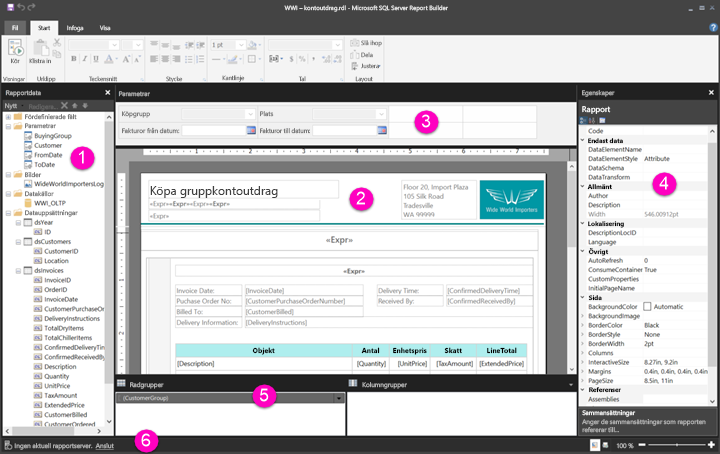

# Navigera i rapportens designvy för sidnumrerade rapporter (förhandsversion)

Rapportens designvyn i Report Builder är designutrymmet för att skapa sidnumrerade rapporter som du kan publicera i Power BI-tjänsten. Designytan är i mitten av Report Builder med menyfliksområdet och fönster runt den. Designytan är där du lägger till och organiserar dina rapportobjekt. Den här artikeln förklarar fönstren du använder för att lägga till och ordna resurserna i rapporten och för att ändra rapportegenskaper för objektet.  

1.  [Fönstret Rapportdata](#report-data-pane) 
2.  [Rapportens designyta](#report-design-surface)  
3.  [Parameterfönstret](#parameters-pane) 
4.  [Egenskapsfönster](#properties-pane) 
5.  [Grupperingsfönster](#grouping-pane) 
6.  [Aktuell rapports statusfält](#current-report-status-bar)  
  
## 1 Fönstret Rapportdata  
 Från fönstret Rapportdata definierar du de rapportdata och rapportresurser som du behöver för en rapport innan du utformar din rapportlayout. Du kan till exempel lägga till datakällor, datauppsättningar, beräknade fält, rapportparametrarna och bilder till fönstret Rapportdata.  
  
 När du har lagt till objekt i fönstret Rapportdata drar du fälten till rapportobjekten i designvyn för att styra var data visas i rapporten.  
  
> [!TIP]  
>  Om du drar ett fält från fönstret Rapportdata direkt till rapportens designyta i stället för att placera det i ett dataområde, till exempel en tabell eller ett diagram, kommer du när du kör rapporten bara att se det första värdet från data i fältet.  
  
 Du kan också dra inbyggda fält från fönstret Rapportdata till rapportens designyta. Vid återgivning ger dessa fält information om rapporten, till exempel rapportens namn, det totala antalet sidor i rapporten och det aktuella sidnumret.  
  
 Några saker läggs automatiskt till fönstret Rapportdata när du lägger till något till rapportens designyta. Om du t.ex. bäddar in en bild i rapporten, läggs den till i mappen Bilder i fönstret Rapportdata.  
  
> [!NOTE]  
>  Du kan använda knappen **Ny** för att lägga till ett nytt objekt i fönstret Rapportdata. Du kan lägga till flera datauppsättningar från samma datakälla eller från andra datakällor i rapporten. Om du vill lägga till en ny datauppsättning från samma datakälla, högerklickar du på en datakälla > **Lägg till datauppsättningen**.  
  
## 2 Rapportens designyta  
 Report Builder-rapportens designyta är den huvudsakliga arbetsytan för att utforma dina rapporter. Om du vill placera rapportobjekt som dataområden, underrapporter, textrutor, bilder, rektanglar och rader i rapporten kan du lägga till dem från menyfliksområdet eller i rapportdelens galleri till designytan. Där kan du lägga till grupper, uttryck, parametrar, filter, åtgärder, synlighet och formatering till dina rapportobjekt.  
  
 Du kan också ändra följande:  
  
-   Egenskaperna för rapportinnehåll, till exempel färg på kantlinje och fyllningsfärg, genom att högerklicka på designytans vita område utanför alla rapportobjekt och välja **Egenskaper för rapportinnehåll**.  
  
-   Sidhuvud- och sidfotsegenskaperna, till exempel färg på kantlinje och fyllningsfärg genom att högerklicka på designytas vita område i sidhuvudet eller sidfoten utanför alla rapportobjekt och välja **Sidhuvudegenskaper** eller **Sidfotsegenskaper**.  
  
-   Egenskaperna för själva rapporten, till exempel Utskriftsformat, genom att högerklicka på det grå området runt designytan och välja **Rapportegenskaper**.  
  
-   Egenskaperna för rapportobjekt genom att högerklicka på dem och välja **Egenskaper**.  
  
### Utforma ytans storlek och utskriftområde  
Designytans storlek kan skilja sig från utskriftsområdets storlek som du anger för att skriva ut rapporten. Att ändra storlek på designytan ändrar inte rapportens utskriftsområde. Oavsett vilken storlek du angett för rapportens utskriftsområde, så ändras inte den fullständiga designstorleken. Mer information finns i återgivningsbeteenden. 
  
- För att visa linjalen, markerar du under fliken **Visa** kryssrutan **Linjal**.  
  
## 3 Parameterfönstret  
 Med rapportparametrarna kan du styra rapporten, koppla ihop relaterade rapporter och variera rapportpresentationen. Parameterfönstret ger en flexibel layout för rapportparametrarna.  
  
 Läs mer om rapportparametrar   
  
## 4 Egenskapsfönster
 Alla objekt i en rapport, inklusive dataområden, bilder, textrutor och rapportinnehåll, har egenskaper som är kopplade till den. Till exempel visar BorderColor-egenskapen för en textruta värdet för textrutans kantlinje och egenskapen PageSize för rapporten visar sidstorleken i rapporten.  
  
 Dessa egenskaper visas i fönstret Egenskaper. Egenskaper i fönstret ändras beroende på det rapportobjekt som du väljer.  
  
- Visa fönstret Egenskaper på fliken **Visa** i gruppen **Visa/Dölj** > **Egenskaper**.  
  
### Ändra egenskapsvärden  
 Du kan ändra egenskaperna för rapportobjekt på flera olika sätt i Report Builder:  
  
-   Genom att välja knappar och listor i menyfliksområdet.  
  
-   Genom att ändra inställningarna inom dialogrutor.  
  
-   Genom att ändra egenskapsvärden i fönstret Egenskaper.  
  
 De vanligaste egenskaperna är tillgängliga i dialogrutorna och i menyfliksområdet.  
  
 Beroende på egenskapen kan du ställa ett egenskapsvärde från en nedrullningsbar listruta, skriva in värdet, eller välja `<Expression>` att skapa ett uttryck.  
  
### Ändra egenskapsfönstrets vy  
 Egenskaperna som visas i fönstret Egenskaper är som standard uppdelade i kategorier, t.ex åtgärd, kantlinje, fyllning, teckensnitt och allmänt. Varje kategori har en uppsättning egenskaper som är kopplade till den. Till exempel visas följande egenskaper i kategorin teckensnitt: Color, FontFamily, FontSize, FontStyle, FontWeight, LineHeight och TextDecoration. Om du vill kan du alfabetiskt ordna alla egenskaper som visas i fönstret. Detta tar bort kategorierna och visar en lista över alla egenskaper i alfabetisk ordning, oavsett kategori.  
  
 Egenskapsrutan har tre knappar överst i fönstret: **Kategori**, **Ordna alfabetiskt** och **Egenskapssidan**. Välj knapparna Kategori och Ordna alfabetiskt för att växla mellan egenskapsfönstrets vyer. Välj knappen **Egenskapssidor** för att öppna egenskapsdialogrutan för ett valt rapportobjekt.  
  
  
## 5 Grupperingsfönster

 Grupper används för att ordna rapportdata till en visuell hierarki och för att beräkna totalsummor. Du kan visa rad- och kolumngrupper inom ett dataområde på designytan och också i fönstret Gruppera. Fönstret Gruppera har två delar: radgrupper och kolumngrupper. När du väljer ett dataområde visar fönstret Gruppera alla grupper i den dataregionen som en hierarkisk lista: underordnade grupper visas indragna under deras överordnade grupper.  
  
 Du kan skapa grupper genom att dra fält från fönstret Rapportdata och släppa dem på designytan eller i fönstret Gruppera. I fönstret Gruppera kan du lägga till överordnade, intilliggande och underordnade grupper, ändra gruppegenskaper och ta bort grupper.  
  
 Fönstret Gruppera visas som standard men du kan stänga det genom att avmarkera grupperingsfönstrets kryssruta i fliken Visa. Fönstret Gruppera är inte tillgängligt för dataområdena Diagram eller Mätare.  
  
 Mer information finns i fönstret Gruppering och Förstå grupper.  
  
## 6 Aktuell rapports statusfält

Den aktuella rapportens statusfält visar namnet på den server som rapporten är ansluten till, eller så visas ”ingen aktuell rapportserver”. Du kan välja **Anslut** för att ansluta till en server.

## Nästa steg

[Vad är sidnumrerade rapporter i Power BI Premium? (Förhandsversion)](paginated-reports-report-builder-power-bi.md) 

  
  
