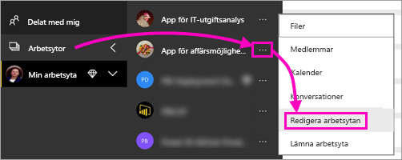
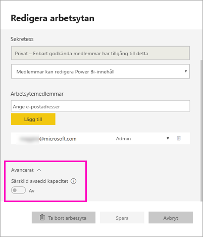
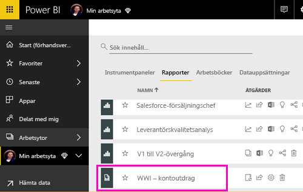
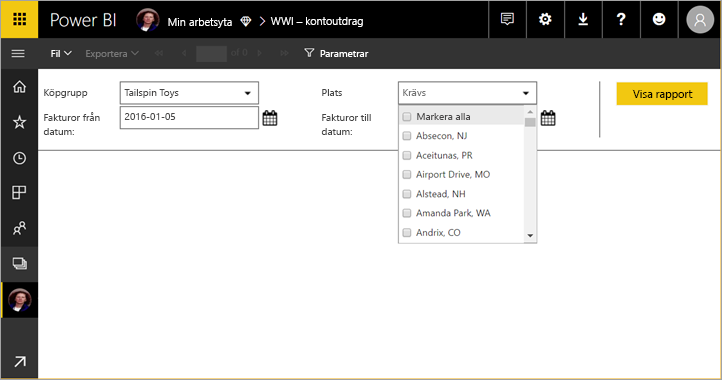
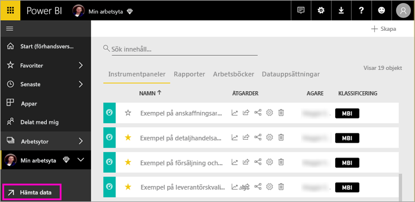
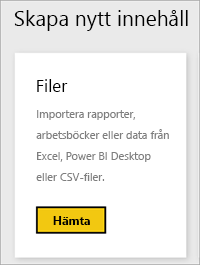
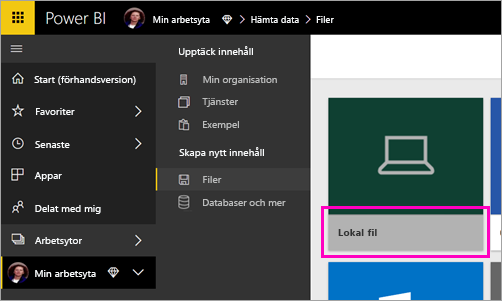
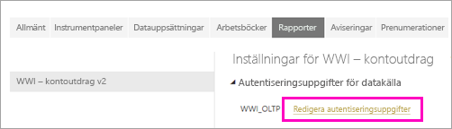
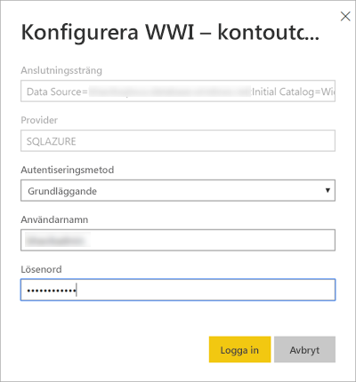
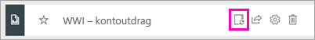

# Publicera en sidnumrerad rapport i Power BI-tjänsten

I den här artikeln får du lära dig om att publicera en sidnumrerad rapport i Power BI-tjänsten genom att överföra den från din lokala dator. Du kan överföra sidnumrerade rapporter till Min arbetsyta eller en annan arbetsyta, så länge arbetsytan finns i en Premium-kapacitet. Leta efter diamantikonen  bredvid arbetsytans namn. 

Om rapportdatakällan finns lokalt måste du skapa en gateway när du har laddat upp rapporten. Läs mer i avsnittet [Skapa en gateway](#create-a-gateway) längre fram i artikeln.

## Lägg till en arbetsyta till en Premium-kapacitet

Om arbetsytan inte har diamantikonen  bredvid namnet, behöver du lägga till arbetsytan till en Premium-kapacitet. 

1. Välj **Arbetsytor**, välj ellipsen ( **...** ) bredvid arbetsytans namn och välj sedan **Redigera arbetsyta**.

    

1. I dialogrutan **Redigera arbetsyta** expanderar du **Avancerat** och drar sedan **Dedikerad kapacitet** till **På**.

    

   Du kanske inte kan ändra den. Om inte kan du kontakta administratören för Power BI Premium-kapaciteten för att ge dig tilldelningsbehörighet att lägga till din arbetsyta till en Premium-kapacitet.

## Publicera en sidnumrerad rapport från Report Builder

1. Skapa din sidnumrerade rapport i Report Builder och spara den till din lokala dator.

1. Öppna menyn **Arkiv** i Report Builder och välj **Spara som**.

    

    Om du inte är inloggad i Power BI än måste du logga in eller skapa ett konto nu. Välj **Logga in** uppe till höger i Report Builder och slutför stegen.

2. I listan över arbetsytor till vänster väljer du en arbetsyta med diamantikonen  bredvid namnet. Ange ett **filnamn** i rutan > **Spara**. 

    

4. Öppna Power BI-tjänsten i en webbläsare och gå till Premium-arbetsytan där du publicerade den sidnumrerade rapporten. Rapporten visas på fliken **Rapporter**.

    

5. Välj den sidnumrerade rapporten så att den öppnas i Power BI-tjänsten. Om den har parametrar, måste du välja dem innan du kan visa rapporten.

    

6. Om rapportens datakälla finns lokalt läser du om att [skapa en gateway](#create-a-gateway) i den här artikeln så att du kommer åt datakällan.

## Ladda upp en sidnumrerad rapport från Power BI-tjänsten

Du kan också börja från Power BI-tjänsten och ladda upp en sidnumrerad rapport.

1. Skapa din sidnumrerade rapport i Report Builder och spara den till din lokala dator.

1. Öppna Power BI-tjänsten i en webbläsare och gå till Premium-arbetsytan där du vill publicera rapporten. Observera diamantikonen  bredvid namnet. 

1. Välj **Hämta data**.

    

1. I rutan **Filer** väljer du **Hämta**.

    

1. Välj **Lokal fil** > gå till den sidnumrerade rapporten > **Öppna**.

    

1. Välj **Fortsätt** > **Redigera autentiseringsuppgifter**.

    

1. Konfigurera dina inloggningsuppgifter > **Logga in**.

    

   Rapporten visas på fliken **Rapporter**.

    

1. Välj den för att öppna den i Power BI-tjänsten. Om den har parametrar, måste du välja dem innan du kan visa rapporten.
 
    

6. Om rapportens datakälla finns lokalt läser du om att [skapa en gateway](#create-a-gateway) i den här artikeln så att du kommer åt datakällan.

## Skapa en gateway

Precis som alla andra Power BI-rapporter, om rapportdatakällan finns på plats, måste du skapa eller ansluta till en gateway för att komma åt data.

1. Bredvid rapportnamnet, väljer du **Hantera**.

   

1. Information och följande steg finns i Power BI-tjänstartikeln [Vad är en lokal datagateway?](service-gateway-onprem.md).

### Gateway-begränsningar

För närvarande stöder inte gatewayer flervärdesparametrar.

## Nästa steg

- [Visa en sidnumrerad rapport i Power BI-tjänsten](consumer/paginated-reports-view-power-bi-service.md)
- [Vad är sidnumrerade rapporter i Power BI Premium?](paginated-reports-report-builder-power-bi.md)
- [Självstudie: Bädda in sidnumrerade Power BI-rapporter i en app för dina kunder](developer/embed-paginated-reports-customers.md)

