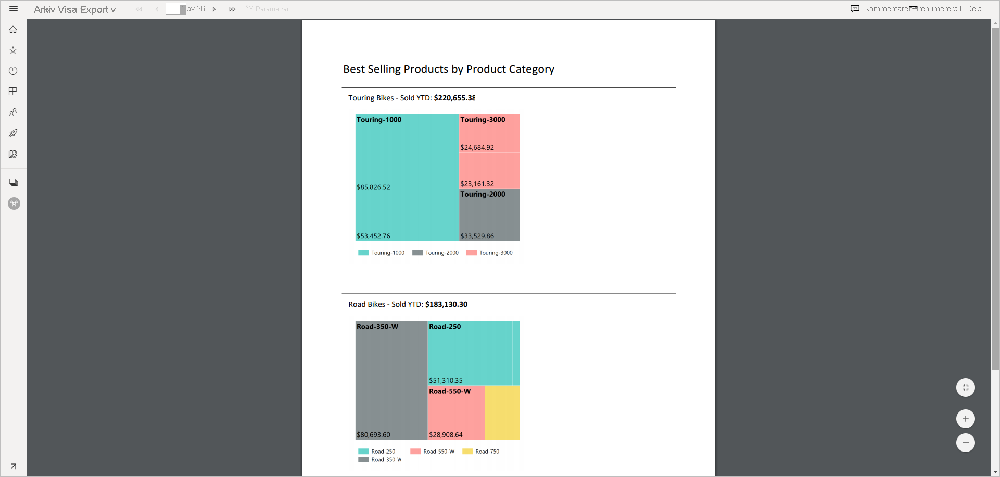
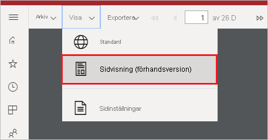
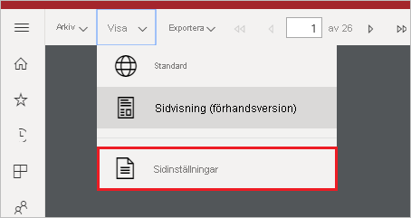
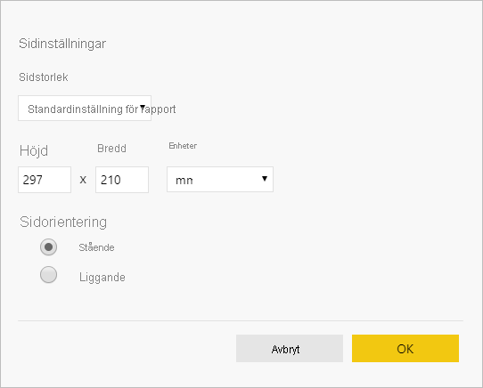

# Ange rapportvyer för sidnumrerade rapporter i Power BI-tjänsten

När du visar en sidnumrerad rapport i Power BI-tjänsten är standardvyn HTML-baserad och interaktiv. Det nya alternativet Sidvisning är en annan rapportvy för fasta sidformat som PDF.

**Interaktiv vy (standard)**

**Sidvisning**

I Sidvisning ser rapporten annorlunda ut jämfört med standardvyn. Vissa egenskaper och begrepp i sidnumrerade rapporter gäller endast för fasta sidor. Vyn ser ut ungefär som när rapporten skrivs ut eller exporteras. Du kan fortfarande ändra vissa element, till exempel parametervärden, men det finns inga andra interaktiva funktioner som sortering av kolumner eller växlingsknappar.

Sidvisning stöder alla funktioner som PDF-visningsprogrammet i webbläsaren stöder, till exempel zooma in, zooma ut och anpassa till sida.

## Växla till sidvisning

När du öppnar en sidnumrerad rapport visas den interaktiva vyn som standard. Om rapporten har parametrar väljer du parametrar och visar sedan rapporten.

1. Välj **Visa** i verktygsfältet > **Sidvisning**.

    

2. Du kan ändra inställningarna för sidvisning genom att välja **Sidinställningar** på **Visa**-menyn i verktygsfältet. 

    
    
    I dialogrutan **Sidinställningar** finns alternativ för att ange **sidstorlek** och **orientering** för sidvisningen. När du har tillämpat sidinställningarna gäller samma alternativ när du skriver ut sidan senare.
   
    

3. Om du vill växla tillbaka till den interaktiva vyn väljer du **Standard** i listrutan **Visa**.

## Stöd för webbläsare

Sidvisning stöds i webbläsarna Google Chrome och Microsoft Edge. Kontrollera att visning av PDF-filer har aktiverats i webbläsaren. Det är standardinställningen för dessa webbläsare.

Sidvisning stöds inte i Internet Explorer och Safari, så alternativet är inaktiverat. Det stöds inte heller i webbläsare på mobila enheter eller i Power BI-mobilappar.  

## Nästa steg

- [Visa en sidnumrerad rapport i Power BI-tjänsten](../consumer/paginated-reports-view-power-bi-service.md)
- [Vad är sidnumrerade rapporter i Power BI Premium?](paginated-reports-report-builder-power-bi.md)
