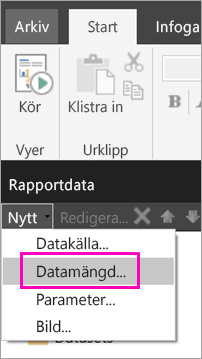
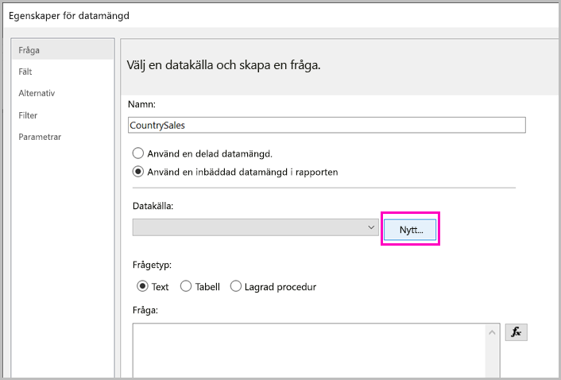
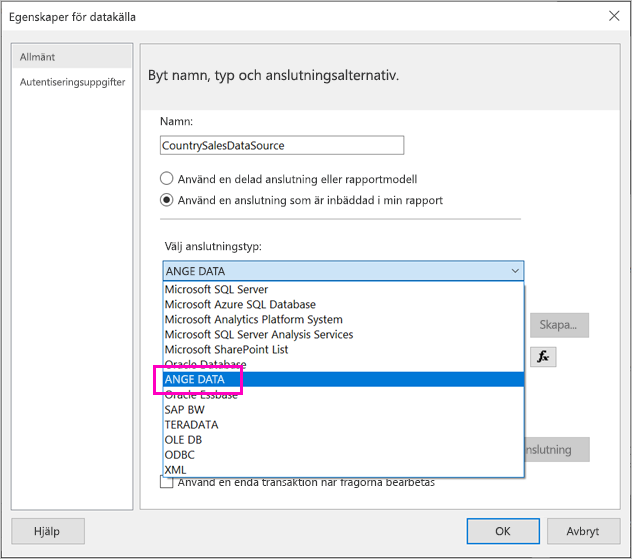
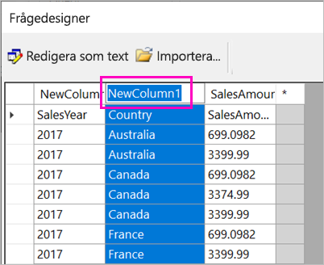
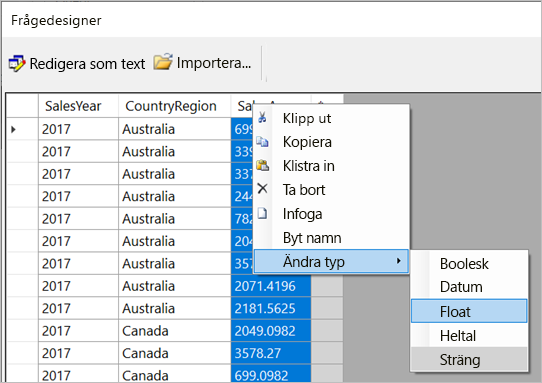
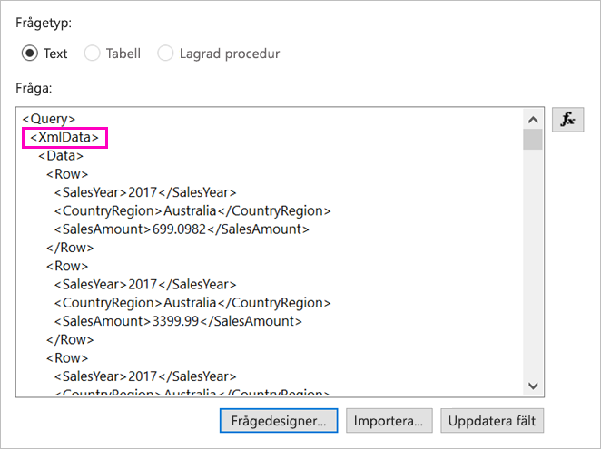
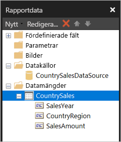

# <a name="enter-data-directly-in-a-paginated-report-in-report-builder---power-bi"></a>Ange data direkt i en sidnumrerad rapport i Report Builder – Power BI

I den här artikeln får du lära dig om en funktion i den nya versionen av Microsoft Power BI Report Builder som gör att du kan ange data direkt i en RDL-rapport som en inbäddad datamängd.  Den här funktionen liknar Power BI Desktop. Du kan ange data direkt i en datamängd i rapporten eller klistra in dem från ett annat program som Microsoft Excel. När du har skapat en datamängd genom att ange information kan du använda den precis på samma sätt som andra inbäddade datamängder som du har skapat. Dessutom kan du lägga till mer än en tabell och använda en som ett filter för den andra. Den här funktionen är särskilt användbar för små, statiska datamängder som du kan behöva använda i rapporten, t.ex. rapportparametrar.
 
## <a name="prerequisites"></a>Förutsättningar

- Om du vill ange data direkt i en sidnumrerad rapport ska du [ladda ned och installera Power BI Report Builder](https://aka.ms/pbireportbuilder). 
- För att spara din sidnumrerade rapport i Power BI-tjänsten behöver du ett [Power BI Pro-konto](../fundamentals/service-self-service-signup-for-power-bi.md) och skrivåtkomst till en arbetsyta i en [Power BI Premium-kapacitet](../admin/service-premium-what-is.md).
- Om du vill spara din sidnumrerade rapport till en rapportserver behöver du behörigheter för att [redigera filen Rsreportserver.config](#upload-the-paginated-report-to-a-report-server).

## <a name="create-a-data-source-and-dataset"></a>Skapa en datakälla och en datamängd

När du har hämtat och installerat Report Builder följer du samma arbetsflöde som du använder för att lägga till en inbäddad datamängd och datamängd i rapporten. I följande procedur under **Datakällor** så ser du ett nytt alternativ: **Ange data**.  Du behöver bara konfigurera den här datakällan en gång i en rapport. Efter det kan du skapa flera tabeller för data som har angetts som separata datamängder med den enda datakällan.

1. I fönstret **Rapportdata** i Report Builder väljer du **Nytt** > **Datamängd**.

    

1. I dialogrutan **Egenskaper för datamängd** väljer du alternativet att **använda en inbäddad datamängd i rapporten**.

1. Bredvid **Datakälla**väljer du **Nytt**.

    

1. I dialogrutan **Egenskaper för datamängd** väljer du alternativet att **använda en inbäddad anslutning i rapporten**.
2. I rutan **Välj anslutningstyp** väljer du **ANGE DATA** > **OK**.

    

1. I dialogrutan **Egenskaper för datamängd** klickar du på **Frågedesigner**.
2. I **Frågedesigner**  högerklickar du och klistrar in dina data i tabellen.

    

1. För att ange namn på kolumnerna dubbelklickar du på varje **NewColumn** och anger kolumnens namn.

    

1. Om den första raden innehåller kolumnrubriker i den ursprungliga informationen högerklickar du på den och tar bort den.
    
9. Som standard är datatypen för varje kolumn String. Högerklicka på kolumnrubriken om du vill ändra datatypen > **Ändra typ** och ange en annan datatyp för den, till exempel Datum eller Flyttal.

    

1. När du har skapat tabellen väljer du **OK**.  

    Den fråga som skapas är samma som visas med en XML-datakälla. Under försättsbladen använder vi XML som dataleverantör.  Vi har ändrat syfte för att även aktivera det här scenariot.

    

12. I dialogrutan **Egenskaper för datamängd** klickar du på **OK**.

13. Du ser din datakälla och datamängd i fönstret **Rapportdata**.

    

Du kan använda din datamängd som grund för datavisualiseringar i rapporten. Du kan också lägga till ytterligare en datamängd och använda samma datakälla för den.

## <a name="design-the-report"></a>Utforma rapporten

Nu när du har en datakälla och en datamängd kan du skapa din rapport. Följande procedur skapar en enkel rapport baserad på data från föregående avsnitt.

1. Gå till menyn **Infoga** och välj **Tabell** > **Tabellguiden**.

    :::image type="content" source="media/paginated-reports-enter-data/paginated-table-wizard.png" alt-text="Skärmbild av att välja alternativet Tabellguiden.":::

1. Välj den datamängd du nyss skapade > **Nästa**.

    :::image type="content" source="media/paginated-reports-enter-data/paginated-choose-dataset.png" alt-text="Skärmbild av dialogrutan Välj en datamängd.":::

2.  Dra fälten du vill gruppera efter från rutan **Tillgängliga fält** till rutan **Radgrupper** på sidan Ordna fält. I det här exemplet:

    - CountryRegion
    - SalesYear

3.  Dra de fält du vill aggregera från rutan **Tillgängliga fält** till rutan **Värden**. I det här exemplet:

    - SalesAmount

    Report Builder summerar som standard fälten i rutan **Värden**, men du kan välja en annan aggregering.

    :::image type="content" source="media/paginated-reports-enter-data/paginated-select-aggregation.png" alt-text="Skärmbild av olika aggregeringar du kan välja.":::
 
1. Välj **Nästa**.
4.  Behåll alla standardinställningar på sidan **Välj layout**, men avmarkera **Visa/dölj grupper**. I allmänhet är det bra att kunna visa och dölja grupper, men den här gången vill vi se alla data.

5.  Välj **Nästa** > **Slutför**. Tabellen visas på designytan.

    :::image type="content" source="media/paginated-reports-enter-data/paginated-design-view-matrix.png" alt-text="Skärmbild av rapporten i designvyn.":::

### <a name="run-the-report"></a>Kör rapporten

Om du vill se faktiska värden och förhandsgranska rapporten kör du den.

1. Välj **Kör** i menyfliksområdet **Start**.

    :::image type="content" source="media/paginated-reports-enter-data/paginated-run-report.png" alt-text="Skärmbild av att välja kör i menyfliksområdet Start.":::

    Nu visas värdena. Matrisen innehåller fler rader än de du såg i designvyn!  Du kan antingen formatera sidan eller välja att använda standardinställningarna innan du sparar rapporten lokalt eller publicerar den till tjänsten.

1. Om du vill se hur rapporten kommer att se ut när du skriver ut den väljer du **Utskriftslayout**.

    :::image type="content" source="media/paginated-reports-enter-data/paginated-select-print.png" alt-text="Skärmbild av att välja Utskriftslayout.":::

    Nu ser du rapporten som den ser ut efter utskrift.

    :::image type="content" source="media/paginated-reports-enter-data/paginated-print-layout.png" alt-text="Skärmbild av rapporten i vyn Utskriftslayout.":::

## <a name="upload-the-paginated-report-to-the-power-bi-service"></a>Ladda upp en sidnumrerad rapport i Power BI-tjänsten

Nu när sidnumrerade rapporter stöds i Power BI-tjänsten kan du överföra din sidnumrerade rapport till en Premium-kapacitet. I [Ladda upp en sidnumrerad rapport](paginated-reports-save-to-power-bi-service.md) finns mer information.

## <a name="upload-the-paginated-report-to-a-report-server"></a>Ladda upp den sidnumrerade rapporten till en rapportserver

Du kan också ladda upp din sidnumrerade rapport till en Power BI-rapportserver eller SQL Server Reporting Services 2016 eller 2017-rapportservern. Innan du gör det måste du lägga till följande objekt i din RsReportServer.config som en utökning av ytterligare data. Säkerhetskopiera filen RsReportServer.config innan du gör ändringen, ifall du stöter på problem.

```xml
<Extension Name="ENTERDATA" Type="Microsoft.ReportingServices.DataExtensions.XmlDPConnection,Microsoft.ReportingServices.DataExtensions">
    <Configuration>
        <ConfigName>ENTERDATA</ConfigName>
    </Configuration>
</Extension>
```

När du har redigerat det ska listan med dataleverantörer i konfigurationsfilen se ut så här:


Det var allt – du kan nu publicera rapporter som använder den här nya funktionen till rapportservern.

## <a name="next-steps"></a>Nästa steg

- [Vad är sidnumrerade rapporter i Power BI Premium?](paginated-reports-report-builder-power-bi.md)
- [Vad är Power BI-rapportservern?](../report-server/get-started.md)
