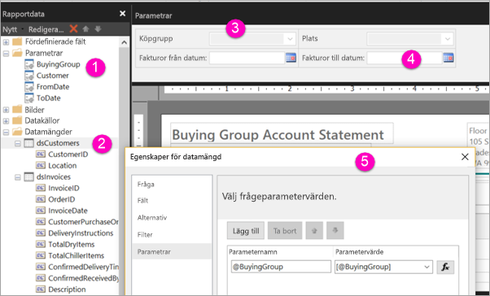

# Skapa parametrar för sidnumrerade rapporter i Power BI-tjänsten

I den här artikeln lär du dig att skapa parametrar för sidnumrerade rapporter i Power BI-tjänsten.  En rapportparameter är ett sätt att välja rapportdata och variera rapportpresentationen på. Du kan ange ett standardvärde och en lista med tillgängliga värden, och dina rapportläsare kan ändra valet.  

I följande bild visas designvyn i Power BI Report Builder för en rapport med parametrarna @BuyingGroup, @Customer, @FromDate och @ToDate. 
  

  
1.  Rapportparametrarna i fönstret Rapportdata.  
  
2.  Tabell med en av parametrarna i datamängden.  
  
3.  Fönstret Parametrar. Du kan anpassa layouten för parametrarna i parameterfönstret. 
  
4.  Parametrarna @FromDate och @ToDate har datatypen **DateTime**. När du visar rapporten kan du antingen ange ett datum i textrutan eller välja ett datum i kalendern. 

5.  En av parametrarna i dialogrutan **Egenskaper för datamängd**.  

  
## Skapa eller redigera en rapportparameter  
  
1.  Öppna din sidnumrerade rapport i Power BI Report Builder.

1. I fönstret **Rapportdata** högerklickar du på noden **Parametrar** > **Lägg till parameter**. Dialogrutan **Egenskaper för rapportparameter** öppnas.  
  
2.  I **Namn** skriver du ett namn på parametern eller så godkänner du standardnamnet.  
  
3.  I **Fråga** skriver du den text som ska visas bredvid textrutan för parametern när användaren kör rapporten.  
  
4.  I **Datatyp** väljer du datatypen för parametervärdet.  
  
5.  Om parametern kan innehålla ett tomt värde, väljer du **Tillåt tomt värde**.  
  
6.  Om parametern kan innehålla ett null-värde, väljer du **Tillåt null-värde**.  
  
7.  Om du vill tillåta att en användare kan välja mer än ett värde för parametern, väljer du **Tillåt flera värden**.  
  
8.  Ange synlighetsalternativet.  
  
    -   Om du vill att visa parametern i verktygsfältet högst upp i rapporten, väljer du **Synlig**.  
  
    -   Om du vill dölja parametern så att den inte visas i verktygsfältet, väljer du **Dold**.  
  
    -   Om du vill dölja parametern och hindra att den ändras på rapportservern när rapporten har publicerats, väljer du **Internt**. Rapportparametern visas därefter bara i rapportdefinitionen. För det här alternativet måste du ange ett standardvärde, eller tillåta att parametern accepterar ett null-värde.  
  
9. Välj **OK**. 

## Överväganden och felsökning

- Om du använder en Power BI-datamängd eller Analysis Services-modell som datakälla kan du på grund av DAX-begränsningar inte skicka fler än 1 000 parametervärden i en enskild begäran. 

 
## Nästa steg

Se [Visa parametrar för sidnumrerade rapporter](../consumer/paginated-reports-view-parameters.md) för att se hur parametrarna ser ut i Power BI-tjänsten.

Mer detaljerad information om parametrar i sidnumrerade rapporter finns i [Rapportparametrar i Power BI Report Builder](report-builder-parameters.md).
