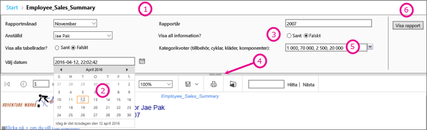
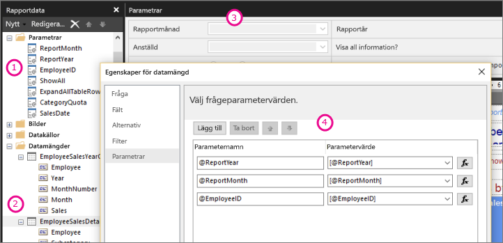

# Rapportparametrar i Power BI Report Builder

I det här ämnet beskrivs vanliga användningsområden för rapportparametrar i Power BI Report Builder, vilka egenskaper du kan ange och mycket mer. Med rapportparametrar kan du kontrollera rapportdata, koppla ihop relaterade rapporter och variera rapportpresentationen. Du kan använda rapportparametrar i sidnumrerade rapporter som du skapar i Report Builder.

##  Vanliga användningsområden för parametrar

 Här följer några av de vanligaste sätten att använda parametrar.  
  
**Kontrollera sidnumrerade rapportdata**
  
- Filtrera sidnumrerade rapportdata vid datakällan genom att skriva datamängdsfrågor som innehåller variabler.  
  
- Ge användarna möjligheten att ange värden för att anpassa data i en sidnumrerad rapport. Ange till exempel två parametrar för startdatum och slutdatum för försäljningsdata.  
  
**Variera rapportpresentation**
  
- Ge användarna möjligheten att ange värden för att anpassa utseendet på en rapport. Ange till exempel en boolesk parameter för att indikera huruvida du vill visa eller dölja alla kapslade radgrupper i en tabell.  
  
- Ge användarna möjligheten att anpassa rapportdata och utseende genom att inkludera parametrar i ett uttryck.  
  
##  Visa en rapport med parametrar

När du visar en rapport som har parametrar, visar rapportgranskarens verktygsfält varje parameter så att du kan ange värden interaktivt. Följande bild visar parameterområdet för en rapport med parametrarna @ReportMonth, @ReportYear, @EmployeeID, @ShowAll, @ExpandTableRows, @CategoryQuota och @SalesDate.  

  
1. **Parameterfönstret** Rapportgranskarens verktygsfält visar ett meddelande och ett standardvärde för varje parameter. Du kan anpassa layouten för parametrarna i parameterfönstret.  
  
2. **@SalesDate Parametern** parametern @SalesDate är datatypen **DateTime**. Frågan Select the Date (Välj datum) visas intill textrutan. Ändra datumet genom att skriva ett nytt datum i textrutan eller använda kalenderkontrollen.  
  
3. **@ShowAll Parametern** parametern @ShowAll är datatypen **booleskt**. Använd alternativknapparna för att ange **Sant** eller **Falskt**.  
  
4. **Visa eller dölj referens för Dölj parameterområde** I rapportgranskarens verktygsfält klickar du på den här pilen för att visa eller dölja parameterfönstret.  
  
5. **@CategoryQuota Parametern** parametern @CategoryQuota är datatypen **flytande**, så att det tar ett numeriskt värde.  @CategoryQuota har angetts för att tillåta flera värden.  
  
6. **Visa rapporten** När du angett parametervärden klickar du på **Visa rapport** för att köra rapporten. Om alla parametrar har standardvärden körs rapporten automatiskt vid den första visningen.  
  
##  Skapa parametrar

Du kan skapa rapportparametrar på ett par olika sätt.
  
> [!NOTE]
>  Inte alla datakällor stöder parametrar.
  
**Datamängdsfråga eller lagrad procedur med parametrar**
  
 Lägg till en datamängdsfråga som innehåller variabler eller en lagrad datamängdsprocedur som innehåller indataparametrar. En datamängdsparameter skapas för varje variabel eller indataparameter, och en rapportparameter skapas för varje datamängdsparameter.  
  

  
 Den här bilden från Report Builder visar:  
  
1.  Rapportparametrarna i fönstret Rapportdata.  
  
2.  Datamängden med parametrar.  
  
3.  Fönstret Parametrar.  
  
4.  De parametrar som anges i dialogrutan Datamängdsegenskaper.  
  
**Skapa en parameter manuellt**
  
Skapa en parameter manuellt från fönstret Rapportdata. Du kan konfigurera rapportparametrar så att en användare interaktivt kan ange värden för att anpassa innehållet eller utseendet för en rapport. Du kan även konfigurera rapportparametrar så att en användare inte kan ändra förkonfigurerade värden.  
  
> [!NOTE]  
>  Eftersom parametrar hanteras oberoende av varandra på servern skrivs de befintliga parameterinställningarna för rapporten inte över om en huvudrapport publiceras på nytt med nya parameterinställningar.  

### Parametervärden

 Följande är alternativ för att välja parametervärden i rapporten.  
  
- Välj ett enskilt parametervärde från en listruta.  
  
- Välj flera parametervärden från en listruta.  
  
- Välj ett värde från en listruta för en parameter, som bestämmer vilka värden som är tillgängliga i listrutan för en annan parameter. De här är sammanhängande parametrar. Med sammanhängande parametrar kan du filtrera parametervärden från tusentals värden till ett hanterbart antal. Mer information finns i [Använda sammanhängande parametrar i sidnumrerade rapporter](../guidance/paginated-report-cascading-parameter.md).
  
- Kör rapporten utan att först behöva välja ett parametervärde eftersom ett standardvärde har skapats för parametern.  
  
##  Egenskaper för rapportparametrar

 Du kan ändra egenskaperna för rapportparameter med hjälp av dialogrutan Rapportegenskaper. I följande tabell sammanfattas de egenskaper som du kan ange för varje parameter:  
  
|Egenskap|Beskrivning|  
|--------------|-----------------|  
|Namn|Skriv ett skiftlägeskänsligt namn för parametern. Namnet måste börja med en bokstav och kan innehålla bokstäver, siffror och understreck (_). Namnet får inte innehålla blanksteg. För automatiskt genererade parametrar matchar namnet parametern i datamängdsfrågan. Som standard liknar manuellt skapade parametrar ReportParameter1.|  
|Promptfråga|Den text som visas intill parametern i rapportgranskarens verktygsfält.|  
|Datatyp|En rapportparameter måste vara någon av följande datatyper:   **Boolean** (Boolesk). Användaren väljer True (Sant) eller False (Falskt) från en alternativknapp.   **DateTime**. Användaren väljer ett datum från en kalenderkontroll.   **Integer** (Heltal). Användaren skriver värden i en textruta.   **Float** (Flyttal). Användaren skriver värden i en textruta.   **Text**. Användaren skriver värden i en textruta.   När tillgängliga värden har definierats för en parameter väljer användaren värden från en listrutan, även när datatypen är **DateTime**.|  
|Tillåta tomt värde|Välj det här alternativet om värdet för parametern kan vara en tom sträng eller ett tomt värde.   Om du anger giltiga värden för en parameter och du vill att ett tomt värde ska vara ett av de giltiga värdena måste du inkludera det som ett av de värden som du anger. Om du väljer det här alternativet inkluderas inte ett tomt värde automatiskt för tillgängliga värden.|  
|Tillåta nullvärde|Välj det här alternativet om värdet för parametern kan vara null.   Om du anger giltiga värden för en parameter och du vill att null ska vara ett av de giltiga värdena måste du inkludera null som ett av de värden som du anger. Om du väljer det här alternativet inkluderas inte null automatiskt för tillgängliga värden.|  
|Tillåta flera värden|Ange tillgängliga värden för att skapa en listruta som användarna kan välja från. Det här är ett bra sätt att se till att endast giltiga värden skickas i datamängdsfrågan.   Välj det här alternativet om värdet för parametern kan vara flera värden som visas i en listruta. Nullvärden tillåts inte. När det här alternativet väljs läggs kryssrutorna i listan över tillgängliga värden i en listruta för parametrar. Överst i listan finns en kryssruta för **Markera alla**. Användare kan markera de värden som de vill ha.   Om de data som ger värden ändras snabbt blir den lista som användaren ser kanske inte den mest aktuella.|  
|Synliga|Välj det här alternativet för att visa rapportparametern överst i rapporten när den körs. Med det här alternativet kan användarna välja parametervärden vid körning.|  
|Dold|Välj det här alternativet om du vill dölja rapportparametern i den publicerade rapporten. Rapportparameterns värden kan fortfarande anges i en rapport-URL, i en prenumerationsdefinition eller på rapportservern.|  
|Internt|Välj det här alternativet om du vill dölja rapportparametern. I den publicerade rapporten kan rapportparametern endast visas i rapportdefinitionen.|  
|Tillgängliga värden|Om du har angett tillgängliga värden för en parameter visas de giltiga värdena alltid som en listruta. Om du till exempel anger tillgängliga värden för en **DateTime**-parameter visas en listruta för datum i parameterfönstret i stället för en kalenderkontroll.   För att säkerställa att en lista med värden är konsekvent mellan en rapport och underrapporter kan du ange ett alternativ för att datakällan ska använda en enda transaktion för alla frågor i de datamängder som är associerade med en datakälla.   **Säkerhetsmeddelande** I rapporter som innehåller en parameter med datatypen **Text** bör du använda en lista över tillgängliga värden (kallas även en lista med giltiga värden) och kontrollera att alla användare som kör rapporten har endast de behörigheter som krävs för att visa data i rapporten.|  
|Standardvärden|Ange standardvärden från en fråga eller från en statisk lista.   När varje parameter har ett standardvärde körs rapporten automatiskt vid den första visningen.|  
|Avancerat|Ange rapportdefinitionsattributet **UsedInQuery**, ett värde som anger huruvida den här parametern direkt eller indirekt påverkar data i en rapport.   **Automatiskt avgöra när uppdatering ska ske**  Välj det här alternativet när du vill att rapportbearbetaren ska bestämma en inställning för det här värdet. Värdet är **Sant** om rapportbearbetaren identifierar en datamängdsfråga med en direkt eller indirekt referens till den här parametern, eller om rapporten innehåller underrapporter.   **Uppdatera alltid**  Välj det här alternativet när rapportparametern används direkt eller indirekt i en datamängdsfråga eller ett parameteruttryck. Det här alternativet anger **UsedInQuery** till True (Sant).   **Uppdatera aldrig**  Välj det här alternativet när rapportparametern inte används direkt eller indirekt i en datamängdsfråga eller ett parameteruttryck. Det här alternativet anger **UsedInQuery** till False (Falskt).   **Varning** Använd **Uppdatera aldrig** med försiktighet. På rapportservern används **UsedInQuery** för att kontrollera cachealternativ för rapportdata och återgivna rapporter, och parameteralternativ för ögonblicksbilder av rapport. Om du anger **Uppdatera aldrig** på fel sätt kan det leda till att felaktiga rapportdata eller rapporter cachelagras eller att en ögonblicksbild av rapport har inkonsekventa data. |  
  
##   Datamängdsfråga  
 Om du vill filtrera data i datamängdsfrågan kan du inkludera en begränsningssats som begränsar hämtade data genom att ange värden för att inkludera eller exkludera från resultatuppsättningen.  
  
 Använda frågedesignern för datakällan för att skapa en parametriserad fråga.  
  
-   För Transact-SQL-frågor stöder olika datakällor olika syntax för parametrar. Stöder sträcker sig från parametrar som identifieras i frågan efter position eller efter namn. I relationsfrågedesignern måste du välja parameteralternativet för att ett filter ska skapa en parametriserad fråga.   
  
-   För frågor som baseras på en flerdimensionell datakälla såsom Microsoft SQL Server Analysis Services kan du ange om en parameter baserat på ett filter som du anger i frågedesignern ska skapas. 
  
##   Parameterhantering för en publicerad rapport  
 När du utformar en rapport sparas rapportparametrarna i rapportdefinitionen. När du publicerar en rapport sparas och hanteras rapportparametrarna separat från rapportdefinitionen.  
  
 För en publicerad rapport kan du använda följande:  
  
-   **Egenskaper för rapportparametrar.** Ändra rapportparametervärden direkt på rapportservern oberoende av rapportdefinitionen.  
  
-   **Rapportprenumerationer.** Du kan ange parametervärden för att filtrera data och leverera rapporter via prenumerationer. 
  
 Parameteregenskaperna för en publicerad rapport bevaras om du publicerar rapportdefinitionen på nytt. Om rapportdefinitionen publiceras på nytt som samma rapport förblir parameternamnen och datatyperna desamma, och egenskapsinställningarna bevaras. Om du lägger till eller tar bort parametrar i rapportdefinitionen, eller ändrar datatypen eller namnet på en befintlig parameter, kan du behöva ändra parameteregenskaperna i den publicerade rapporten.  
  
 Inte alla parametrar kan ändras i samtliga fall. Om en rapportparameter får ett standardvärde från en datamängdsfråga kan det värdet inte ändras för en publicerad rapport och kan inte ändras på rapportservern. Det värde som används vid körning bestäms när frågan körs, eller när uttrycket utvärderas då det gäller uttrycksbaserade parametrar.  
  
 Alternativ för rapportkörning kan påverka hur parametrar bearbetas. En rapport som körs som en ögonblicksbild kan inte använda parametrar som kommer från en fråga såvida inte frågan innehåller standardvärden för parametrarna.  
  
##   Parametrar för en prenumeration  
 Du kan definiera en prenumeration för en på begäran-rapport eller en ögonblicksbild av rapport och ange parametervärden som ska användas vid prenumerationsbearbetning.  
  
-   **Rapport på begäran.**  För en på begäran-rapport kan du ange ett annat parametervärde än det publicerade värdet för varje parameter som anges för rapporten. Anta exempelvis att du har en kundtjänstrapport som använder en *Time Period*-parameter (Tidsperiod) för att returnera kundservicebegäranden för aktuell dag, vecka eller månad. Om standardparametervärdet för rapporten anges till **today** (i dag) kan prenumerationen använda ett annat parametervärde (till exempel **week** (vecka) eller **month** (månad)) för att framställa en rapport som innehåller veckovisa eller månadsvisa uppgifter.  
  
## Nästa steg

- [Vad är sidnumrerade rapporter i Power BI Premium?](paginated-reports-report-builder-power-bi.md)  
- [Använda sammanhängande parametrar i sidnumrerade rapporter](../guidance/paginated-report-cascading-parameter.md)
