# Skapa en sidnumrerad rapport baserat på en delad Power BI-datamängd

Du kan använda en datamängd som du skapar i Power BI Desktop som datakälla för sidnumrerade rapporter för Paginated Report Builder i Power BI. Tänk dig följande scenario: Du har skapat en Power BI-rapport i Power BI Desktop. Du har ägnat mycket tid åt att utforma datamodellen och skapade sedan en snygg Power BI-rapport med alla möjliga häftiga visuella objekt. Rapporten innehåller en matris med många rader, så du måste bläddra för att se alla. De som läser din rapport vill ha en rapport som de kan skriva ut och som visar alla rader i matrisen. En sidnumrerad Power BI-rapport kan göra detta: skriva ut en tabell eller matris som körs på flera sidor, med sidhuvuden och sidfötter samt en perfekt sidlayout som du utformar. Den kompletterar Power BI Desktop-rapporten. Du vill att de ska baseras på exakt samma data, utan avvikelser, så du använder samma datamängd.

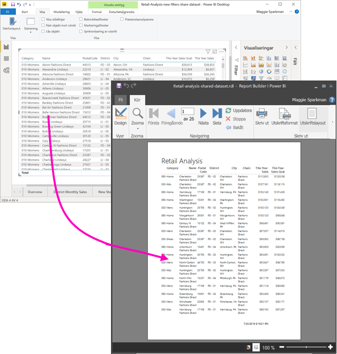

Datamängden behöver inte finnas på en arbetsyta i en Premium-kapacitet, och du behöver inte vara medlem i den arbetsytan. Du behöver bara ha [behörigheten Skapa](../service-datasets-build-permissions.md) för datamängden. För att publicera en sidnumrerad rapport behöver du en Power BI Pro-licens. Du behöver även minst rollen Deltagare för en arbetsyta i en Premium-kapacitet.

## Detta behöver du

Här är en lista över det du behöver och inte behöver för att använda en delad datamängd i Report Builder i Power BI.

- Öppna Report Builder i Power BI. [Ladda ned och installera Report Builder i Power BI](https://go.microsoft.com/fwlink/?linkid=2086513).
- För att få åtkomst till en Power BI-datamängd behöver du ha behörigheten Skapa för datamängden. Läs om [behörigheten Skapa](../service-datasets-build-permissions.md).
- Du behöver ingen Power BI Pro-licens för att skapa en sidnumrerad rapport i Report Builder. 
- Du behöver dock en Power BI Pro-licens för att publicera den sidnumrerade rapporten. Du behöver även minst rollen Deltagare för en arbetsyta i en Premium-kapacitet. 
- Valfritt: Om du vill följa med i den här artikeln laddar du ned filen[Retail Analysis sample .pbix](https://download.microsoft.com/download/9/6/D/96DDC2FF-2568-491D-AAFA-AFDD6F763AE3/Retail%20Analysis%20Sample%20PBIX.pbix), öppnar den i Power BI Desktop och lägger till en tabell med många kolumner. I fönstret **Format** inaktiverar du **Totals** (Summor). Publicera den sedan på en arbetsyta i Power BI-tjänsten.

    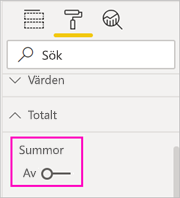

## Ansluta till Power BI-datamängden

1. Öppna Power BI Report Builder.
1. Välj **Logga in** i det övre högra hörnet av Report Builder för att logga in på ditt Power BI-konto.
1. I fönstret Rapportdata väljer du **Ny** > **Power BI-datamängdsanslutning**.

    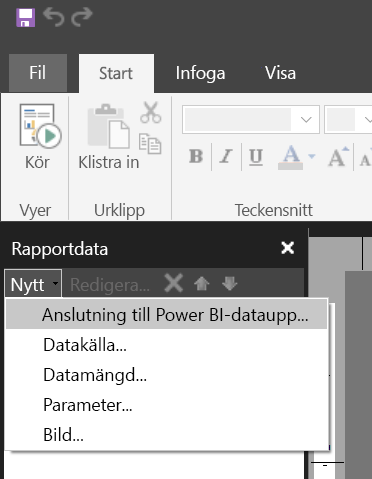

    > [!NOTE]
    > Du kan inte skapa datakällan eller datamängden för en Power BI-datamängd med hjälp av guiderna Tabell, Matris eller Diagram i Report Builder. När du har skapat dem kan du använda guiderna för att skapa tabeller, matriser eller diagram baserat på dem.

1. Sök eller bläddra efter datamängden eller den arbetsyta där den finns > **Välj**.
    Report Builder fyller i datamängdens namn.

    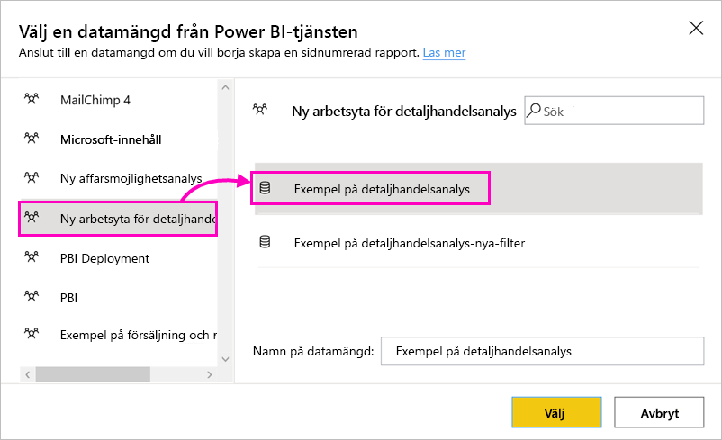
    
1. Datamängden visas under Datakällor i fönstret Rapportdata.

    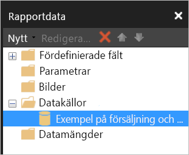

    Kom ihåg att du kan ansluta till flera Power BI-datamängder och andra datakällor i samma sidnumrerade rapport.

## Hämta DAX-frågan för datamängden

När du vill att data i Power BI-rapporten och i Report Builder-rapporten ska vara samma räcker det inte att ansluta till datamängden. Du behöver även den fråga som bygger på den datamängden.

### Video: Hämta DAX-frågan

I det här videoklippet visar Chris Finlan hur du hämtar den DAX du behöver till din sidnumrerade rapport.

<iframe width="400" height="450" src="https://www.youtube.com/embed/NfoOK4QRkhI" frameborder="0" allowfullscreen></iframe>

### Steg för att hämta DAX-frågan

Här är stegen du behöver utföra för att hämta frågan.

1. Öppna Power BI-rapporten (.pbix) i Power BI Desktop.
1. Se till att du har en tabell i rapporten som innehåller alla data som du vill ha i den sidnumrerade rapporten. Tabellen måste uppfylla dessa två krav:
    - Det måste vara en platt tabell, inte en matris eller något annat visuellt objekt. Om det inte är en tabell konverterar du den till en tabell nu, går igenom följande steg för prestandaanalys och konverterar sedan tillbaka tabellen till det visuella objekt du vill använda.
    - För dina numeriska fält måste du använda *fördefinierade mått*. De har en miniräknarsymbol bredvid sig. Läs om att [skapa mått](../desktop-measures.md). 

        

1. I menyfliksområdet **Visa** väljer du **Prestandaanalys**.

    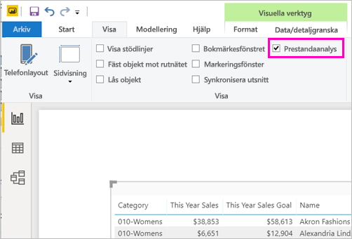

1. I fönstret **Prestandaanalys** väljer du **Starta inspelning** och sedan **Uppdatera visuella objekt**.

    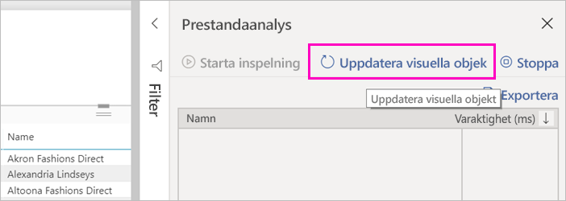

1. Expandera plustecknet ( **+** ) intill tabellnamnet och välj **Kopiera fråga**. Frågan är den DAX-formel som du behöver för datamängden i Report Builder i Power BI.

    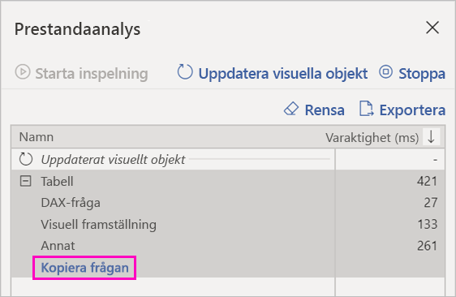

## Skapa datamängden med frågan

1. Gå tillbaka till Report Builder i Power BI.
1. Högerklicka på datamängden under **Datakällor** och välj **Lägg till datamängd**.

    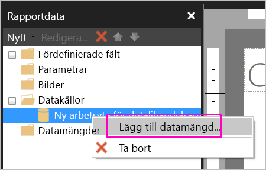

1. I Egenskaper för datamängd ger du den ett namn och väljer **Frågedesigner**.

4. Kontrollera att **DAX** är valt och avmarkera ikonen för **Designläge**.

    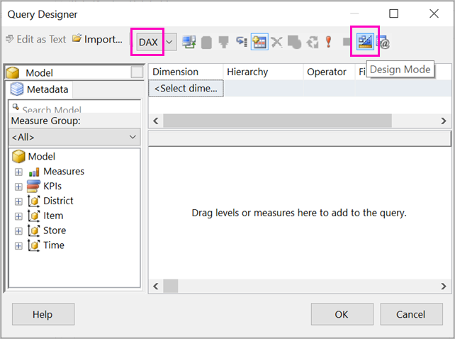

1. I den övre rutan klistrar du in den fråga som du kopierade från Power BI Desktop.

1. Välj **Kör fråga** (det röda utropstecknet, !) för att kontrollera att frågan fungerar. 

    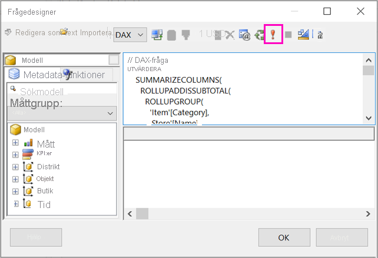

    Du ser resultatet av frågan i den nedre rutan.

    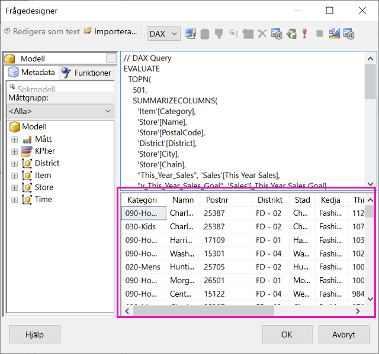

1. Välj **OK**.

    Du ser frågan i fönstret **Fråga** i dialogrutan **Egenskaper för datamängd**.

    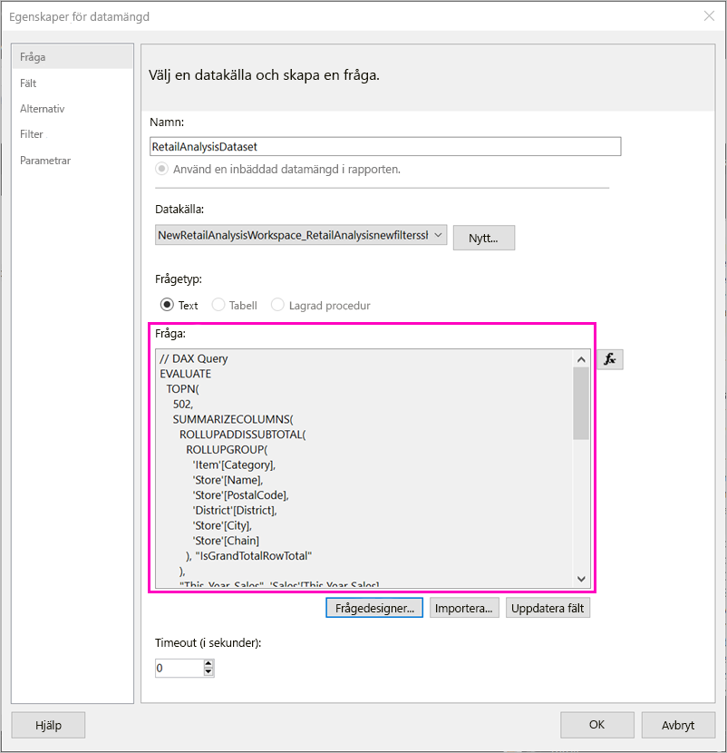

1. Välj **OK**.

    Nu ser du den nya datamängden med en lista över dess fält i fönstret Rapportdata.

    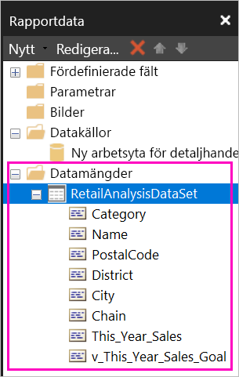

## Skapa en tabell i rapporten

Ett snabbt sätt att skapa en tabell är att använda tabellguiden.

1. På menyfliksområdet **Infoga** väljer du **Tabell** > **Tabellguiden**.

    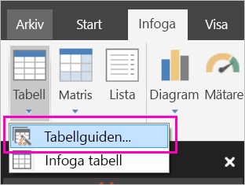

1. Välj den datamängd som du skapade med DAX-frågan > **Nästa**.

    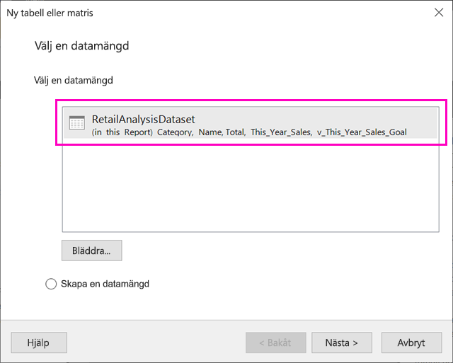

1. För att skapa en platt tabell väljer du de fält som du vill använda i **Tillgängliga fält**. Du kan välja flera fält åt gången genom att välja det första som du vill ha, hålla Skift-tangenten och välja det sista.

    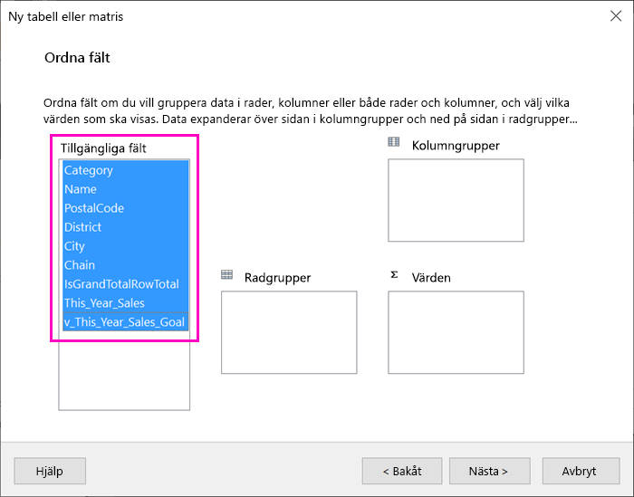

1. Dra fälten till rutan **Värden** > **Nästa**.

    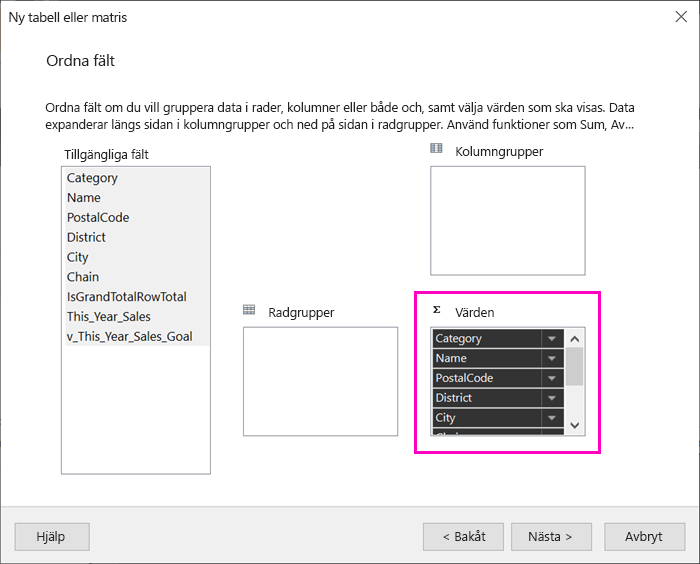

1. Välj önskade layoutalternativ > **Nästa**.

1. Välj **Slutför**.
    Tabellen visas i designvyn.

    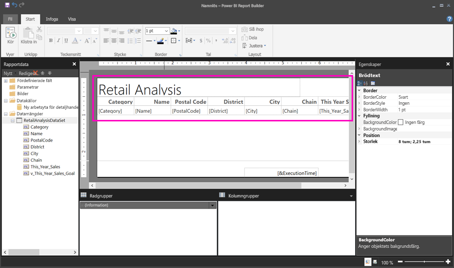

1. Välj **Klicka för att lägga till rubrik** och lägg till en rubrik.

1. Välj **Kör** för att förhandsgranska rapporten.

    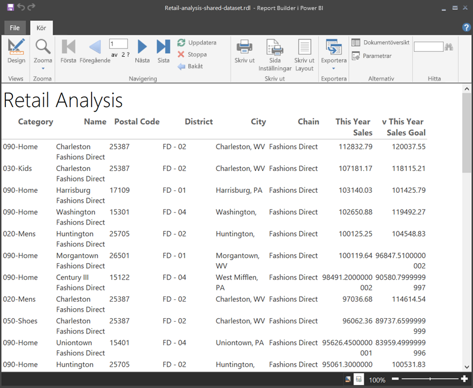

1. Välj **Utskriftslayout** för att se hur rapporten kommer att se ut när den skrivs ut. 

    Den här rapportlayouten behöver ändras lite. Den har 54 sidor eftersom kolumnerna och marginalerna gör tabellen två sidor bred.

    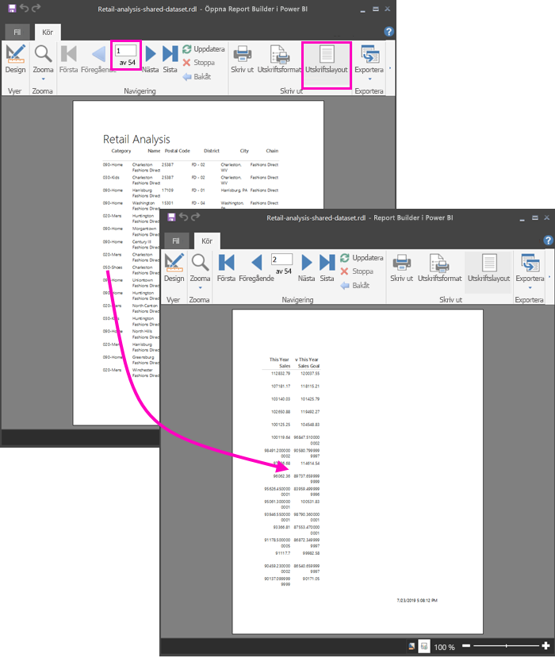

## Formatera rapporten

Det finns flera formateringsalternativ som gör att din tabell får plats på en sida. 

1. Du kan begränsa sidmarginalerna i fönstret Egenskaper. Om fönstret Egenskaper inte visas går du till menyfliksområdet **Visa** och markerar kryssrutan **Egenskaper**.

1. Välj rapporten, inte tabellen eller rubriken.
1. I fönstret **Rapportegenskaper** går du till **Sida**, expanderar **Marginaler** och ändrar var och en till **0,75 tum**.

    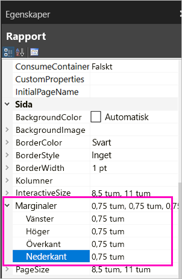

1. Du kan även göra kolumner smalare. Markera kolumnens kantlinje och dra den högra sidan till vänster.

    

1. Ett annat alternativ är att se till att siffervärdena har bra formatering. Markera en cell med ett siffervärde. 
    > [!TIP]
    > Du kan formatera fler än en cell i taget genom att hålla ned Skift-tangenten och markera de andra cellerna.

    

1. I menyfliksområdet **Start** går du till avsnittet **Tal** och ändrar formatet **Standard** till ett numeriskt format såsom **Valuta**.

    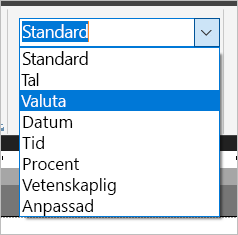

1. Ändra stilen för **Platshållare** till **Exempelvärden** så att du kan se formateringen i cellen. 

    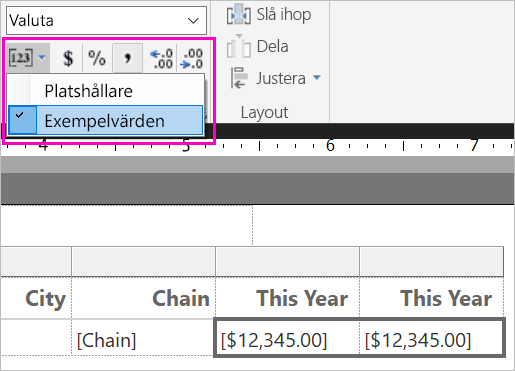

1. Om det behövs kan du minska antalet decimaler i avsnittet **Tal** för att spara mer utrymme.

### Ta bort tomma sidor

Även om du har gjort marginalerna och tabellkolumnerna smalare kan det fortfarande hända att varannan sida blir tom. Varför? Det har med matematiken att göra. 

När du adderar de sidmarginaler som du har angett plus bredden på rapportens *brödtext* måste resultatet vara mindre än rapportformatets bredd.

Anta till exempel att rapporten har formatet 8,5 x 11 tum och att du har angett sidmarginalerna till 0,75 tum vardera. Tillsammans blir de två marginalerna 1,5 tum, och därför måste brödtexten vara mindre än 7 tum bred.

1. Markera högerkanten på rapportdesignytan och dra den så att den blir mindre än den önskade siffran på linjalen. 

    > [!TIP]
    > Du kan ange den mer noggrant i egenskaperna för **Brödtext**. Under **Storlek** anger du egenskapen **Bredd**.

    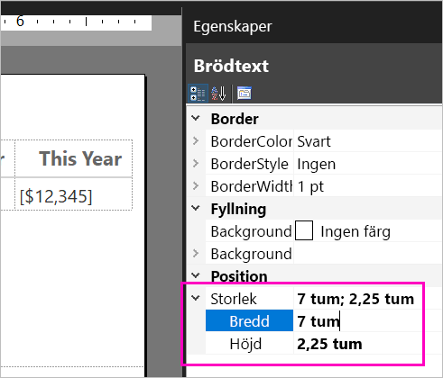

1. Välj **Kör** för att förhandsgranska rapporten och se till att du har tagit bort de tomma sidorna. Den här rapporten har nu bara 26 sidor i stället för de ursprungliga 54. Klart!

    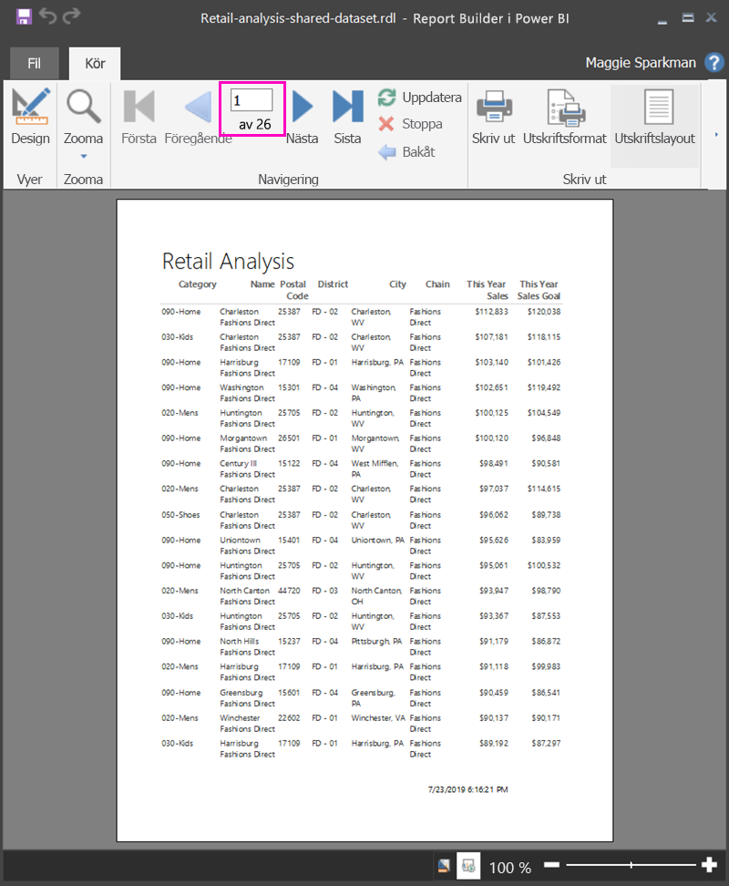

## Begränsningar och överväganden 

- För datamängder som använder en live-anslutning till Analysis Services kan du ansluta direkt med hjälp av den underliggande Analysis Services-anslutningen i stället för en delad datamängd.
- Datamängder med upphöjda eller certifierade intyg visas i listan över tillgängliga datamängder, men de markeras inte som sådana. 
- Du kan inte bädda in sidnumrerade rapporter som baseras på delade Power BI-datamängder i scenariot ”Appen äger data”.

## Nästa steg

- [Vad är sidnumrerade rapporter i Power BI Premium?](paginated-reports-report-builder-power-bi.md)