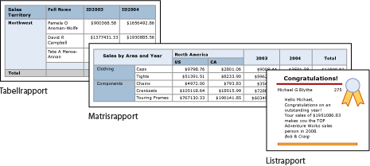

# Tabeller, matriser och listor i Power BI Report Builder
 I Report Builder är tabeller, matriser och listor *dataområden* som visar sidnumrerade rapportdata i celler som ordnas i rader och kolumner. Cellerna innehåller vanligtvis textdata som text, datum och siffror, men de kan även innehålla mätare, diagram eller rapportobjekt såsom bilder. Sammantaget kallas tabeller, matriser och listor ofta *tablix*-dataområden.  
  
 Mallarna för tabeller, matriser och listor bygger på tablix-dataområdet, vilket är ett flexibelt rutnät som kan visa data i celler. I mallarna för tabeller och matriser är celler ordnade i rader och kolumner. Eftersom mallar är varianter av det underliggande allmänna tablix-dataområdet kan du visa data i kombination med mallformat och ändra den tabell, matris eller lista som ska inkludera funktionerna i ett annat dataområde när du utvecklar rapporten. Om du till exempel lägger till en tabell och upptäcker att den inte uppfyller dina behov kan du lägga till kolumner för att göra tabellen till en matris.  
  
 Tabellen och matrisdataområdena kan visa komplexa datarelationer genom att inkludera kapslade tabeller, matriser, listor, diagram och mätare. Tabeller och matriser har en tabellbaserad layout, och deras data kommer från en enda datamängd som bygger på en enskild datakälla. Den viktigaste skillnaden mellan tabeller och matriser är att tabeller endast kan inkludera radgrupper, medan matriser har radgrupper och kolumngrupper.  
  
 Listor fungerar lite annorlunda. De har stöd för en fri layout som kan innehålla flera peer-tabeller eller matriser som var och en använder data från en annan datamängd. Listor kan även användas för formulär, till exempel fakturor.  
  
 Följande bilder visar enkla rapporter med en tabell, en matris eller en lista.  

  
##   Tabeller  
 Använd en tabell för att visa detaljerade data, organisera data i radgrupper eller både och. Tabellmallen innehåller tre kolumner med en rad för tabellrubrik och en detaljrad för data. Följande bild visar den initiala tabellmallen, som markerats på designytan:  

  
 Du kan gruppera data efter ett enskilt fält, efter flera fält eller genom att skriva ett eget uttryck. Du kan skapa kapslade grupper eller oberoende, angränsande grupper och visa aggregerade värden för grupperade data eller lägga till summor i grupper. Om din tabell till exempel har en radgrupp som heter **Kategori** kan du lägga till en delsumma för varje grupp samt en totalsumma för rapporten. Du kan slå samman celler och formatera data och tabellrubriker för att förbättra utseendet på tabellen och markera data som du vill framhäva.  
  
 Du kan först dölja detalj eller grupperade data och inkluderar knappar för ökad detaljnivå så att användare interaktivt kan välja hur mycket data som ska visas.  
  
##   Matriser  
 Använd en matris för att visa aggregerade datasammanfattningar, grupperade i rader och kolumner, på ett sätt som liknar pivottabeller eller korsfrågor. Antalet rader och kolumner för grupper bestäms av antalet unika värden för varje radgrupp och kolumngrupp. Följande bild visar den initiala matrismallen, som markerats på designytan:  

 
 Du kan gruppera data efter flera fält eller uttryck i radgrupper och kolumngrupper. När rapportdata och dataområden kombineras vid körning växer en matris vågrätt och lodrätt på sidan allt eftersom kolumner för kolumngrupper och rader för radgrupper läggs till. Matrisceller visar aggregatvärden som får omfång för skärningspunkten för de radgrupper och kolumngrupper som celler tillhör. Om din matris till exempel har en radgrupp (Kategori) och två kolumngrupper (Territorium och År) som visar summan av försäljning så visar rapporten två celler med summan av försäljning för varje värde i gruppen Kategori. Omfånget för cellerna i de två skärningspunkterna är: Kategori och Territorium samt Kategori och År. Matrisen kan innehålla kapslade och angränsande grupper. Kapslade grupper har en överordnad-underordnad-relation, och angränsande grupper har en peer-relation. Du kan lägga till delsummor för valfria nivåer av kapslade radgrupper och kolumngrupper i matrisen.  
  
 Om du vill göra det lättare att läsa matrisdata och markera de data du vill betona kan du slå samman celler eller dela vågrätt och lodrätt samt formatera data och grupprubriker.  
  
 Du kan även inkludera växlar för ökad detaljnivå som till en början döljer detaljdata. Användaren kan sedan klicka på växlarna för att visa mer eller mindre detalj efter behov.  
  
##   Listor  
 Använd en lista för att skapa en fri layout. Du är inte begränsad till en rutnätslayout, utan kan placera fält fritt i listan. Du kan använda en lista för att utforma ett formulär till att visa många datamängdsfält eller som en container för att visa flera dataområden sida vid sida för grupperade data. Du kan till exempel definiera en grupp för en lista: lägg till en tabell, ett diagram och en bild och visa värden i en tabell och ett grafiskt formulär för varje gruppvärde, som du kanske skulle göra för en anställds eller patients akt.  

  
##   Förbereda data  
 Tabeller, matriser och listdataområden visar data från en datamängd. Du kan förbereda data i den fråga som hämtar data för datamängden eller genom att ange egenskaper i tabellen, matrisen eller listan.  
  
 Frågespråk såsom Transact-SQL, som du använder för att hämta data för rapportdatamängden, kan förbereda data genom att filtrera så att endast en delmängd av data inkluderas, ersätta nullvärden eller tomma värden med konstanter som gör rapporten enklare att läsa samt sortera och gruppera data.  
  
 Om du väljer att förbereda data i tabellen, matrisen eller listdataområdet för en rapport anger du egenskaper för dataområdet eller cellerna i dataområdet. Om du vill filtrera eller sortera data anger du egenskaperna på dataområdet. Om du till exempel vill sortera data anger du de kolumner som ska sorteras och sorteringsriktningen. Om du vill ange ett alternativt värde för ett fält anger du värdena för den celltext som visar fältet. För att till exempel visa Tomt när ett fält är tomt eller null använder du ett uttryck för att ange värdet.  
  
##   Skapa och konfigurera en tabell, en matris eller en lista  
 När du lägger till tabeller eller matriser i rapporten kan du använda tabell- och matrisguiden eller skapa dem manuellt från de mallar som Report Builder innehåller. Listor skapas manuellt från listmallen.  
  
 Guiden vägleder dig genom stegen för att snabbt skapa och konfigurera en tabell eller en matris. När du har slutfört guiden eller om du bygger tablix-dataområdena från början kan du ytterligare konfigurera och förfina dem. Dialogrutorna, som är tillgängliga på högerklicksmenyerna på dataområdena, gör det enkelt att ange de vanligaste egenskaperna för sidbrytningar, repeterbarhet och synlighet för sidhuvuden och sidfötter, visningsalternativ, filter och sortering. Men tablix-dataområdet innehåller en mängd ytterligare egenskaper som du endast kan ange i fönstret Egenskaper i Report Builder. Om du till exempel vill visa ett meddelande när datamängden för en tabell, matris eller lista är tom så anger du meddelandetexten i tablix-egenskapen NoRowsMessage i fönstret Egenskaper.  
  
##   Ändra mellan tablix-mallar  
 Du begränsas inte av ditt första val av tablix-mall. När du lägger till grupper, summor och etiketter vill du kanske ändra tablix-designen. Du kan till exempel börja med en tabell och sedan ta bort detaljraden och lägga till kolumngrupper.  
  
 Du kan fortsätta att utveckla en tabell, en matris eller en lista genom att lägga till valfri tablix-funktion. Tablix-funktioner omfattar visa detaljerade data eller aggregat för grupperade data i rader och kolumner. Du kan skapa kapslade grupper, oberoende angränsande grupper eller rekursiva grupper. Du kan filtrera och sortera grupperade data och enkelt kombinera grupper genom att inkludera flera grupputtryck i en gruppdefinition  
  
 Du kan även lägga till summor för en grupp eller totalsummor för dataområdet. Du kan dölja rader eller kolumner att förenkla en rapport och göra så att användaren kan visa dolda data, som i en rapport med ökad detaljnivå. 

## Nästa steg

- [Vad är sidnumrerade rapporter i Power BI Premium?](paginated-reports-report-builder-power-bi.md)
